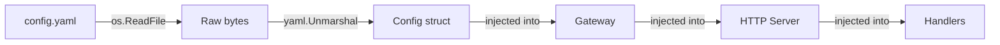
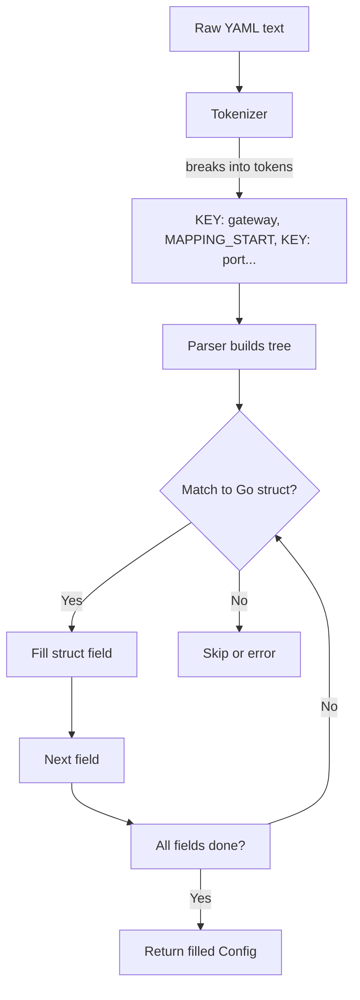
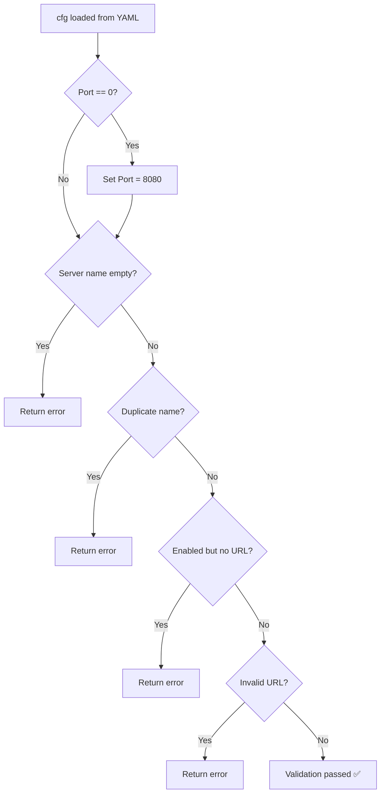
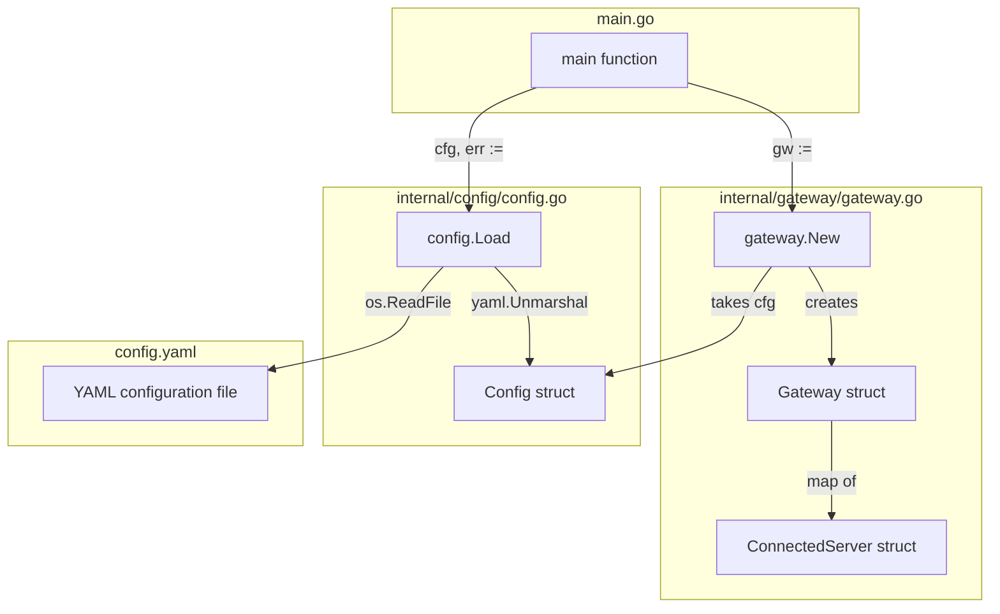
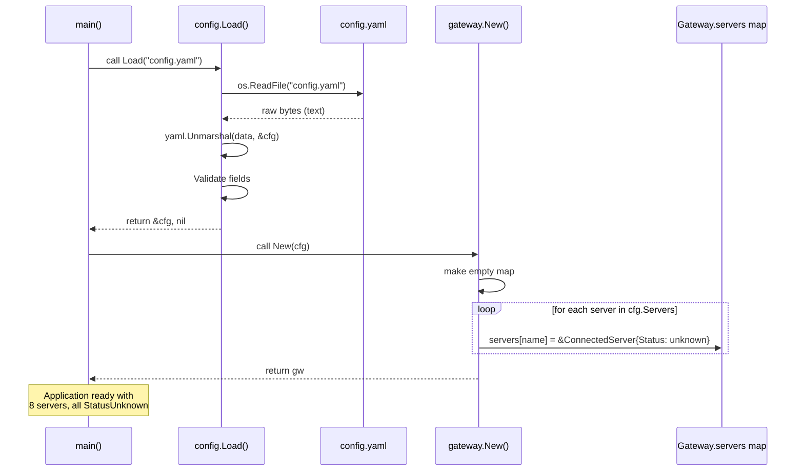
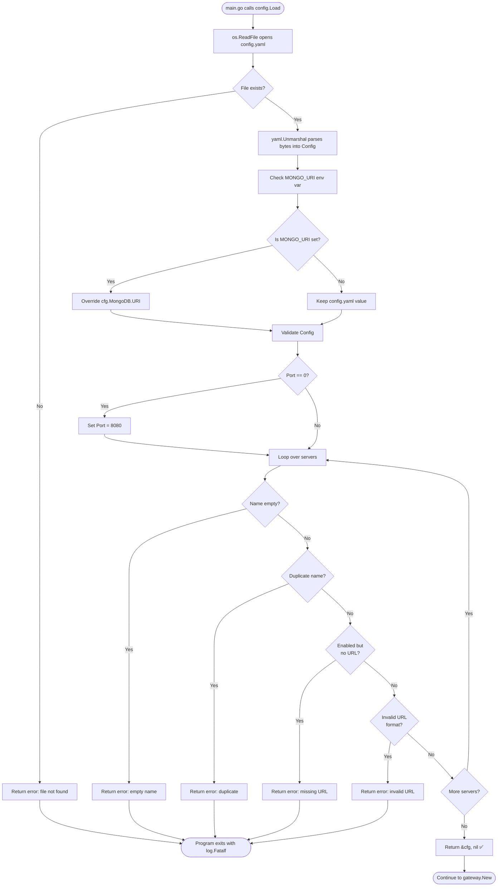
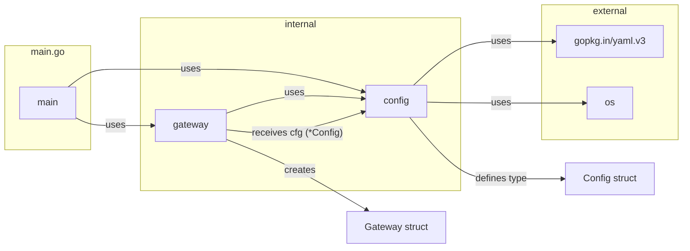
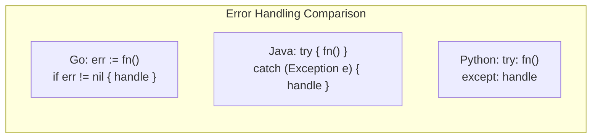

# Part 1: Configuration Loading & Gateway Initialization

## Table of Contents
1. [Architecture Overview](#1-architecture-overview)
2. [Package vs Type vs Variable](#2-package-vs-type-vs-variable)
3. [Function Signatures Deep Dive](#3-function-signatures-deep-dive)
4. [YAML Unmarshalling Process](#4-yaml-unmarshalling-process)
5. [Environment Variable Overrides](#5-environment-variable-overrides)
6. [Validation — Fail Fast](#6-validation--fail-fast)
7. [Gateway Structure & Memory Layout](#7-gateway-structure--memory-layout)
8. [Initialization Order](#8-initialization-order)
9. [Concurrency with sync.RWMutex](#9-concurrency-with-syncrwmutex)
10. [Interview Questions & Answers](#10-interview-questions--answers)
11. [Diagrams](#11-diagrams)

---

## 1. Architecture Overview

### The Application Lifecycle

```
Phase 1: Load Config  ──→  Phase 2: Build Core  ──→  Phase 3: Start Servers  ──→  Phase 4: Listen
   (main.go:28)           (main.go:34)              (main.go:73-98)              (main.go:118-119)
```

Every application follows a lifecycle. This project's startup has 4 phases, and Part 1 covers the first two.

### Dependency Injection Pattern



The project uses **dependency injection**: objects are created first, then passed (injected) into the objects that need them. This makes testing easy because you can pass mock objects.

---

## 2. Package vs Type vs Variable

### The #1 confusion for beginners — explained 3 ways

### Analogy 1: The Library

| Concept | Analogy | In our code |
|---------|---------|-------------|
| **Package** (`config`) | A library building | `internal/config/` folder |
| **Type** (`Config`) | A book category — "Cookbook" | `type Config struct{...}` defines the shape |
| **Variable** (`cfg`) | A specific book on the shelf | `cfg := config.Load(...)` — one instance |

### Analogy 2: The Blueprint

```
config.Config     = Blueprint for a house (the design/structure)
cfg               = An actual house built from that blueprint (one instance in memory)
config.ServerConfig = Blueprint for a room
cfg.Servers[0]    = One specific room (the weather server's config)
```

### Analogy 3: Memory

```
config ───> Package = a folder on disk at internal/config/
  │
  └──> Config = a type defined in config.go
       │
       └──> cfg = a variable of type Config, allocated in memory
```

### Why `config.Config` notation?

The dot `.` is the **selection operator**. `config.Config` means:

> *"Navigate into the config package and select the Config type defined there."*

Go does NOT allow importing individual types. You import the package and use dots to access its contents.

### Why lowercase `c` in `config` but uppercase `C` in `Config`?

```go
config.Load()    // lowercase = exported function (public)
config.Config    // uppercase C = exported type (public)
config.config    // WRONG — would be private (unexported)
```

**Go's visibility rule:** Capital first letter = exported/public. Lowercase first letter = unexported/private to the package. No `public`, `private`, or `protected` keywords needed.

---

## 3. Function Signatures Deep Dive

### Line 28: The Entry Point

```go
cfg, err := config.Load("config.yaml")
```

### The Function Being Called

```go
func Load(path string) (*Config, error) {
```

### Breaking down `func Load(path string) (*Config, error) {`

| Token | Meaning | Why it matters |
|-------|---------|----------------|
| `func` | Declares a function | Go functions are first-class: can be passed as args, returned, assigned |
| `Load` | Function name (exported) | Capital L = public. Lowercase = private to package |
| `(` | Opens parameter list | Go uses parentheses, unlike Python's `def` |
| `path` | Parameter name | Local variable inside the function |
| `string` | Parameter type | Go is statically typed — every variable has a fixed type |
| `)` | Closes parameter list | |
| `(*Config, error)` | Return types | **Multiple return values** — Go's alternative to exceptions |
| `{` | Opens function body | MUST be on same line as declaration (compiler-enforced) |

### Go's Error Handling Philosophy

```go
// Go: Error as a return value
cfg, err := config.Load("config.yaml")
if err != nil {
    log.Fatalf("Failed: %v", err)
}

// Java: Exception
// try { Config cfg = config.load("config.yaml"); }
// catch (IOException e) { System.out.println("Failed: " + e); }

// Python: Exception
// try: cfg = config.load("config.yaml")
// except FileNotFoundError as e: print(f"Failed: {e}")
```

**Why Go does this:** Exceptions create hidden control flow — any line can throw, and you might forget to catch. Go forces you to handle errors explicitly at the call site. The compiler even warns about unused return values.

### What's a Pointer?

```go
*Config  // Means "pointer to a Config"
```

A pointer is a **memory address**. Instead of giving you the actual data, it tells you WHERE the data lives.

```
cfg = config.Load("config.yaml")

Memory diagram:

  main() stack frame:          Heap:
  ┌─────────────────┐         ┌──────────────────────────┐
  │ cfg: 0x00A3F7C0 │───────→│ Config struct @ 0x00A3F7C0│
  │ (pointer)       │         │   Port: 8080             │
  │ err: nil        │         │   Name: "MCP Gateway"    │
  └─────────────────┘         │   Servers: [...]         │
                              └──────────────────────────┘
```

**Why return a pointer (`*Config`) instead of a value (`Config`)?**

1. **Memory efficiency** — Config has ~200+ bytes. Copying it every time it's passed to functions wastes memory
2. **Nil-ability** — Pointers can be `nil`, signaling "nothing here"
3. **Shared state** — Multiple parts of the code can reference the same Config instance

### The Short Variable Declaration `:=`

```go
cfg, err := config.Load("config.yaml")
```

`:=` is Go's **short variable declaration**. It does two things:
1. **Declares** the variables (creates them)
2. **Assigns** values to them (from the function return)

It's equivalent to:
```go
var cfg *Config
var err error
cfg, err = config.Load("config.yaml")
```

But shorter. You can only use `:=` inside functions, and at least one variable on the left must be new.

---

## 4. YAML Unmarshalling Process

### Step 1: Reading the File

```go
data, err := os.ReadFile(path)
```

**What happens inside `os.ReadFile`:**

```
1. Go makes a system call to the OS kernel: "Open this file"
2. OS returns a file descriptor (an integer handle)
3. Go reads ALL bytes from the file into a byte slice
4. Go closes the file descriptor
5. Returns the bytes as []byte

Result: data = []byte("# MCP Gateway Configuration...")
```

### Step 2: Parsing YAML

```go
err = yaml.Unmarshal(data, &cfg)
```

**Why `&cfg` and not `cfg`?**

In Go, function arguments are **passed by value** (copied). If you pass `cfg`, Unmarshal would get a **copy**, modify the copy, and the original would remain empty. `&cfg` passes the **memory address** so Unmarshal can write directly to the original.

```
Without & (WRONG):
  cfg (original) ──→ copy ──→ Unmarshal fills the copy
       ↑                        The original stays empty!

With & (CORRECT):
  cfg (original) ←──── Unmarshal writes directly to this address via &cfg
```

### The Parsing Algorithm



### YAML Tags Explained

```go
type GatewayConfig struct {
    Port int    `yaml:"port"`   // YAML key "port" → Go field "Port"
    Name string `yaml:"name"`   // YAML key "name" → Go field "Name"
}
```

**Backtick strings** `` `yaml:"port"` `` are **struct tags** — metadata attached to struct fields. The YAML library reads these tags to know which YAML key maps to which Go field.

Without tags, Go uses **case-insensitive matching** of field names. But tags give you:
- Different YAML key names than Go field names
- Options like `omitempty`, `flow`, `inline`
- Explicit control

### Memory After Unmarshalling

```
cfg (on heap):
┌─────────────────────────────────────────────────────┐
│ config.Config                                        │
│   Gateway: config.GatewayConfig                      │
│   ├── Port: int = 8080                             │
│   └── Name: string = "MCP Gateway"                  │
│                                                      │
│   MongoDB: config.MongoConfig                        │
│   ├── URI: string = ""                              │
│   └── Database: string = "mcp_gateway"              │
│                                                      │
│   Servers: []config.ServerConfig (slice)             │
│   ├── len: 8, cap: 8                                │
│   ├── [0]: config.ServerConfig{Name:"weather",...}  │
│   ├── [1]: config.ServerConfig{Name:"notes",...}    │
│   ├── [2]: config.ServerConfig{Name:"github",...}   │
│   ├── [3]: config.ServerConfig{Name:"crypto",...}   │
│   ├── [4]: config.ServerConfig{Name:"news",...}     │
│   ├── [5]: config.ServerConfig{Name:"url-tools",...}│
│   ├── [6]: config.ServerConfig{Name:"search",...}   │
│   └── [7]: config.ServerConfig{Name:"documents",...}│
└─────────────────────────────────────────────────────┘
```

---

## 5. Environment Variable Overrides

### The Code

```go
if envURI := os.Getenv("MONGO_URI"); envURI != "" {
    cfg.MongoDB.URI = envURI
}
```

### What is an Environment Variable?

At the OS level, environment variables are key-value pairs stored in memory for each running process:

```
Process Memory:
├── Environment Block
│   ├── PATH = "C:\Windows;C:\Program Files..."
│   ├── USERNAME = "Varun Banda"
│   ├── MONGO_URI = "" (not set)
│   └── ...
└── Program Code
```

When you run `mcp-gateway.exe`, it **inherits** all environment variables from your terminal. `os.Getenv("MONGO_URI")` asks the OS: *"Does this process have a variable called MONGO_URI? If so, what's its value?"*

### The if-with-initializer Pattern

This Go construct:

```go
if envURI := os.Getenv("MONGO_URI"); envURI != "" {
```

Is equivalent to:

```go
envURI := os.Getenv("MONGO_URI")
if envURI != "" {
    cfg.MongoDB.URI = envURI
}
```

**The difference:** In the first form, `envURI` is **scoped** to the if block — it doesn't exist after the `}`. This prevents variable leakage and makes code cleaner.

### Why Environment Variables?

| Concern | Config File | Environment Variable |
|---------|-------------|---------------------|
| **Security** | Gets committed to git (password leaked!) | Stays on the server |
| **Per-environment** | Need different files for dev/staging/prod | Single binary, different env vars |
| **12-factor app** | ❌ Violates factor 3 | ✅ Follows factor 3 |

**The 12-Factor App** methodology states: *"Store config in the environment."* This allows the same binary to be deployed to development, staging, and production — just with different environment variables.

### In Your Debugging Session

```
os.Getenv("MONGO_URI") returned "" (empty string)
  → envURI = ""
  → envURI != "" is FALSE
  → Code inside if block did NOT run
  → cfg.MongoDB.URI stays "" (from config.yaml)

Result: Authentication will be DISABLED at runtime
```

---

## 6. Validation — Fail Fast

### The Code

```go
if cfg.Gateway.Port == 0 {
    cfg.Gateway.Port = 8080 // Default port
}
```

### Why `==` for equality?

In Go:
- `=` is **assignment**: `x = 5` means "put 5 into x"
- `==` is **comparison**: `x == 5` means "is x equal to 5?"

This is different from:
- Python: `x = 5` (assignment), `x == 5` (equality) — same, uses `=` for assignment
- JavaScript: Same as Python
- SQL: Single `=` for both!

### What Validations Are Performed



### Why Validate at Startup?

**The Fail Fast principle:** Detect errors as early as possible. A misconfigured server is easier to fix at startup than to debug at 3 AM when routing mysteriously fails.

Without validation:
```
1. App starts fine
2. User tries to call "get_weather"
3. Gateway looks for the weather server
4. Server not found (because name was empty in config)
5. Mysterious error returned to user
6. Engineer spends 2 hours debugging
```

With validation:
```
1. App starts
2. Validation finds empty server name
3. log.Fatalf prints clear error and exits
4. Engineer fixes config.yaml
5. Re-deploys (2 minutes total)
```

---

## 7. Gateway Structure & Memory Layout

### The Gateway Struct

```go
type Gateway struct {
    servers map[string]*ConnectedServer
    mu      sync.RWMutex
}
```

### What's a Map?

A map (`map[string]*ConnectedServer`) is a **hash table** — a data structure that maps keys to values for fast lookups.

```
Map memory layout:
┌────────────────────────────────────────┐
│ hash table                             │
│                                        │
│ hash("weather") = 0xA3 → bucket 3      │
│   bucket 3:                            │
│     key: "weather"                     │
│     value: *ConnectedServer ──→ 0x7F00 │
│                                        │
│ hash("notes") = 0x1B → bucket 1       │
│   bucket 1:                            │
│     key: "notes"                       │
│     value: *ConnectedServer ──→ 0x7F30 │
│                                        │
│ ... (total 8 entries)                  │
└────────────────────────────────────────┘
```

**Lookup performance:** O(1) average — constant time regardless of map size.

### The ConnectedServer Struct

```go
type ConnectedServer struct {
    Config    config.ServerConfig  // Static config from YAML
    Status    ServerStatus         // "unknown" | "online" | "offline"
    Tools     []Tool              // Discovered tools (empty at start)
    LastCheck time.Time           // Timestamp of last health check
    Latency   time.Duration       // Response time in ms
}
```

**Mixed lifecycle:**
- `Config` is set once at creation and never changes
- Everything else is updated by the health checker
- `Status` starts at `""` (zero value for string) which maps to `StatusUnknown`
- `Tools` starts as an empty slice

### Memory After Gateway Creation

```
Gateway @ 0x00A3F7C0:
├── mu: sync.RWMutex (unlocked)
└── servers: map[string]*ConnectedServer
    ├── key: "weather"    → &ConnectedServer @ 0x007F00
    │   ├── Config: {Name:"weather", URL:"http://localhost:3001", Enabled:true}
    │   ├── Status: "" (unknown)
    │   ├── Tools: [] (empty slice, len=0, cap=0)
    │   ├── LastCheck: time.Time{} (zero time = Jan 1, year 1)
    │   └── Latency: 0
    │
    ├── key: "notes"      → &ConnectedServer @ 0x007F30
    │   ├── Config: {Name:"notes", URL:"http://localhost:3002", Enabled:true}
    │   └── ... (same structure)
    │
    ├── key: "github"     → &ConnectedServer @ 0x007F60
    │   └── ...
    │
    ├── key: "crypto"     → &ConnectedServer @ 0x007F90
    ├── key: "news"       → &ConnectedServer @ 0x007FC0
    ├── key: "url-tools"  → &ConnectedServer @ 0x007FF0
    ├── key: "search"     → &ConnectedServer @ 0x008020
    └── key: "documents"  → &ConnectedServer @ 0x008050
```

---

## 8. Initialization Order

### Step-by-Step Execution

```
main.go:28 ──→ config.Load("config.yaml")
                │
                ▼
config.go:51 ──→ func Load(path string) (*Config, error) {
config.go:53 ──→ data, err := os.ReadFile(path)
                │   data = []byte("# MCP Gateway Configuration...")
                │
config.go:60 ──→ err = yaml.Unmarshal(data, &cfg)
                │   cfg = Config{
                │     Port: 8080,
                │     Name: "MCP Gateway",
                │     Servers: [8 entries],
                │   }
                │
config.go:66 ──→ env var override check (MONGO_URI) → skipped (empty)
config.go:69 ──→ env var override check (MONGO_DATABASE) → skipped (empty)
config.go:74 ──→ Port default check → skipped (already 8080)
config.go:78 ──→ Validation loop → passed
                │
config.go:97 ──→ return &cfg, nil
                │
                ▼
main.go:28 ──→ cfg, err := config.Load("config.yaml")
main.go:30 ──→ if err != nil → skipped (err is nil)
main.go:32 ──→ log.Printf("Loaded config: 8 servers configured")
                │
                ▼
main.go:34 ──→ gw := gateway.New(cfg)
                │
                ▼
gateway.go:56 ──→ func New(cfg *config.Config) *Gateway {
gateway.go:57 ──→ gw = &Gateway{servers: make(map[string]*ConnectedServer)}
                    │
gateway.go:61 ──→ for _, serverCfg := range cfg.Servers {
                    │  Iteration 1: serverCfg = {Name:"weather", URL:":3001", Enabled:true}
                    │  Iteration 2: serverCfg = {Name:"notes", URL:":3002", Enabled:true}
                    │  ...
                    │  Iteration 8: serverCfg = {Name:"documents", URL:":3008", Enabled:true}
                    │
gateway.go:66 ──→ gw.servers[serverCfg.Name] = &ConnectedServer{
                    Status: StatusUnknown,
                    Tools:  []Tool{},
                    ...
                }
                    │
gateway.go:74 ──→ return gw
                    │
                    ▼
main.go:34 ──→ gw = <Gateway with 8 servers, all StatusUnknown>
main.go:36 ──→ log.Printf("Gateway initialized with 8 servers")
```

### Why StatusUnknown?

It represents **"not yet checked"** — the health checker hasn't contacted the server yet. This is different from "offline" (checked and confirmed down).

The three-state system:
```
Unknown  ──→  Online  (health check succeeded)
Unknown  ──→  Offline (health check failed)
```

---

## 9. Concurrency with sync.RWMutex

### The Problem: Data Races

The Gateway is accessed by **multiple goroutines simultaneously**:

```
Goroutine 1 (Health Checker):            Goroutine 2 (HTTP Handler):
  gw.UpdateServerStatus("weather",         servers := gw.ListServers()
    StatusOnline, tools, latency)               ↑
      │                                         │
      │   Write to servers["weather"]           │   Read from servers["weather"]
      │                                         │
      └────────────── TIME ──────────────────→ ┘

Without mutex: DATA RACE!
Goroutine 2 reads servers["weather"] while Goroutine 1 is writing to it.
Result: corrupted data (half-old, half-new).
```

### The Solution: RWMutex

```go
type Gateway struct {
    servers map[string]*ConnectedServer
    mu      sync.RWMutex  // Read-Write Mutex
}
```

### How RWMutex Works

```
         Time ──────────────────────────────────────────→

Reader 1:  [----READ----]
Reader 2:       [----READ----]          ← Multiple readers OK
Writer 1:                    [--WRITE--] ← Exclusive access
Reader 3:                          [----READ----] ← After writer unlocks
```

| Operation | Multiple allowed? | Blocks readers? | Blocks writers? |
|-----------|-------------------|-----------------|-----------------|
| Read Lock | ✅ Yes | ❌ No | ✅ Yes |
| Write Lock | ❌ No | ✅ Yes | ✅ Yes |

### In Practice

```go
// Read operation (like listing servers):
func (gw *Gateway) ListServers() []ConnectedServer {
    gw.mu.RLock()           // Lock for reading
    defer gw.mu.RUnlock()   // Unlock when function returns
    // ... read from servers map ...
}

// Write operation (like updating status):
func (gw *Gateway) UpdateServerStatus(...) {
    gw.mu.Lock()            // Lock for writing (exclusive)
    defer gw.mu.Unlock()    // Unlock when function returns
    // ... write to servers map ...
}
```

**Why RWMutex over regular Mutex?** Read operations are far more common (dashboard polling, tool listing) than writes (health check every 10s). RWMutex allows all readers to proceed concurrently, improving performance.

---

## 10. Interview Questions & Answers

### Q1: "Explain how this project starts up."

> The startup follows a **dependency injection pattern**. First, `main.go` calls `config.Load("config.yaml")` which reads the YAML file using `os.ReadFile`, then parses it with `yaml.Unmarshal` into a strongly-typed `Config` struct. The config is validated to catch issues early — ensuring ports are set, URLs are valid, and server names are unique and non-empty. Environmental variables like `MONGO_URI` can override YAML values for different deployment environments without code changes.
>
> Once the config is loaded, `gateway.New(cfg)` creates the core Gateway object. This initializes an empty map of servers, then iterates over the config's server list and populates the map with `ConnectedServer` entries. Each entry starts with `Status: "unknown"` and an empty tools list because the health checker hasn't contacted them yet. The Gateway uses a `sync.RWMutex` for concurrent access since it will be read by HTTP handlers and written by the health checker simultaneously.
>
> This architecture follows the **separation of concerns** principle — config loading, gateway management, and HTTP serving are all independent packages that can be developed and tested separately. The dependency injection makes testing easy because mock objects can be substituted at each level.

### Q2: "Why does Go use `config.Config` nomenclature instead of importing types directly?"

> Go uses a **flat package namespace** — you import packages, not individual types. When you write `import "github.com/varunbanda/mcp-gateway/internal/config"`, you bring the entire `config` package into scope. `config.Config` refers to the `Config` type defined within that package. The lowercase `config` is the package name (conventionally matching the directory name), and the uppercase `Config` is the exported struct name.
>
> In Go, **uppercase = exported/public**, **lowercase = unexported/private**. This is Go's visibility mechanism — it eliminates the need for `public`, `private`, or `protected` keywords found in Java and C++. This design choice simplifies the language by having a single, consistent rule for visibility based on the first letter's case.
>
> The naming convention also reinforces the package as the unit of organization. Instead of thinking about individual types scattered across files, Go developers organize code into cohesive packages with a clear public API of exported types and functions.

### Q3: "Explain the purpose of `sync.RWMutex` in the Gateway."

> The Gateway is **shared state** accessed by multiple goroutines concurrently. The health checker goroutine periodically writes updated statuses, while HTTP handler goroutines read the server list to serve dashboard requests. Without synchronization, this creates a **data race** — one goroutine could read a partially-updated struct while another writes to it, causing corrupted data or panics.
>
> A `sync.RWMutex` (Read-Write Mutex) is preferred over a regular `sync.Mutex` because it **optimizes for the read-heavy workload**. Multiple readers can acquire the read lock simultaneously without blocking each other. Only writers need exclusive access. Since reads (dashboard refreshes, tool listing) are far more frequent than writes (health checks every 10 seconds), this improves performance under load.
>
> The usage follows a consistent pattern: read operations use `RLock()`/`RUnlock()`, write operations use `Lock()`/`Unlock()`. The `defer` keyword ensures the lock is always released, even if the function panics.

### Q4: "What is the significance of `StatusUnknown`?"

> `StatusUnknown` represents the **initial state** before any health check has been performed. It's implemented as the Go zero value for the `ServerStatus` type (which is a `string`), so new servers automatically start in this state.
>
> This is important because it distinguishes three distinct conditions:
> 1. **Unknown** — Not yet checked (initial state)
> 2. **Online** — Checked and confirmed operational
> 3. **Offline** — Checked and confirmed unreachable
>
> The dashboard can display different indicators for each state: gray for unknown, green for online, red for offline. This prevents false negatives at startup — if servers started as "offline", users might think they're broken before the first health check completes.

### Q5: "How does error handling work in this code?"

> Go treats errors as **values** rather than exceptions. Functions that can fail return an `error` as their last return value. The caller checks this value immediately:
>
> ```go
> cfg, err := config.Load("config.yaml")
> if err != nil {
>     log.Fatalf("Failed to load config: %v", err)
> }
> ```
>
> This approach has several advantages:
> 1. **Explicit** — Error handling is visible in the code, not hidden in catch blocks
> 2. **Local** — Errors are handled close to where they occur
> 3. **Type-safe** — The compiler ensures errors are checked (unused return values cause warnings)
> 4. **Consistent** — Every function follows the same pattern
>
> `log.Fatalf` is used for startup errors — it prints the error and exits the program. This implements the **Fail Fast** principle: if the config is broken, don't start at all rather than running with invalid state.

### Q6: "Why use YAML for configuration instead of JSON or TOML?"

> YAML is chosen for several practical reasons:
>
> 1. **Readability** — YAML uses indentation and minimal punctuation, making it human-friendly
> 2. **Comments** — YAML supports `#` comments (JSON does not), allowing documentation inline
> 3. **Multi-line strings** — YAML handles multi-line values elegantly
> 4. **Type inference** — YAML automatically detects types (strings, numbers, booleans)
> 5. **Go ecosystem** — `gopkg.in/yaml.v3` is a mature, well-maintained library
>
> While TOML is also popular in the Go community (used by Go modules), YAML's widespread use in DevOps (Docker Compose, Kubernetes, CI/CD) makes it a familiar choice for configuration files. The abstraction via `config.Load()` means the format could be swapped without affecting the rest of the code.

### Q7: "What design patterns are used in Part 1?"

> Several design patterns are evident:
>
> 1. **Factory Method** — `config.Load()` creates and returns a Config object
> 2. **Constructor** — `gateway.New(cfg)` constructs a properly initialized Gateway
> 3. **Dependency Injection** — Config is created first, then injected into Gateway, which is injected into Server. This decouples creation from usage.
> 4. **Singleton** — There's a single Config instance shared across the application via pointers
> 5. **Strategy** — The config file format (YAML) can be swapped without changing the Config type or consumers
> 6. **Fail Fast** — Validation at startup prevents runtime errors from misconfiguration
>
> Dependency injection is particularly important because it enables unit testing — you can pass a mock Config to Gateway or a mock Gateway to Server without needing actual files or network.

### Q8: "Explain the memory layout after Part 1 completes."

> After Part 1, the heap contains:
>
> 1. **One Config struct** — Contains port 8080, gateway name, MongoDB settings, and a slice header pointing to 8 ServerConfig structs
> 2. **One Gateway struct** — Contains a sync.RWMutex and a map with 8 entries
> 3. **8 ConnectedServer structs** — Each with static config (name, URL, enabled), StatusUnknown, empty tools slice, zero LastCheck, and zero Latency
>
> The stack contains the `main` function's local variables: `cfg` (pointer to Config), `gw` (pointer to Gateway), and `err` (nil). Total memory allocated is approximately 2-3 KB — negligible for modern systems.
>
> No network connections have been made yet. No files are open. The program is listening on no ports. Part 1 is purely about in-memory initialization.

---

## 11. Diagrams

### Component Architecture



### Data Flow



### Decision Flow for Config Loading



### Package Dependency Graph



### Comparison: Go vs Other Languages



---

## Quick Reference

### Key Files

| File | Purpose |
|------|---------|
| `main.go` | Entry point — orchestrates initialization |
| `internal/config/config.go` | Reads and validates config.yaml |
| `config.yaml` | Configuration data (port, servers, etc.) |
| `internal/gateway/gateway.go` | Gateway struct and constructor |

### Key Variables (after Part 1)

| Variable | Type | Value |
|----------|------|-------|
| `cfg` | `*config.Config` | Port: 8080, 8 servers, MongoDB: unconfigured |
| `gw` | `*gateway.Gateway` | Map with 8 ConnectedServers, all StatusUnknown |
| `err` | `error` | `nil` (no errors) |

### Key Functions

| Function | Input | Output |
|----------|-------|--------|
| `config.Load(path)` | Filename string | `*Config`, `error` |
| `gateway.New(cfg)` | `*Config` | `*Gateway` |

### Go Syntax Learned

| Syntax | Meaning | Example |
|--------|---------|---------|
| `:=` | Declare + assign | `x := 5` |
| `==` | Equality check | `if x == 5` |
| `=` | Assignment | `x = 5` |
| `&` | Address of | `&cfg` → pointer to cfg |
| `*` | Pointer type | `*Config` → pointer to Config |
| `.` | Selection | `config.Load` → Load in config package |
| `if init; cond` | If with initializer | `if x := fn(); x > 0` |

---

*End of Part 1 study material. Continue to Part 2: Health Checker for the next phase.*