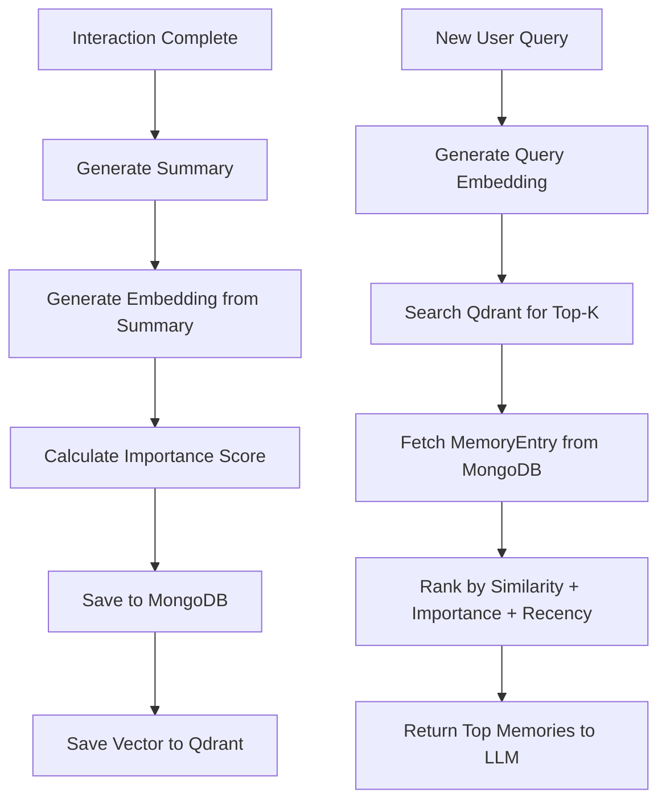

# Part 10: Redesigned Memory Subsystem

**Part 9:** [Documents RAG Server](./part-9-documents-rag.md) | **Table of Contents**

---

## Table of Contents
1. [Why Redesign the Memory Subsystem?](#1-why-redesign-the-memory-subsystem)
2. [Two Independent Systems](#2-two-independent-systems)
3. [Retrieval Memory Architecture](#3-retrieval-memory-architecture)
4. [MemoryEntry Schema](#4-memoryentry-schema)
5. [Interaction Summary](#5-interaction-summary)
6. [Importance Score](#6-importance-score)
7. [Embedding Generation](#7-embedding-generation)
8. [Storage: MongoDB + Qdrant](#8-storage-mongodb--qdrant)
9. [Retrieval Pipeline](#9-retrieval-pipeline)
10. [Conversation History Architecture](#10-conversation-history-architecture)
11. [Conversation Summary](#11-conversation-summary)
12. [Configuration](#12-configuration)
13. [Performance](#13-performance)
14. [Backward Compatibility](#14-backward-compatibility)
15. [Testing](#15-testing)
16. [Migration Guide](#16-migration-guide)

---

## 1. Why Redesign the Memory Subsystem?

### 1.1 Problems with the Original Implementation

The original memory system was a simple **InMemoryStore** with these limitations:

| Problem | Impact |
|---|---|
| No persistence | Memory lost on every server restart |
| No semantic retrieval | Keyword matching misses conceptually related interactions |
| Fixed size cap (200 entries) | Old memories discarded regardless of importance |
| No memory ranking | Could not prioritize important or recent memories |
| Single storage backend | Could not scale beyond available RAM |
| No user isolation | All users shared the same memory pool |

### 1.2 Design Goals

1. **Persistent storage** — Memories survive server restarts
2. **Semantic retrieval** — Find conceptually relevant memories, not just keyword matches
3. **Memory ranking** — Rank by semantic similarity + importance score + recency
4. **User isolation** — Each user only sees their own memories
5. **Scalability** — Handle tens of thousands of memories efficiently
6. **Modular architecture** — AI pipeline stays decoupled from storage layer

---

## 2. Two Independent Systems

The redesign introduces **two completely separate memory systems** that serve different purposes:

### Retrieval Memory
- **Purpose:** Long-term semantic memory across sessions
- **Technology:** MongoDB (source of truth) + Qdrant (vector search)
- **Contains:** Immutable `MemoryEntry` documents
- **Used by:** Brain to retrieve relevant past interactions
- **Example:** User once asked about Planner architecture — store the summary and embedding for future retrieval

### Conversation History
- **Purpose:** Maintain current session context
- **Technology:** MongoDB only
- **Contains:** Session document + messages + evolving summary
- **Used by:** Brain to provide conversational continuity
- **Example:** User asked 5 questions in the current chat — maintain recent messages + evolving summary

### Clear Separation Rule

```
Retrieval Memory ≠ Conversation History
```

- Retrieval Memory stores **reusable knowledge** (cross-session)
- Conversation History stores **session flow** (intra-session)
- Never mix these systems
- Use different MongoDB collections
- Use different retrieval strategies

---

## 3. Retrieval Memory Architecture

### 3.1 Flow Diagram



### 3.2 Component Overview

| Component | Responsibility | Location |
|---|---|---|
| `MemoryEntry` | Data model for stored memory | `internal/memory/memory.go` |
| `MemoryStore` | Interface for storage operations | `internal/memory/memory.go` |
| `MongoDBStore` | Persistence layer | `internal/memory/mongodb_store.go` |
| `QdrantClient` | Vector similarity search | `internal/memory/qdrant.go` |
| `GroqEmbeddingGenerator` | Embedding generation via Groq | `internal/memory/embedding.go` |
| `InteractionSummaryGenerator` | Generate 1-3 sentence summaries | `internal/memory/summary.go` |
| `ImportanceScorer` | Rate interaction importance 0.1-1.0 | `internal/memory/importance.go` |
| `RetrievalPipeline` | Orchestrates search + ranking | `internal/memory/retrieval.go` |

---

## 4. MemoryEntry Schema

Every completed interaction creates **one immutable** `MemoryEntry`.

### Schema Definition

```go
type MemoryEntry struct {
    MemoryID        string    `json:"memory_id" bson:"memory_id"`
    UserID          string    `json:"user_id" bson:"user_id"`
    SessionID       string    `json:"session_id" bson:"session_id"`
    Query           string    `json:"query" bson:"query"`
    Answer          string    `json:"answer" bson:"answer"`
    Summary         string    `json:"summary" bson:"summary"`
    ImportanceScore float64   `json:"importance_score" bson:"importance_score"`
    ToolsUsed       []string  `json:"tools_used" bson:"tools_used"`
    CreatedAt       time.Time `json:"created_at" bson:"created_at"`
}
```

### Field Descriptions

| Field | Description | Required | Immutable? |
|---|---|---|---|
| `memory_id` | SHA-256 hash of query + timestamp | Yes | Never updated |
| `user_id` | Authenticated user identifier | Yes | Never updated |
| `session_id` | Session that produced this entry | Yes | Never updated |
| `query` | Original user question | Yes | Never updated |
| `answer` | AI's response | Yes | Never updated |
| `summary` | 1-3 sentence condensed summary | Yes | Never updated |
| `importance_score` | 0.1 - 1.0 importance rating | Yes | Never updated |
| `tools_used` | List of tools invoked | Yes | Never updated |
| `created_at` | When the interaction occurred | Yes | Never updated |

### Immutability Rule

```
Once a MemoryEntry is created, NEVER update it.
```

- No updates to query, answer, or summary
- No edits to importance score
- No modification of tools used
- Deletion is the only mutation allowed

---

## 5. Interaction Summary

### 5.1 Requirements

After every completed interaction, generate **one concise summary**:

- **Length:** 1-3 sentences
- **Content:** Important concepts only
- **Noise removal:** Strip conversational filler
- **Immutability:** Summary is never regenerated

### 5.2 Generation Process

```
1 completed interaction
        ↓
Generate 1-3 sentence summary
        ↓
Store summary in MemoryEntry
        ↓
Pass summary (not full answer) to embedding model
```

### 5.3 Example

**User Query:** "Explain how the Planner works"

**Assistant Answer:** "The Planner decomposes your goal into a list of executable tasks, determines their dependencies, and executes them in parallel where possible. Each task is called through the Gateway tool calling system, and failed tasks can be retried with alternative tools."

**Generated Summary:**
"Discussion about Planner architecture and task decomposition strategy with parallel execution and retry logic."

### 5.4 Summary Generation Strategy

The summary is generated by sending the query + answer + tools used to an LLM with a focused prompt. If the LLM call fails, a fallback summary is generated programmatically:

```
Fallback: "Interaction about {query} involved using {tools}."
```

---

## 6. Importance Score

Every interaction receives an **importance score** between 0.1 and 1.0.

### 6.1 Scoring Criteria

| Priority | Keywords | Score Delta | Examples |
|---|---|---|---|
| Very High | password, secret, token, key, credential | +0.2 | "remember my API key", "set up authentication" |
| High | preference, must, required, essential, important | +0.2 | "I prefer metric units", "this is important" |
| Medium | architecture, design, pattern, decision | +0.1 | "explain the architecture", "design pattern" |
| Default | (no keywords matched) | +0.0 | General conversation |
| + Bonus | Tools were used | +0.1 | Any tool invocation |

### 6.2 Scoring Example

**Query:** "What is my API token for GitHub?"
**Importance:** **Very High** — contains "token" and "key" keywords

**Query:** "Hello"
**Importance:** **Low** — no keywords, no tools used

### 6.3 Usage

The importance score is combined with semantic similarity during retrieval ranking. Higher importance memories rank higher, ensuring critical information is retrieved first.

---

## 7. Embedding Generation

### 7.1 Rule: One Interaction → One Summary → One Embedding

```
Individual Interaction
        ↓
  Generate Summary (1-3 sentences)
        ↓
  Generate Embedding from Summary ONLY
        ↓
Store Vector in Qdrant
```

### 7.2 What Gets Embedded

| Embed | Don't Embed |
|---|---|
| Interaction summary | Full answer text |
| | Complete conversation |
| | Growing session summary |
| | Query text |
| | Tools used list |

### 7.3 Embedding Model

The system uses Groq's LLM API for embedding generation. The model is configurable:

```yaml
memory:
  embedding_model: "llama-3.3-70b-versatile"
```

### 7.4 Why Only the Summary?

Embedding the full answer introduces noise (raw data, tool results, formatting). Embedding the summary captures the **semantic essence** of the interaction, making retrieval more accurate.

---

## 8. Storage: MongoDB + Qdrant

### 8.1 MongoDB — Source of Truth

MongoDB stores the complete `MemoryEntry` document:

```
mongodb://localhost:27017/mcp_gateway/memories
```

**Stored in MongoDB:**
- memory_id
- user_id
- session_id
- query
- answer
- summary
- importance_score
- tools_used
- created_at

### 8.2 Qdrant — Vector Search Only

Qdrant stores only vectors and metadata for semantic search:

**Stored in Qdrant:**
- `vector` — the embedding vector
- `memory_id` — reference to MongoDB document
- `user_id` — for payload filtering

**NOT stored in Qdrant:**
- answer text
- query text
- summary text
- tools_used
- importance_score

### 8.3 Storage Flow

```
1. New MemoryEntry created
2. Insert into MongoDB (full document)
3. Extract summary embedding
4. Upsert vector into Qdrant (vector + memory_id + user_id)
```

### 8.4 Why This Split?

| Database | Purpose | Data Type |
|---|---|---|
| MongoDB | Document storage, full-text retrieval | JSON documents |
| Qdrant | Vector similarity search | Float vectors + metadata |

MongoDB is the authoritative source. Qdrant is optimized for the one thing it does best: finding vectors that are semantically similar.

---

## 9. Retrieval Pipeline

### 9.1 Pipeline Flow

```
User Query
    ↓
1. Generate Embedding from Query
    ↓
2. Search Qdrant (user_id filtered)
    ↓
3. Get Top-K memory_ids from Qdrant
    ↓
4. Fetch MemoryEntry documents from MongoDB
    ↓
5. Rank by Combined Score:
   score = 0.6 × semantic_similarity + 0.4 × importance_score
    ↓
6. Return Highest-Ranked Memories
    ↓
7. Pass to LLM with summaries + original queries + original answers
```

### 9.2 Retrieval Output Format

Each retrieved memory sent to the LLM includes:

```
Past interaction 1:
  User asked: How to set up authentication?
  I answered: Authentication is configured using...
  Summary: Discussion about authentication setup.
  Importance: 0.9
  Tools used: get_user, add_note
```

### 9.3 Ranking Strategy

The combined ranking formula:

```
final_score = (0.6 × semantic_similarity) + (0.4 × importance_score)
```

With optional recency weighting:

```
final_score = (0.6 × semantic_similarity) + (0.3 × importance_score) + (0.1 × recency_score)
```

### 9.4 Retrieval Configuration

```yaml
memory:
  retrieval_top_k: 5  # Number of memories to retrieve
```

---

## 10. Conversation History Architecture

### 10.1 Purpose

Conversation History maintains **session flow** during the current interaction. It is NOT retrieval memory.

```
Session Document
    ↓
    ├── Messages (chronological list)
    ├── Conversation Summary (evolving)
    └── Metadata (user_id, created_at, message_count)
```

### 10.2 MongoDB Collections

Collection | Purpose | Key Fields
---|---|---
`chat_sessions` | Session documents | session_id, user_id, summary, message_count
`chat_messages` | Individual messages | session_id, user_id, role, content, timestamp

### 10.3 Session Document

```json
{
  "session_id": "abc123",
  "user_id": "user456",
  "created_at": "2026-07-29T12:00:00Z",
  "updated_at": "2026-07-29T12:30:00Z",
  "summary": "User discussed memory system architecture...",
  "message_count": 15
}
```

### 10.4 Message Document

```json
{
  "message_id": "msg001",
  "session_id": "abc123",
  "user_id": "user456",
  "role": "user",
  "content": "What is retrieval memory?",
  "timestamp": "2026-07-29T12:05:00Z"
}
```

---

## 11. Conversation Summary

### 11.1 Conversation Summary ≠ Interaction Summary

| Property | Interaction Summary | Conversation Summary |
|---|---|---|
| Granularity | Per interaction | Per session |
| Content | 1-3 sentences about one exchange | Topics, decisions, conclusions |
| Updates | Never updated (immutable) | Evolves over session |
| Purpose | Semantic retrieval | Session context |

### 11.2 What Goes in Conversation Summary

- Important discussion topics
- Decisions made
- Conclusions reached
- Unresolved questions
- Current context/state

### 11.3 Update Strategy

The conversation summary is **NOT** regenerated after every assistant response. It updates only when:

| Trigger | Default Value | Configurable? |
|---|---|---|
| Message threshold exceeded | 20 messages | Yes |
| Token threshold exceeded | 8000 tokens | Yes |
| Recent-message window overflow | Yes | Yes |

### 11.4 Retrieval Strategy

When a new user message arrives, the system loads:

1. **Conversation summary** — evolving session context
2. **Last N recent messages** — configurable window (default 20)
3. **Current user message** — the new query

All three are sent to the LLM for context-aware response generation.

---

## 12. Configuration

All memory-related settings are configurable in `config.yaml`:

```yaml
memory:
  retrieval_top_k: 5                    # Number of memories to retrieve
  embedding_model: "llama-3.3-70b-versatile"
  qdrant_url: "http://localhost:6333"
  qdrant_collection: "mcp_memories"
  qdrant_api_key: ""
  mongodb_memory_collection: "memories"
  groq_api_key: ""

conversation:
  recent_message_window: 20              # Max recent messages to load
  conversation_summary_message_threshold: 20
  conversation_summary_token_threshold: 8000
  mongodb_chat_collection: "chat_sessions"
```

### Configuration Reference

| Setting | Default | Description |
|---|---|---|
| `retrieval_top_k` | 5 | Number of retrieved memories |
| `embedding_model` | llama-3.3-70b-versatile | Model for embedding generation |
| `qdrant_url` | http://localhost:6333 | Qdrant server address |
| `qdrant_collection` | mcp_memories | Qdrant collection name |
| `qdrant_api_key` | "" | API key for Qdrant Cloud |
| `mongodb_memory_collection` | memories | MongoDB collection for memories |
| `recent_message_window` | 20 | Recent messages to load per session |
| `conversation_summary_message_threshold` | 20 | Regroup summary after N messages |
| `conversation_summary_token_threshold` | 8000 | Regroup summary after N tokens |
| `mongodb_chat_collection` | chat_sessions | MongoDB collection for chat sessions |

---

## 13. Performance

### 13.1 MongoDB Indexes

**Memories collection (`memories`):**
- `{ user_id: 1 }` — filter memories by user
- `{ session_id: 1 }` — find memories by session
- `{ created_at: -1 }` — sort by recency
- `{ importance_score: -1 }` — sort by importance
- Compound: `{ user_id: 1, created_at: -1 }` — user + recency

**Chat sessions collection (`chat_sessions`):**
- `{ session_id: 1 }` — lookup by session ID
- `{ user_id: 1 }` — find all sessions for a user
- `{ updated_at: -1 }` — sort by most recent

**Chat messages collection (`chat_messages`):**
- `{ session_id: 1, timestamp: 1 }` — ordered by time within session
- `{ user_id: 1 }` — find messages by user

### 13.2 Qdrant Payload Filtering

When searching Qdrant, results are filtered by `user_id` using payload filters:

```json
{
  "filter": {
    "must": [
      { "key": "user_id", "match": { "keyword": "user123" } }
    ]
  }
}
```

This ensures users only retrieve their own memories, even in a shared Qdrant instance.

### 13.3 Scaling Considerations

- Qdrant handles vector search efficiently at scale (thousands to millions of vectors)
- MongoDB indexes ensure fast document retrieval by memory_id
- The retrieval pipeline fetches only Top-K memory IDs from Qdrant, then fetches corresponding full documents from MongoDB
- This two-step approach (Qdrant → MongoDB) is more efficient than fetching full documents for every vector search result

---

## 14. Backward Compatibility

### 14.1 Existing AI Pipeline Continues Working

The redesign preserves the existing AI pipeline:

```
Brain → Retrieval Memory → Planner → Executor → Tool Execution → LLM
```

No changes to the Brain, Planner, Executor, or Tool Execution logic.

### 14.2 MemoryStore Interface

The `MemoryStore` interface provides the same contract:

| Method | Old | New |
|---|---|---|
| `Save` | Yes | Yes (expanded MemoryEntry) |
| `QueryRelevant` | Yes | Replaced by `Retrieve` (with userID) |
| `GetRecent` | Yes | Yes (now by sessionID) |
| `Clear` | Yes | Yes |
| `Delete` | No | Yes |
| `ListByUser` | No | Yes |
| `ListAll` | No | Yes |

### 14.3 Brain and Orchestrator Integration

- `Brain.WithMemory(memory.MemoryStore)` — same method, new implementation
- `Brain.RetrieveRelevantMemories(query, userID)` — now includes userID parameter
- Orchestrator saves `memory.MemoryEntry` with all new fields on completion

---

## 15. Testing

### 15.1 Unit Tests Added

| Test File | Coverage |
|---|---|
| `internal/memory/memory_test.go` | Importance scoring, memory ID generation, fallback summary, truncation |
| `internal/conversation/conversation_test.go` | Summary trigger logic, summary generation, fallback behavior |

### 15.2 Test Coverage Areas

- Memory importance scorer boundary values
- Memory ID determinism and uniqueness
- Summary generation with and without LLM client
- Conversation summary should/should not triggers
- Retrieval ranking formula components
- MongoDB filter construction
- Qdrant payload filter construction

---

## 16. Migration Guide

### From InMemoryStore to MongoDB + Qdrant

1. **Start MongoDB:**
   ```bash
   mongod --dbpath ./data/db
   ```

2. **Start Qdrant (optional, for semantic search):**
   ```bash
   docker run -p 6333:6333 qdrant/qdrant
   ```

3. **Update `config.yaml`:**
   ```yaml
   memory:
     retrieval_top_k: 5
     embedding_model: "llama-3.3-70b-versatile"
     qdrant_url: "http://localhost:6333"
     qdrant_collection: "mcp_memories"
     mongodb_memory_collection: "memories"
   ```

4. **Set MongoDB URI:**
   ```bash
   export MONGO_URI="mongodb://localhost:27017"
   ```

5. **Run the gateway:**
   ```bash
   go run main.go
   ```

### Migration Notes

| Aspect | Old (InMemoryStore) | New (MongoDB + Qdrant) |
|---|---|---|
| Persistence | Lost on restart | Permanent |
| Retrieval | Keyword matching | Semantic + importance + recency |
| User isolation | None | Per-user via user_id filter |
| Scalability | Limited by RAM | Handles millions of memories |
| Dependencies | None | MongoDB + optional Qdrant |
| Configuration | None | YAML config section |

---

*See the [AI Chat System](./part-5-ai-chat-system.md) for how memory integrates with the Brain pipeline, and [Authentication](./part-6-authentication.md) for user_id resolution.*
