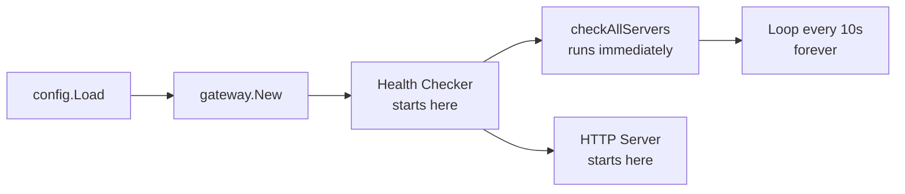
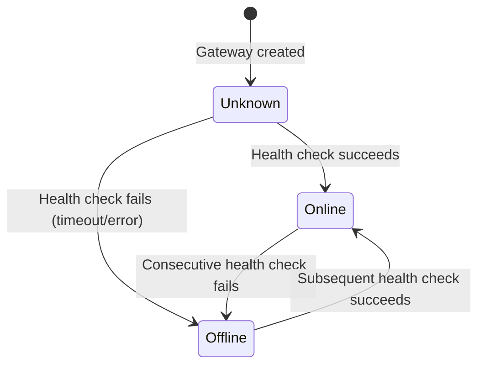
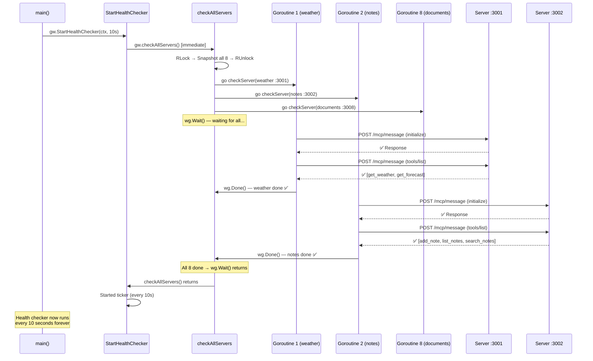
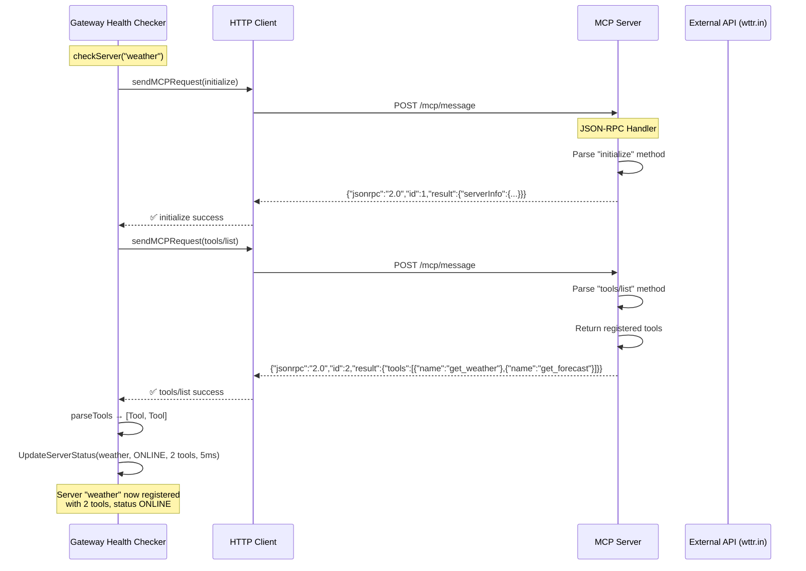
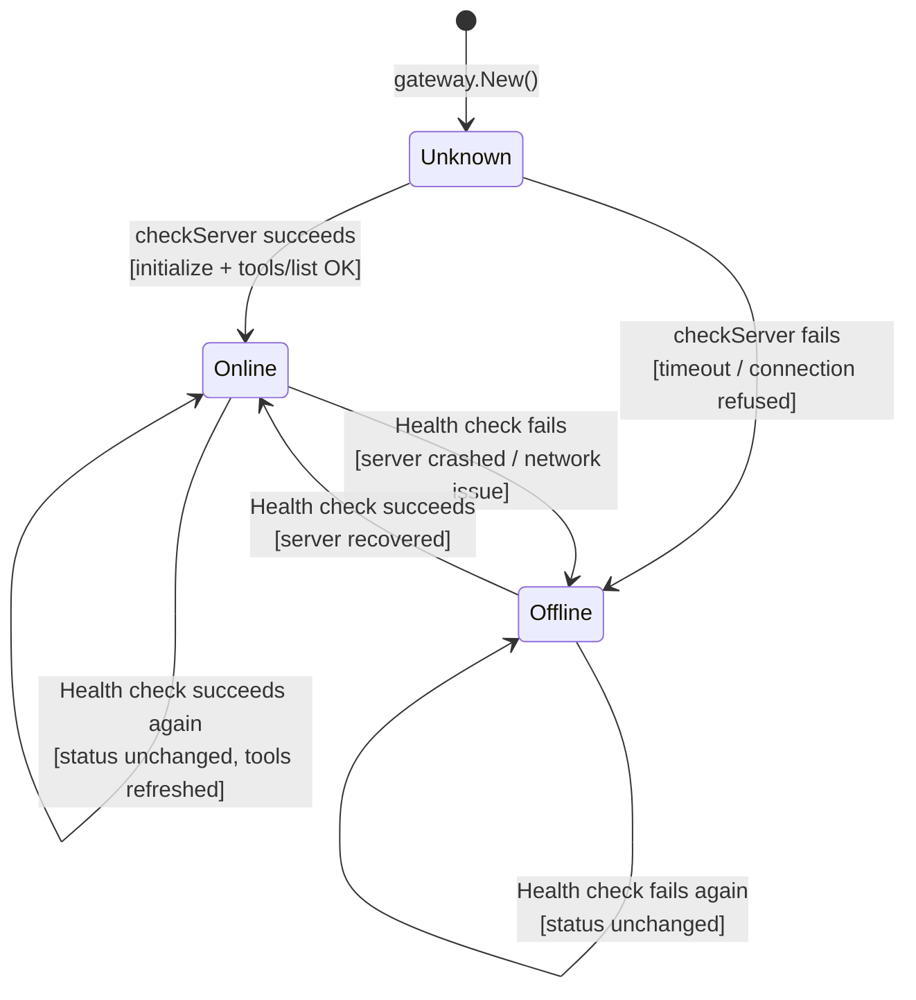

# Part 2: The Health Checker — Server Discovery & Status Tracking

## Table of Contents
1. [Architecture Overview](#1-architecture-overview)
2. [StartHealthChecker — The Entry Point](#2-starthealthchecker--the-entry-point)
3. [checkAllServers — Snapshot & Launch](#3-checkallservers--snapshot--launch)
4. [Goroutines & WaitGroups — Concurrent Checking](#4-goroutines--waitgroups--concurrent-checking)
5. [checkServer — The Actual HTTP Ping](#5-checkserver--the-actual-http-ping)
6. [MCP Protocol — Initialize & tools/list](#6-mcp-protocol--initialize--toolslist)
7. [Status Transition: Unknown → Online/Offline](#7-status-transition-unknown--onlineoffline)
8. [Full Execution Flow](#8-full-execution-flow)
9. [Interview Questions & Answers](#9-interview-questions--answers)
10. [Diagrams](#10-diagrams)

---

## 1. Architecture Overview

### The Role of the Health Checker

The health checker is the **bridge between Part 1 and Part 3**:

```
Part 1 (Config Loading):  All servers → StatusUnknown, Tools: []
         │
         ▼
Part 2 (Health Checker):  Ping each server → StatusOnline/Offline, Tools: [actual tools]
         │
         ▼
Part 3 (HTTP Server):     Dashboard shows real-time status, routes tool calls correctly
```

Without the health checker, the gateway would have 8 servers with **unknown** status and **no tools** — completely useless.

### Where it fits in the lifecycle



The health checker is started at `main.go:105`, runs once immediately, then loops every 10 seconds for the entire lifetime of the application.

---

## 2. StartHealthChecker — The Entry Point

### The Code (healthcheck.go:41-61)

```go
func (gw *Gateway) StartHealthChecker(ctx context.Context, interval time.Duration) {
    gw.checkAllServers()  // Run once immediately

    go func() {
        ticker := time.NewTicker(interval)
        defer ticker.Stop()

        for {
            select {
            case <-ctx.Done():
                log.Println("Health checker stopped")
                return
            case <-ticker.C:
                gw.checkAllServers()
            }
        }
    }()

    log.Printf("Health checker started (interval: %s)", interval)
}
```

### Breaking Down the Function Signature

```go
func (gw *Gateway) StartHealthChecker(ctx context.Context, interval time.Duration) {
```

| Part | Meaning |
|------|---------|
| `func` | This is a function |
| `(gw *Gateway)` | **Receiver** — this function belongs to the Gateway type. You call it as `gw.StartHealthChecker(...)` |
| `StartHealthChecker` | Function name (exported, so other packages can call it) |
| `ctx context.Context` | A **context** — like a "remote control" that can send cancel signals. When ctx is cancelled, the health checker stops |
| `interval time.Duration` | How often to check (e.g., 10 seconds) |

### What is a Context?

A `context.Context` is Go's way of managing long-running operations. Think of it as:

```
Context = A walkie-talkie that can say "STOP EVERYTHING!"
```

When the user presses Ctrl+C in the terminal:
1. Go catches the signal
2. It cancels the context (`ctx.Done()` channel closes)
3. The health checker receives the cancellation signal
4. It stops the ticker and exits cleanly

This is called **graceful shutdown** — instead of killing the program abruptly, it lets everything clean up properly.

### Why `go func()`?

```go
go func() {
    ticker := time.NewTicker(interval)
    ...
}()
```

The `go` keyword launches a **goroutine** — a lightweight thread. Without it, the function would block forever inside the for loop, and the rest of the program (HTTP server, etc.) would never start.

### The select Statement

```go
select {
case <-ctx.Done():
    // Context was cancelled → stop
    return
case <-ticker.C:
    // 10 seconds passed → run check
    gw.checkAllServers()
}
```

`select` is like a **switch statement for channels**. It waits until one of the cases is ready:

```
Time ─────────────────────────────────────────────────────→

ticker.C:  ──────[10s]──────[10s]──────[10s]──────[10s]──→
                    │         │         │         │
                    ▼         ▼         ▼         ▼
               checkAll  checkAll  checkAll  checkAll

ctx.Done():  ────────────────────────────────────[Ctrl+C]─
                                                   │
                                                   ▼
                                              Stop & return
```

---

## 3. checkAllServers — Snapshot & Launch

### The Code (healthcheck.go:67-96)

```go
func (gw *Gateway) checkAllServers() {
    // Step 1: Read-lock and snapshot
    gw.mu.RLock()
    type serverSnapshot struct {
        name string
        cfg  ConnectedServer
    }
    snapshots := make([]serverSnapshot, 0, len(gw.servers))
    for name, s := range gw.servers {
        snapshots = append(snapshots, serverSnapshot{name: name, cfg: *s})
    }
    gw.mu.RUnlock()

    // Step 2: Launch concurrent checks
    var wg sync.WaitGroup
    for _, snap := range snapshots {
        wg.Add(1)
        go func(name string, s ConnectedServer) {
            defer wg.Done()
            tools, latency, err := gw.checkServer(&s)
            if err != nil {
                gw.UpdateServerStatus(name, StatusOffline, nil, 0)
            } else {
                gw.UpdateServerStatus(name, StatusOnline, tools, latency)
            }
        }(snap.name, snap.cfg)
    }
    wg.Wait()
}
```

### Step 1: The Snapshot (Why?)

```go
gw.mu.RLock()     // Lock for reading
// ... copy all servers ...
gw.mu.RUnlock()   // Unlock
```

**Why take a snapshot instead of reading directly?**

Checking a server takes **seconds** (network timeout is 5 seconds). If we held the lock for 5 seconds per server × 8 servers = 40 seconds, the entire HTTP server would be **frozen** — no dashboard, no tool calls, nothing.

By copying all server entries into a local list and then releasing the lock, we allow other goroutines to read the map freely while the slow pings happen.

```
Without snapshot:
  [Lock acquired] → Ping server 1 (5s) → Ping server 2 (5s) → ... → [Lock released = 40s]
  Dashboard: "I'm waiting..."

With snapshot:
  [Lock acquired] → Copy all 8 (1μs) → [Lock released in 1μs]
  Dashboard: "I can read anytime! ✅"
  Ping server 1, server 2, ... (happens in background)
```

### The serverSnapshot Struct

```go
type serverSnapshot struct {
    name string          // Server name like "weather"
    cfg  ConnectedServer // A COPY of the ConnectedServer (not a pointer)
}
```

This struct is defined **inside the function** — it's a local type used only here. The `*s` in `cfg: *s` means "dereference the pointer and make a copy." This ensures the snapshot is independent of the original map.

### Step 2: The Loop

```go
for _, snap := range snapshots {
    wg.Add(1)
    go func(name string, s ConnectedServer) {
        defer wg.Done()
        // ... check server ...
    }(snap.name, snap.cfg)
}
```

This is the core pattern: for each server, increment the WaitGroup counter and launch a goroutine. The goroutine decrements the counter when done.

---

## 4. Goroutines & WaitGroups — Concurrent Checking

### What is a Goroutine?

A **goroutine** is a lightweight thread managed by Go. Think of it as:

```
Normal code:   You cook one dish at a time
Goroutine:     You hire 8 chefs who each cook one dish simultaneously
```

```go
go func() {
    // This runs in parallel with other goroutines
}()
```

The `go` keyword makes the function call **non-blocking** — it starts running in the background and the program continues immediately.

### What is a WaitGroup?

```go
var wg sync.WaitGroup
```

A `sync.WaitGroup` is a **counter** that blocks until it reaches zero.

```
Methods:
  wg.Add(1)    → Counter += 1  ("I have one more task")
  wg.Done()    → Counter -= 1  ("One task finished")
  wg.Wait()    → Block until counter is 0  ("Wait for everyone")
```

### The Full Concurrent Flow

```
Time ────────────────────────────────────────────────────────────────→

Main goroutine (loop):
  wg.Add(1)  ─── wg.Add(1)  ─── wg.Add(1)  ─── ... ─── wg.Wait() ──→
       │            │            │                                    │
       │ launch     │ launch     │ launch                             │
       ▼            ▼            ▼                                    ▼
Goroutine 1:  [───checkServer("weather")───]
Goroutine 2:               [───checkServer("notes")───]
Goroutine 3:                            [───checkServer("github")───]
...                                                    ...
                                                           All done →
                                                           wg.Wait() returns
```

**Key insight:** All 8 goroutines run **simultaneously**, not sequentially. Total time = time of the slowest server, not the sum of all servers.

### Why Not Sequential?

```go
// BAD: Sequential (takes 8 × 5s = 40s)
for _, snap := range snapshots {
    checkServer(&snap.cfg)  // Waits for each to finish
}

// GOOD: Concurrent (takes ~5s — the slowest one)
for _, snap := range snapshots {
    go checkServer(&snap.cfg)  // All run in parallel
}
wg.Wait()
```

### The defer Keyword

```go
defer wg.Done()
```

`defer` means "run this function when the surrounding function **exits**" — no matter how it exits (normal return, panic, error). This guarantees `wg.Done()` is always called, even if `checkServer` panics.

---

## 5. checkServer — The Actual HTTP Ping

### The Code (healthcheck.go:100-145)

```go
func (gw *Gateway) checkServer(server *ConnectedServer) ([]Tool, time.Duration, error) {
    start := time.Now()  // Start the timer
    mcpURL := server.Config.URL + "/mcp/message"

    // Step 1: Send "initialize" request (MCP handshake)
    initReq := mcpRequest{
        JSONRPC: "2.0",
        ID:      1,
        Method:  "initialize",
        Params: map[string]any{
            "protocolVersion": "2024-11-05",
            "capabilities":    map[string]any{},
            "clientInfo": map[string]any{
                "name":    "mcp-gateway",
                "version": "1.0.0",
            },
        },
    }

    _, err := sendMCPRequest(sharedHealthClient, mcpURL, initReq)
    if err != nil {
        return nil, 0, fmt.Errorf("initialize failed: %w", err)
    }

    // Step 2: Send "tools/list" to discover available tools
    toolsReq := mcpRequest{
        JSONRPC: "2.0",
        ID:      2,
        Method:  "tools/list",
    }

    resp, err := sendMCPRequest(sharedHealthClient, mcpURL, toolsReq)
    if err != nil {
        return nil, 0, fmt.Errorf("tools/list failed: %w", err)
    }

    latency := time.Since(start)

    // Step 3: Parse the tools from the response
    tools, err := parseTools(resp, server.Config.Name)
    if err != nil {
        return nil, latency, fmt.Errorf("failed to parse tools: %w", err)
    }

    return tools, latency, nil
}
```

### What This Function Does

Think of it like a **phone call**:

```
You → Dial weather server at :3001
    → "Hello, are you there? I'm the MCP Gateway." (initialize)
    ← "Yes, I'm here!"
    → "What tools do you offer?" (tools/list)
    ← "I have get_weather and get_forecast."
    → "Great, thanks!" ✓
```

### The Two-Step MCP Handshake

**Step 1 — Initialize:**

```go
initReq := mcpRequest{
    JSONRPC: "2.0",           // Protocol version
    ID:      1,               // Request ID (matches response)
    Method:  "initialize",    // MCP handshake command
    Params: map[string]any{
        "protocolVersion": "2024-11-05",  // MCP version we speak
        "clientInfo": map[string]any{
            "name":    "mcp-gateway",      // Who we are
            "version": "1.0.0",            // Our version
        },
    },
}
```

This follows the **MCP (Model Context Protocol)** standard — a JSON-RPC based protocol. The initialize handshake is like saying: *"Hey, I speak MCP version 2024-11-05, my name is mcp-gateway. Do you speak the same protocol?"*

**Step 2 — tools/list:**

```go
toolsReq := mcpRequest{
    JSONRPC: "2.0",
    ID:      2,
    Method:  "tools/list",
}
```

This asks the server: *"What tools can you give me?"* The server responds with a list like:

```json
{
    "tools": [
        {
            "name": "get_weather",
            "description": "Get current weather for a city"
        },
        {
            "name": "get_forecast",
            "description": "Get 3-day forecast for a city"
        }
    ]
}
```

### The HTTP Client

```go
var sharedHealthClient = &http.Client{Timeout: 5 * time.Second}
```

This is a **shared HTTP client** with a 5-second timeout. If the server doesn't respond in 5 seconds, it's marked offline. The client is shared across all health checks to reuse TCP connections (connection pooling).

### sendMCPRequest (healthcheck.go:148-177)

```go
func sendMCPRequest(client *http.Client, url string, req mcpRequest) (*mcpResponse, error) {
    body, _ := json.Marshal(req)                    // Convert request to JSON
    httpResp, err := client.Post(url, "application/json", bytes.NewReader(body))
    if err != nil {
        return nil, fmt.Errorf("HTTP request failed: %w", err)
    }
    defer httpResp.Body.Close()

    var resp mcpResponse
    json.NewDecoder(httpResp.Body).Decode(&resp)   // Parse JSON response

    if resp.Error != nil {
        return nil, fmt.Errorf("MCP error: %v", resp.Error)
    }

    return &resp, nil
}
```

This function:
1. Converts the MCP request to JSON bytes
2. Sends an HTTP POST to the server's `/mcp/message` endpoint
3. Parses the JSON response
4. Checks for MCP-level errors
5. Returns the response

### parseTools (healthcheck.go:180-218)

```go
func parseTools(resp *mcpResponse, serverName string) ([]Tool, error) {
    resultMap := resp.Result.(map[string]any)     // The "result" field
    toolsRaw := resultMap["tools"].([]any)         // The "tools" array

    var tools []Tool
    for _, t := range toolsRaw {
        toolMap := t.(map[string]any)
        name := toolMap["name"].(string)
        desc := toolMap["description"].(string)
        tools = append(tools, Tool{
            Name:        name,
            Description: desc,
            ServerName:  serverName,    // Which server owns this tool
        })
    }
    return tools, nil
}
```

This function:
1. Extracts the `tools` array from the JSON response
2. For each tool, reads `name` and `description`
3. Creates a `Tool` struct with the server name attached
4. Returns the list

**Why attach `ServerName`?** So the router can later answer: *"Which server owns 'get_weather'?"* — by looking at `ServerName`.

---

## 6. MCP Protocol — Initialize & tools/list

### What is MCP?

MCP stands for **Model Context Protocol** — a JSON-RPC based protocol for AI tools. It's like a **universal language** that AI clients and tool servers speak.

```
MCP Message Format:
{
    "jsonrpc": "2.0",      ← Protocol version (always "2.0")
    "id": 1,               ← Request ID (matches request to response)
    "method": "initialize", ← What to do
    "params": {             ← Arguments (optional)
        ...
    }
}
```

### The Initialize Handshake

This is the first thing the health checker sends. It's like a **handshake**:

```
Gateway                          Server
   │                                │
   │── POST /mcp/message ──────────→│
   │   {                             │
   │     "jsonrpc": "2.0",           │
   │     "id": 1,                    │
   │     "method": "initialize",     │
   │     "params": {                 │
   │       "protocolVersion":        │
   │         "2024-11-05",           │
   │       "capabilities": {},       │
   │       "clientInfo": {           │
   │         "name": "mcp-gateway"   │
   │       }                         │
   │     }                           │
   │   }                             │
   │                                │
   │←── Response ───────────────────│
   │   { "result": { "serverInfo":  │
   │       { "name": "weather-mcp" }│
   │     } }                        │
   │                                │
```

### The tools/list Request

After initialize succeeds, the gateway asks for the server's tool list:

```
Gateway                          Server
   │                                │
   │── POST /mcp/message ──────────→│
   │   {                             │
   │     "jsonrpc": "2.0",           │
   │     "id": 2,                    │
   │     "method": "tools/list"      │
   │   }                             │
   │                                │
   │←── Response ───────────────────│
   │   {                             │
   │     "result": {                 │
   │       "tools": [                │
   │         {                       │
   │           "name": "get_weather",│
   │           "description": "..."  │
   │         }                       │
   │       ]                         │
   │     }                           │
   │   }                             │
   │                                │
```

### What Each Server Offers

After the health check completes, the gateway knows:

| Server | Tools |
|--------|-------|
| weather (:3001) | get_weather, get_forecast |
| notes (:3002) | add_note, list_notes, search_notes |
| github (:3003) | get_user, list_repos, get_repo |
| crypto (:3004) | get_price, get_market_data |
| news (:3005) | get_headlines, search_news |
| url-tools (:3006) | shorten_url, expand_url |
| search (:3007) | search_web |
| documents (:3008) | upload_document, query_documents |

---

## 7. Status Transition: Unknown → Online/Offline

### The Three-State System



### How Status Changes

After the goroutine calls `checkServer()`:

```go
if err != nil {
    // Server didn't respond → mark OFFLINE
    gw.UpdateServerStatus(name, StatusOffline, nil, 0)
} else {
    // Server responded → mark ONLINE with tools
    gw.UpdateServerStatus(name, StatusOnline, tools, latency)
}
```

### UpdateServerStatus (gateway.go:136-148)

```go
func (gw *Gateway) UpdateServerStatus(name string, status ServerStatus, tools []Tool, latency time.Duration) {
    gw.mu.Lock()     // WRITE lock — exclusive access
    defer gw.mu.Unlock()

    if s, exists := gw.servers[name]; exists {
        s.Status = status       // "online" or "offline"
        s.LastCheck = time.Now() // When we checked
        s.Latency = latency      // How long it took
        if tools != nil {
            s.Tools = tools     // Save the discovered tools
        }
    }
}
```

This uses a **write lock** (`Lock()` not `RLock()`), because it's modifying the map's contents. Only one writer can be active at a time.

### The Memory Change

**Before health check:**
```
servers["weather"] = {
    Status:    "" (unknown)
    Tools:     [] (empty)
    LastCheck: Jan 1, year 1 (never)
    Latency:   0
}
```

**After successful health check:**
```
servers["weather"] = {
    Status:    "online" ✓
    Tools:     ["get_weather", "get_forecast"]
    LastCheck: 2026-07-24 12:18:28
    Latency:   5ms
}
```

---

## 8. Full Execution Flow

### Complete Trace



### What Happens After

Back in `main.go`, after `StartHealthChecker` returns (it returns immediately because the loop is in a goroutine), the code continues:

```go
// main.go:108-118
port := cfg.Gateway.Port       // 8080
approvalStore := approval.NewStore(5 * time.Minute)

srv := server.New(gw, reqLogger, brain, authenticator, port)
srv.WithApprovalStore(approvalStore)
srv.Start()  // ← This blocks forever (listening on port 8080)
```

The HTTP server starts listening. Meanwhile, the health checker's background goroutine keeps running, pinging servers every 10 seconds and updating their status.

---

## 9. Interview Questions & Answers

### Q1: "Explain how the health checker works in the MCP Gateway."

> The health checker is responsible for discovering which servers are alive and what tools they offer. It's started at `main.go:105` with `gw.StartHealthChecker(ctx, 10*time.Second)`. This function does two things:
>
> 1. **Runs immediately** — calls `checkAllServers()` right away to get initial status
> 2. **Runs every 10 seconds** — launches a background goroutine with a ticker that calls `checkAllServers()` periodically
>
> Inside `checkAllServers()`, the gateway first takes a read-locked snapshot of all servers to avoid holding the lock during slow network calls. Then it launches a **goroutine for each server** — all 8 are pinged concurrently using a `sync.WaitGroup` to coordinate completion.
>
> Each goroutine calls `checkServer()`, which sends two MCP JSON-RPC requests via HTTP POST:
> - **`initialize`** — MCP handshake to confirm the server is alive and speaks the same protocol
> - **`tools/list`** — discovers what tools the server offers
>
> If both succeed, the server is marked **online** and its tools are registered. If either fails (timeout, connection refused, etc.), the server is marked **offline**. The entire process uses a shared HTTP client with a 5-second timeout to fail fast on unresponsive servers.
>
> This design ensures the gateway always has up-to-date status without blocking other operations, since checking is done concurrently and the map is only locked briefly during snapshot and status updates.

### Q2: "Why use goroutines instead of checking servers sequentially?"

> Checking servers sequentially would take `N × timeout` time — if we have 8 servers with 5-second timeouts, that's 40 seconds before we know any server's status. The dashboard would show "unknown" for 40 seconds on startup.
>
> By using goroutines, all 8 servers are checked **concurrently**. The total time is approximately the timeout of the **slowest** server (about 5 seconds), not the sum of all 8. This is a classic fan-out concurrency pattern.
>
> The `sync.WaitGroup` provides coordination: the main goroutine increments the counter for each server (`wg.Add(1)`), each worker decrements it when done (`wg.Done()`), and `wg.Wait()` blocks until all workers finish. This ensures the health check completes before the function returns, even though all workers run in parallel.

### Q3: "Explain the role of `sync.RWMutex` in the health checker."

> The Gateway's servers map is shared state accessed by multiple goroutines. The health checker needs to **read** the map (to get the list of servers) and **write** to it (to update statuses). HTTP handlers also **read** the map to serve dashboard requests.
>
> The RWMutex is used differently in each phase:
> - **During snapshot** (`checkAllServers`): `RLock()` allows other readers to proceed while we copy the server list. We only hold the lock for microseconds (just a map iteration), not for the entire network call.
> - **During status update** (`UpdateServerStatus`): `Lock()` provides exclusive access while we modify a server's status, tools, and latency fields.
>
> This is more efficient than a regular Mutex because multiple dashboard refreshes can read the map simultaneously without blocking each other.

### Q4: "What happens if a server is down during health check?"

> If a server doesn't respond within 5 seconds (the HTTP client timeout), `sendMCPRequest` returns an error. The goroutine catches this and calls `UpdateServerStatus(name, StatusOffline, nil, 0)`, which sets the server's status to "offline" and clears its tools.
>
> On the next health check cycle (10 seconds later), the gateway tries again. If the server has recovered, it transitions back to "online." This means the gateway is **self-healing** — it automatically detects when servers come back up without manual intervention.
>
> The dashboard reflects this in real-time, showing green for online servers and red for offline ones. Tool calls routed to offline servers will fail with a clear error message.

### Q5: "Explain the MCP initialize handshake."

> The initialize request is the first message in the MCP protocol. It's like a **capability negotiation** — the client (gateway) tells the server who it is and what protocol version it speaks, and the server responds with its own information.
>
> In our code:
> ```go
> initReq := mcpRequest{
>     Method: "initialize",
>     Params: map[string]any{
>         "protocolVersion": "2024-11-05",
>         "clientInfo": map[string]any{
>             "name":    "mcp-gateway",
>             "version": "1.0.0",
>         },
>     },
> }
> ```
>
> This establishes a baseline: both sides know they're communicating over MCP version 2024-11-05. The server can also declare its capabilities (like streaming support), though our servers keep it simple.
>
> The initialize request serves double duty: it's both a **health check** (if the server responds, it's alive) and a **protocol negotiation** (ensuring compatibility).

### Q6: "How does `parseTools` work?"

> After receiving the `tools/list` response, `parseTools` extracts the tool definitions from the JSON structure. The response has a specific format:
>
> ```json
> { "result": { "tools": [{ "name": "...", "description": "..." }, ...] } }
> ```
>
> The function uses **type assertions** to navigate this nested structure:
> - `resp.Result.(map[string]any)` — asserts the result field is a map
> - `resultMap["tools"].([]any)` — asserts the tools field is an array
> - Each array element is asserted as a map to extract `name` and `description`
>
> Each tool is wrapped in a `Tool` struct with the `ServerName` field set, enabling the router to later answer: *"Which server owns tool X?"* This is the core of the tool aggregation system.

### Q7: "How does the ticker-based loop work for periodic checking?"

> After the initial immediate check, `StartHealthChecker` enters an infinite loop:
>
> ```go
> ticker := time.NewTicker(interval) // Fires every 10 seconds
> for {
>     select {
>     case <-ctx.Done():
>         return  // Graceful shutdown
>     case <-ticker.C:
>         gw.checkAllServers()  // Run check
>     }
> }
> ```
>
> `time.NewTicker` creates a channel that delivers a value every `interval` (10 seconds). The `select` statement waits for either:
> - A ticker event → run the check
> - Context cancellation → stop cleanly
>
> This is more efficient than `time.Sleep()` because it's responsive to cancellation — if the program needs to shut down, it doesn't have to wait for the current sleep to finish.

### Q8: "What edge cases does the health checker handle?"

> Several edge cases are covered:
>
> 1. **Server never started** — HTTP connection refused → error → StatusOffline
> 2. **Server crashes mid-operation** — TCP connection reset → error → StatusOffline
> 3. **Server starts late** — First check fails, next cycle succeeds → transitions to Online
> 4. **Network timeout** — HTTP client 5s timeout → error → StatusOffline
> 5. **Context cancellation** — SIGINT/SIGTERM → `ctx.Done()` → clean shutdown
> 6. **Concurrent access** — RWMutex prevents data races
> 7. **Duplicate tool names** — `parseTools` skips duplicates with a warning
> 8. **No tools returned** — Server is online but offers no tools (valid state)
>
> The Fail Fast principle applies: if a server is unreachable, it's marked offline immediately rather than being retried in the same cycle.

---

## 10. Diagrams

### Health Checker Architecture

```mermaid
graph TB
    subgraph "main.go"
        M[main function]
        M -->|line 105| HSCall[gw.StartHealthChecker]
    end

    subgraph "healthcheck.go"
        SHC[StartHealthChecker]
        SHC -->|immediate| CAS[checkAllServers]
        SHC -->|background goroutine| TICKER[Ticker every 10s]
        TICKER -->|tick| CAS

        CAS -->|Step 1| SNAP[RLock → Snapshot → RUnlock]
        CAS -->|Step 2| LOOP[Loop over snapshots]
        LOOP -->|for each server| WG[wg.Add(1)]
        WG -->|launch| GOR[go func: checkServer]
        GOR -->|result| UPDATE[UpdateServerStatus<br/>Online or Offline]
        UPDATE -->|wg.Done| WAIT[wg.Wait]
    end

    subgraph "MCP Protocol"
        CS[checkServer]
        CS -->|1| INIT[sendMCPRequest: initialize]
        CS -->|2| TL[sendMCPRequest: tools/list]
        CS -->|3| PT[parseTools]
    end

    subgraph "gateway.go"
        US[UpdateServerStatus]
        US -->|Lock| WRITE[Write to servers map]
        WRITE -->|Unlock| DONE[✓ Updated]
    end

    subgraph "HTTP Server"
        DASH[Dashboard]
        DASH -->|reads| LS[ListServers]
    end

    LS -.->|RLock| READ[Read servers map]
```

### Goroutine Lifecycle

```mermaid
sequenceDiagram
    participant Main as checkAllServers
    participant Loop as for loop
    participant WG as WaitGroup
    participant G1 as Goroutine (weather)
    participant G2 as Goroutine (notes)
    participant S1 as Server :3001
    participant S2 as Server :3002

    Loop->>WG: wg.Add(1) — counter: 0→1
    Loop->>G1: go func(weather)
    Note over G1: Goroutine starts

    Loop->>WG: wg.Add(1) — counter: 1→2
    Loop->>G2: go func(notes)
    Note over G2: Goroutine starts

    Note over Main: wg.Wait() — counter=2, block

    G1->>S1: initialize + tools/list (5s)
    S1-->>G1: ✅ success
    G1->>WG: wg.Done() — counter: 2→1

    G2->>S2: initialize + tools/list (3s)
    S2-->>G2: ✅ success
    G2->>WG: wg.Done() — counter: 1→0

    Note over Main: counter=0 → wg.Wait() returns
    Main->>Main: checkAllServers() complete
```

### MCP Message Flow



### Status State Machine



### Time Comparison: Sequential vs Concurrent

```mermaid
gantt
    title Sequential (40s) vs Concurrent (5s)
    dateFormat  X
    axisFormat %s

    section Sequential
    Ping weather   : 0, 5
    Ping notes     : 5, 10
    Ping github    : 10, 15
    Ping crypto    : 15, 20
    Ping news      : 20, 25
    Ping url-tools : 25, 30
    Ping search    : 30, 35
    Ping documents : 35, 40

    section Concurrent
    Ping weather   : 0, 5
    Ping notes     : 0, 3
    Ping github    : 0, 4
    Ping crypto    : 0, 5
    Ping news      : 0, 2
    Ping url-tools : 0, 5
    Ping search    : 0, 4
    Ping documents : 0, 5
```



---

## Quick Reference

### Key Files

| File | Purpose |
|------|---------|
| `main.go` (line 105) | Starts the health checker |
| `internal/gateway/healthcheck.go` | All health check logic |
| `internal/gateway/gateway.go` | UpdateServerStatus method |

### Key Functions

| Function | Called from | What it does |
|----------|-------------|--------------|
| `StartHealthChecker(ctx, 10s)` | main.go | Sets up initial check + periodic loop |
| `checkAllServers()` | StartHealthChecker | Snapshots server list, launches goroutines |
| `checkServer(*ConnectedServer)` | Each goroutine | Sends HTTP pings to one server |
| `sendMCPRequest(client, url, req)` | checkServer | Low-level HTTP + JSON-RPC call |
| `parseTools(response, serverName)` | checkServer | Extracts tool names from JSON |
| `UpdateServerStatus(name, status, tools, latency)` | Each goroutine | Writes result back to Gateway map |

### Key Variables

| Variable | Type | Purpose |
|----------|------|---------|
| `sharedHealthClient` | `*http.Client` | Shared HTTP client with 5s timeout |
| `wg` | `sync.WaitGroup` | Coordinates 8 concurrent goroutines |
| `snapshots` | `[]serverSnapshot` | Copy of all servers (avoids holding lock) |

### Terminal Output Examples

```
[weather] ONLINE — 2 tools, latency 5ms        ← Server is up with 2 tools
[github] OFFLINE — initialize failed: timeout  ← Server didn't respond
[crypto] ONLINE — 2 tools, latency 120ms       ← Server is up but slow
```

### Go Concepts Learned

| Concept | Code | Explanation |
|---------|------|-------------|
| **Goroutine** | `go func() { ... }()` | Launches a function in a new lightweight thread |
| **WaitGroup** | `sync.WaitGroup` | Counter that blocks until all tasks finish |
| **Ticker** | `time.NewTicker(10s)` | Channel that fires every 10 seconds |
| **Defer** | `defer wg.Done()` | Run this when function exits (no matter what) |
| **Context** | `ctx.Done()` | Channel that closes when cancellation is requested |
| **Select** | `select { case ... }` | Waits for one of multiple channel events |
| **Type assertion** | `resp.Result.(map[string]any)` | Asserts a variable is of a specific type |
| **JSON-RPC** | `{"jsonrpc":"2.0","method":"..."}` | Remote procedure call protocol using JSON |
| **Mutex** | `gw.mu.Lock()` / `RLock()` | Prevents concurrent access to shared data |

---

*End of Part 2 study material. Continue to Part 3: The HTTP Server for the next phase.*