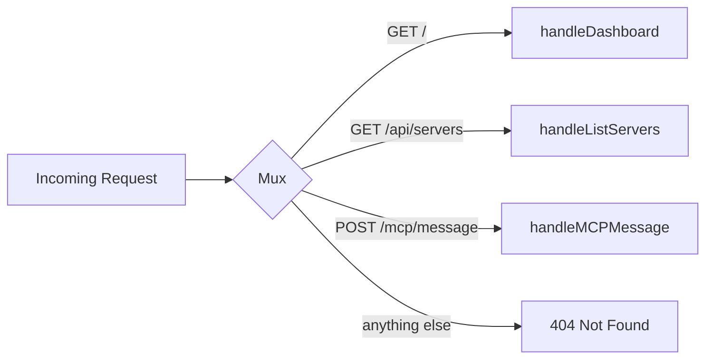
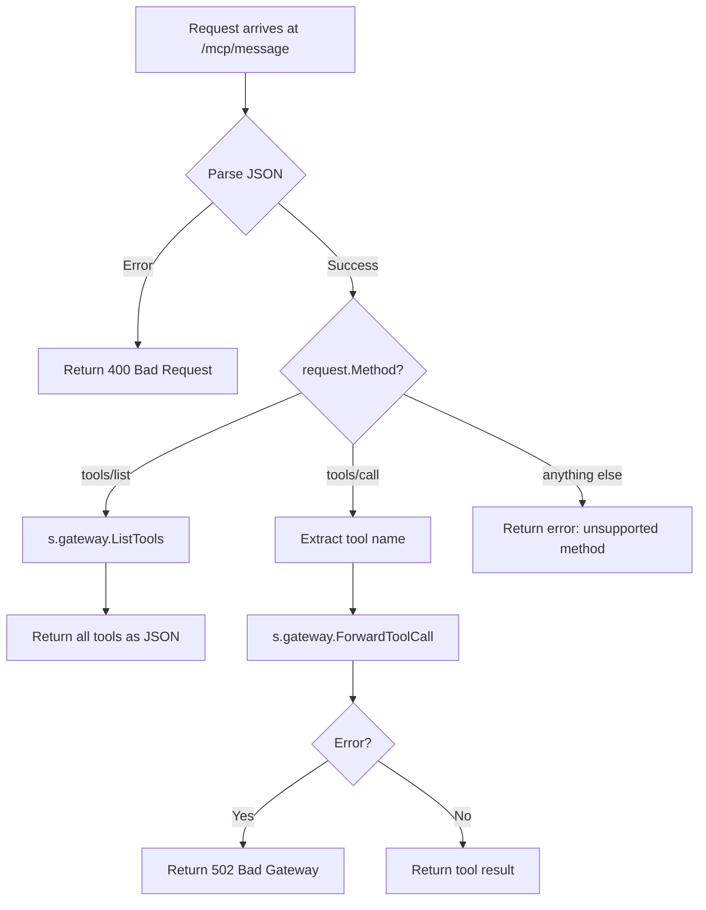
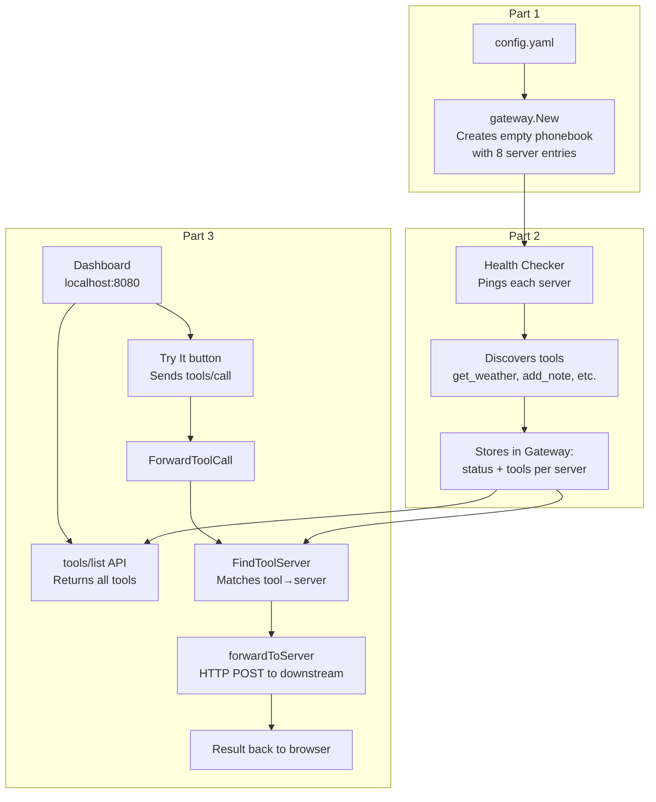
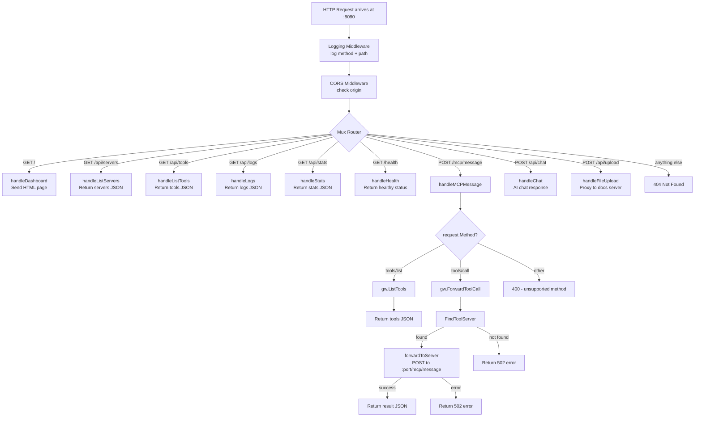
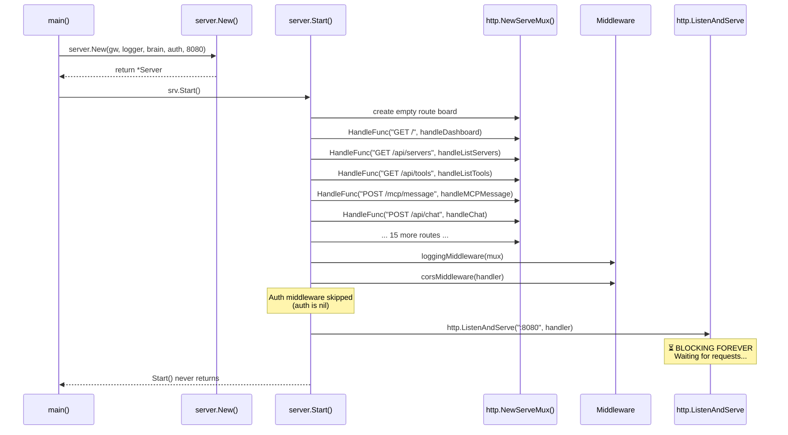
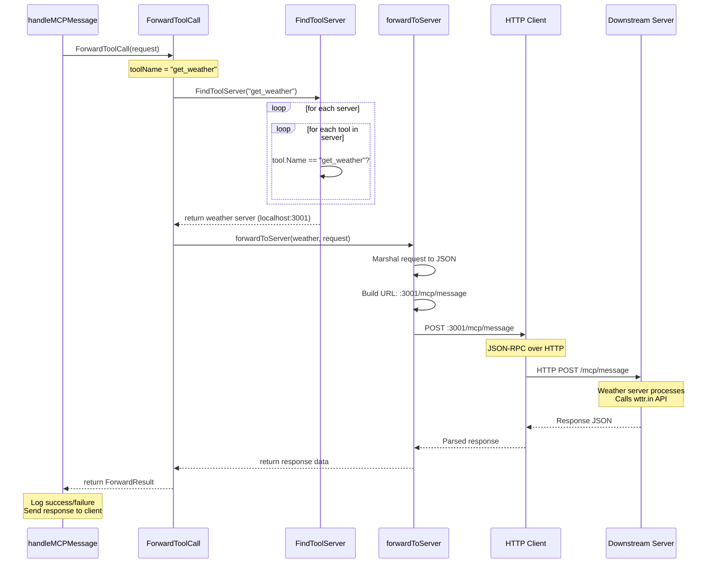
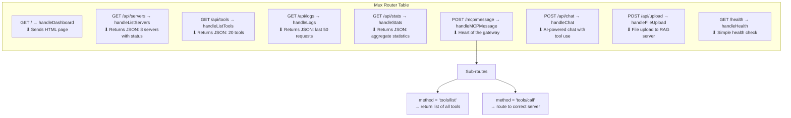

# Part 3: The HTTP Server — Front Door, Routes, Middleware & Tool Routing

## Table of Contents
1. [Architecture Overview](#1-architecture-overview)
2. [Server Constructor — server.New](#2-server-constructor--servernew)
3. [The Start Function — Routes Registration](#3-the-start-function--routes-registration)
4. [Middleware Layer](#4-middleware-layer)
5. [http.ListenAndServe — The Forever Loop](#5-httplistenandserve--the-forever-loop)
6. [handleMCPMessage — The Core Handler](#6-handlemcpmessage--the-core-handler)
7. [ForwardToolCall — Routing Logic](#7-forwardtoolcall--routing-logic)
8. [FindToolServer — The Name-to-Server Mapping](#8-findtoolserver--the-name-to-server-mapping)
9. [forwardToServer — The Actual HTTP Forward](#9-forwardtoserver--the-actual-http-forward)
10. [Complete Request Lifecycle](#10-complete-request-lifecycle)
11. [Interview Questions & Answers](#11-interview-questions--answers)
12. [Diagrams](#12-diagrams)

---

## 1. Architecture Overview

### The Dependency Chain

Part 3 is the **final piece** that makes everything usable:

```
Part 1: Config  →  Part 2: Discovery  →  Part 3: HTTP Server
  (config.yaml      (healthcheck.go)      (server.go)
   → Gateway)        → status + tools)     → dashboard + API)
```

### Where Part 3 Fits

```
main.go:118  srv := server.New(gw, reqLogger, brain, authenticator, port)
main.go:119  srv.WithApprovalStore(approvalStore)
main.go:120  srv.Start()
```

Lines 118-120 are the **last thing main.go does** before the program runs forever.

### The Core Idea

```
Part 3 = A website at :8080 that:
  1. Shows everything Parts 1 & 2 built (dashboard)
  2. Lets you call any tool via Try It buttons (API)
  3. Routes tool calls to the right server (routing)
```

---

## 2. Server Constructor — server.New

### The Code (server.go:111-128)

```go
func New(gw *gateway.Gateway, reqLogger *logger.Logger, aiBrain *ai.Brain, authenticator *auth.Auth, port int) *Server {
    return &Server{
        gateway:     gw,
        logger:      reqLogger,
        brain:       aiBrain,
        auth:        authenticator,
        port:        port,
        memHistory:  make(map[string][]memMessage),
        authLimiter: newRateLimiter(time.Minute, 10),
    }
}
```

### The 5 Inputs

| Input | Type | Where from | Purpose |
|-------|------|-----------|---------|
| `gw` | `*gateway.Gateway` | Part 1 + Part 2 | The phonebook with 8 servers, statuses, and tools |
| `reqLogger` | `*logger.Logger` | `logger.New(1000)` | Records last 1000 requests for the dashboard |
| `aiBrain` | `*ai.Brain` | `ai.New(groqKey)` (or nil) | Powers AI Chat at `/api/chat` |
| `authenticator` | `*auth.Auth` | `auth.New(...)` (or nil) | Powers signup/login with JWT |
| `port` | `int` | `config.yaml` → `port: 8080` | Which door to open |

### The Server Struct (server.go:98-109)

```go
type Server struct {
    gateway       *gateway.Gateway  // From Parts 1 & 2
    logger        *logger.Logger    // Request logger
    brain         *ai.Brain         // AI Chat (optional)
    auth          *auth.Auth        // Login system (optional)
    port          int               // Port number (8080)
    approvalStore *approval.Store   // Human-in-the-loop (set separately)
    authLimiter   *rateLimiter      // 10 login attempts per minute
    memHistory    map[string][]memMessage  // Chat history cache
}
```

### Rate Limiter (server.go:27-69)

```go
type rateLimiter struct {
    attempts map[string][]time.Time  // Stores timestamps per IP
    window   time.Duration           // 1 minute window
    max      int                     // 10 max attempts
}
```

**Purpose:** Prevents brute-force password guessing. After 10 failed login attempts from the same IP in 1 minute, further attempts are blocked.

**In your case:** Auth is disabled (no MongoDB), so this is never used.

---

## 3. The Start Function — Routes Registration

### The Code (server.go:131-179)

```go
func (s *Server) Start() error {
    mux := http.NewServeMux()

    // Public endpoints
    mux.HandleFunc("GET /health", s.handleHealth)
    mux.HandleFunc("GET /", s.handleDashboard)
    mux.HandleFunc("GET /chat", s.handleChatPage)

    // Auth endpoints
    mux.HandleFunc("POST /api/auth/signup", s.handleSignup)
    mux.HandleFunc("POST /api/auth/login", s.handleLogin)
    // ...

    // API endpoints
    mux.HandleFunc("GET /api/servers", s.handleListServers)
    mux.HandleFunc("GET /api/tools", s.handleListTools)
    mux.HandleFunc("GET /api/logs", s.handleLogs)
    mux.HandleFunc("GET /api/stats", s.handleStats)
    mux.HandleFunc("POST /mcp/message", s.handleMCPMessage)
    
    // Wrap with middleware
    handler := s.loggingMiddleware(mux)
    handler = s.corsMiddleware(handler)
    
    // Start listening
    addr := fmt.Sprintf(":%d", s.port)
    log.Printf("MCP Gateway listening on http://localhost%s", addr)
    return http.ListenAndServe(addr, handler)
}
```

### What is a Mux?

A **ServeMux** (multiplexer) is a **route table** — it maps incoming URLs to handler functions:



**Think of it like a restaurant menu:**

| If you ask for | We give you |
|---------------|-------------|
| "The menu" (GET /) | The dashboard page |
| "What chefs are available?" (GET /api/servers) | JSON list of servers |
| "What dishes can you make?" (GET /api/tools) | JSON list of tools |
| "Cook get_weather for Mumbai" (POST /mcp/message) | Weather result |

### All Registered Routes

| Method | Path | Handler | Purpose |
|--------|------|---------|---------|
| GET | `/` | `handleDashboard` | Serves HTML dashboard UI |
| GET | `/chat` | `handleChatPage` | Serves AI chat UI |
| GET | `/health` | `handleHealth` | Returns `{"status": "healthy"}` |
| POST | `/api/auth/signup` | `handleSignup` | Create account (needs MongoDB) |
| POST | `/api/auth/login` | `handleLogin` | Login → get JWT token |
| POST | `/api/auth/refresh` | `handleRefreshToken` | Refresh expired token |
| GET | `/api/auth/me` | `handleAuthMe` | Get current user info |
| GET | `/api/servers` | `handleListServers` | List all 8 servers with status |
| GET | `/api/tools` | `handleListTools` | List all 20 tools |
| GET | `/api/logs` | `handleLogs` | Recent request logs |
| GET | `/api/stats` | `handleStats` | Request statistics |
| POST | `/mcp/message` | `handleMCPMessage` | **Core MCP tool call endpoint** |
| POST | `/api/chat` | `handleChat` | AI Chat with tool execution |
| POST | `/api/upload` | `handleFileUpload` | Upload file to RAG server |
| GET | `/api/approvals/pending` | `handlePendingApprovals` | Pending approvals (if enabled) |
| POST | `/api/approvals/{id}/approve` | `handleApproveAction` | Approve a risky action |
| POST | `/api/approvals/{id}/reject` | `handleRejectAction` | Reject a risky action |

---

## 4. Middleware Layer

### What is Middleware?

Middleware = **layers that every request passes through** before reaching its handler.

```
Request
  │
  ▼
┌──────────────────────┐
│ Logging Middleware    │  ← Logs: "→ GET /api/servers"
│                      │     "← GET /api/servers (5ms)"
└──────────────────────┘
  │
  ▼
┌──────────────────────┐
│ CORS Middleware       │  ← Adds security headers for browser
│                      │     Allows cross-origin requests
└──────────────────────┘
  │
  ▼
┌──────────────────────┐
│ Auth Middleware       │  ← Checks JWT token (if MongoDB enabled)
│ (optional)           │     Without auth: skipped
└──────────────────────┘
  │
  ▼
┌──────────────────────┐
│ Mux Router           │  ← Routes to right handler
└──────────────────────┘
  │
  ▼
    Handler Function
```

### Logging Middleware (server.go:447-454)

```go
func (s *Server) loggingMiddleware(next http.Handler) http.Handler {
    return http.HandlerFunc(func(w http.ResponseWriter, r *http.Request) {
        start := time.Now()
        log.Printf("→ %s %s", r.Method, r.URL.Path)
        next.ServeHTTP(w, r)
        log.Printf("← %s %s (%s)", r.Method, r.URL.Path, time.Since(start))
    })
}
```

**Pattern:** 
1. Record start time
2. Log "request received"
3. Call the next handler (could be more middleware or the actual handler)
4. Log "response sent" with how long it took

### CORS Middleware (server.go:456-483)

```go
func (s *Server) corsMiddleware(next http.Handler) http.Handler {
    allowed := os.Getenv("ALLOWED_ORIGINS")
    if allowed == "" {
        allowed = "https://mcp-gateway-tvaa.onrender.com"
    }
    // ... checks Origin header, adds Access-Control-Allow-Origin ...
}
```

**Purpose:** Browser security. If the dashboard was hosted on a different domain, this tells the browser it's safe to make requests.

### Auth Middleware

```go
if s.auth != nil {
    handler = s.auth.Middleware(handler)
    log.Println("Auth middleware enabled — API routes require JWT token")
}
```

**In your case:** `s.auth` is `nil` (no MongoDB), so this is skipped. All routes are public.

---

## 5. http.ListenAndServe — The Forever Loop

```go
return http.ListenAndServe(addr, handler)
```

### What This Line Does

| Part | Meaning |
|------|---------|
| `http` | Go's built-in HTTP package |
| `ListenAndServe` | "Open a door and wait for visitors forever" |
| `addr` | `":8080"` — door number |
| `handler` | The middleware-wrapped mux — what to do when someone knocks |

### What Happens After

```
http.ListenAndServe(":8080", handler)
                │
                ▼
┌────────────────────────────────────────┐
│  FOREVER LOOP:                         │
│                                        │
│  Wait for a connection on port 8080    │
│  ↓                                     │
│  Accept the connection                 │
│  ↓                                     │
│  Pass to handler (middleware + mux)    │
│  ↓                                     │
│  Handler sends response back           │
│  ↓                                     │
│  Go back to waiting                    │
│                                        │
│  (Only stops on Ctrl+C or crash)       │
└────────────────────────────────────────┘
```

**This is why the program doesn't exit** — it's designed to run forever, waiting for HTTP requests.

---

## 6. handleMCPMessage — The Core Handler

### Full Code (server.go:246-320)

```go
func (s *Server) handleMCPMessage(w http.ResponseWriter, r *http.Request) {
    // Step 1: Timer
    start := time.Now()

    // Step 2: Security — limit request size to 10MB
    r.Body = http.MaxBytesReader(w, r.Body, 10*1024*1024)

    // Step 3: Parse JSON request
    var request MCPRequest
    if err := json.NewDecoder(r.Body).Decode(&request); err != nil {
        s.jsonResponse(w, http.StatusBadRequest, map[string]string{
            "error": "invalid JSON: " + err.Error(),
        })
        return
    }

    // Step 4: Get username (if logged in)
    username, _ := auth.UserFromContext(r.Context())

    // STEP 5: TOOLS/LIST
    if request.Method == "tools/list" {
        tools := s.gateway.ListTools()       // ← Read from Gateway
        // ... log and return tools list ...
        s.jsonResponse(w, http.StatusOK, MCPResponse{
            Result: map[string]any{"tools": tools},
        })
        return
    }

    // STEP 6: TOOLS/CALL
    if request.Method == "tools/call" {
        toolName := request.Params["name"].(string)  // "get_weather"

        fwdReq := gateway.ForwardRequest{
            JSONRPC: "2.0",
            ID:      request.ID,
            Method:  request.Method,
            Params:  request.Params,
        }

        result, err := s.gateway.ForwardToolCall(fwdReq)  // ← ROUTE IT!

        if err != nil {
            // Log error, return error response
            s.jsonResponse(w, http.StatusBadGateway, map[string]string{
                "error": err.Error(),
            })
            return
        }

        // Log success, return result
        s.jsonResponse(w, http.StatusOK, result.Response)
        return
    }

    // STEP 7: UNKNOWN METHOD
    s.jsonResponse(w, http.StatusBadRequest, map[string]string{
        "error": "unsupported method: " + request.Method,
    })
}
```

### The Decision Tree



### What Each Method Does

| Method | Request example | Response |
|--------|----------------|----------|
| `tools/list` | `{"method":"tools/list"}` | `{"tools": [get_weather, get_forecast, ...]}` |
| `tools/call` | `{"method":"tools/call", "params":{"name":"get_weather", "arguments":{"city":"Mumbai"}}}` | `{"content": [{"text": "32°C, Sunny"}]}` |

---

## 7. ForwardToolCall — Routing Logic

### The Code (forwarder.go:38-65)

```go
func (gw *Gateway) ForwardToolCall(req ForwardRequest) (*ForwardResult, error) {
    // Step 1: Extract tool name
    toolName, _ := req.Params["name"].(string)
    if toolName == "" {
        return nil, fmt.Errorf("missing tool name")
    }

    // Step 2: Find which server owns this tool
    server, err := gw.FindToolServer(toolName)
    if err != nil {
        return nil, fmt.Errorf("routing failed: %w", err)
    }

    // Step 3: Forward to that server
    start := time.Now()
    response, err := gw.forwardToServer(server, req)
    latency := time.Since(start)

    if err != nil {
        return nil, fmt.Errorf("forward to %s failed: %w", server.Config.Name, err)
    }

    return &ForwardResult{
        ServerName: server.Config.Name,
        Response:   response,
        Latency:    latency,
    }, nil
}
```

### The 3 Steps

```
ForwardToolCall("get_weather")
    │
    ├── Step 1: "get_weather" — OK, I know which tool
    │
    ├── Step 2: FindToolServer("get_weather") → "weather" server
    │          (searches all servers' tool lists)
    │
    └── Step 3: forwardToServer("weather", request)
               → POST http://localhost:3001/mcp/message
               → Gets result
               → Returns it
```

---

## 8. FindToolServer — The Name-to-Server Mapping

### The Code (gateway.go:120-132)

```go
func (gw *Gateway) FindToolServer(toolName string) (ConnectedServer, error) {
    gw.mu.RLock()
    defer gw.mu.RUnlock()

    // Loop through ALL servers
    for _, s := range gw.servers {
        // Loop through ALL tools of each server
        for _, t := range s.Tools {
            if t.Name == toolName {  // Match found!
                return *s, nil
            }
        }
    }
    return ConnectedServer{}, fmt.Errorf("no server found for tool %q", toolName)
}
```

### How the Mapping Works

This is where Part 2's data is **consumed**. Remember, during health check, each tool was stored with its `ServerName`:

```go
// From healthcheck.go's parseTools():
Tool{
    Name:        "get_weather",     // Tool name
    ServerName:  "weather",         // ← Mapping! Which server owns this
}
```

`FindToolServer` does a **double loop** through all servers:

```
Gateway.servers map:
┌─────────────────────────────────────────────────────┐
│ "weather"  → Tools: ["get_weather", "get_forecast"] │
│ "notes"    → Tools: ["add_note", "list_notes", ...] │
│ "github"   → Tools: ["get_user", "list_repos", ...] │
│ "crypto"   → Tools: ["get_crypto_price", ...]       │
│ "news"     → Tools: ["get_top_news", "search_news"] │
│ "url-tools"→ Tools: ["shorten_url", "generate_qr"]  │
│ "search"   → Tools: ["web_search", "wikipedia_summary"]│
│ "documents"→ Tools: ["upload_document", ...]         │
└─────────────────────────────────────────────────────┘

FindToolServer("get_weather"):
  Check weather.Tools → "get_weather" matches! → Return weather ✅

FindToolServer("add_note"):
  Check weather.Tools → no match
  Check notes.Tools → "add_note" matches! → Return notes ✅
```

### Time Complexity

O(N × M) where N = number of servers (8) and M = tools per server (2-3). For this small dataset, it's instant. For thousands of tools, you'd use a HashMap lookup instead.

---

## 9. forwardToServer — The Actual HTTP Forward

### The Code (forwarder.go:71-111)

```go
func (gw *Gateway) forwardToServer(server ConnectedServer, req ForwardRequest) (any, error) {
    // Step 1: Convert request to JSON
    body, err := json.Marshal(req)
    
    // Step 2: Build URL: http://localhost:3001/mcp/message
    url := server.Config.URL + "/mcp/message"
    
    // Step 3: Send HTTP POST
    ctx, cancel := context.WithTimeout(context.Background(), 30*time.Second)
    defer cancel()
    httpReq, err := http.NewRequestWithContext(ctx, http.MethodPost, url, bytes.NewReader(body))
    httpReq.Header.Set("Content-Type", "application/json")
    
    httpResp, err := forwardClient.Do(httpReq)
    if err != nil {
        return nil, fmt.Errorf("HTTP request failed: %w", err)
    }
    defer httpResp.Body.Close()
    
    // Step 4: Read response (max 10MB)
    respBody, err := io.ReadAll(io.LimitReader(httpResp.Body, 10*1024*1024))
    
    // Step 5: Parse response JSON
    var response any
    json.Unmarshal(respBody, &response)
    
    return response, nil
}
```

### What Happens Step by Step

```
forwardToServer(weather_server, {method:"tools/call", params:{name:"get_weather"}})

Step 1: Convert request to JSON:
        → '{"jsonrpc":"2.0","method":"tools/call","params":{"name":"get_weather","arguments":{"city":"Mumbai"}}}'

Step 2: Build target URL:
        → weather_server.Config.URL = "http://localhost:3001"
        → "http://localhost:3001" + "/mcp/message"
        → "http://localhost:3001/mcp/message"

Step 3: Send HTTP POST:
        POST http://localhost:3001/mcp/message
        Content-Type: application/json
        Body: {"method":"tools/call","params":{"name":"get_weather","arguments":{"city":"Mumbai"}}}

Step 4: Wait for response (30 second timeout)
        ← Response: {"content":[{"type":"text","text":"Current weather in Mumbai: 32°C, Sunny"}]}

Step 5: Parse response JSON and return it
```

### The Forward Client

```go
var forwardClient = &http.Client{Timeout: 30 * time.Second}
```

A shared HTTP client with 30-second timeout. It's reused across all forwarded requests to enable **connection pooling** (reusing TCP connections instead of opening new ones for each request).

---

## 10. Complete Request Lifecycle

### End-to-End: "Try It" on get_weather for Mumbai

```
YOUR BROWSER                    GATEWAY (:8080)                WEATHER SERVER (:3001)
     │                              │                              │
     │ 1. Click "Try It"            │                              │
     │─────────────────────────────→│                              │
     │                              │                              │
     │ 2. Dashboard JS sends POST   │                              │
     │    /mcp/message              │                              │
     │    {                         │                              │
     │      "method":"tools/call",  │                              │
     │      "params":{              │                              │
     │        "name":"get_weather", │                              │
     │        "arguments":{         │                              │
     │          "city":"Mumbai"     │                              │
     │        }                     │                              │
     │      }                       │                              │
     │    }                         │                              │
     │─────────────────────────────→│                              │
     │                              │                              │
     │    3. Logging middleware     │                              │
     │    logs: "→ POST /mcp/message"                              │
     │                              │                              │
     │    4. CORS middleware        │                              │
     │    adds security headers     │                              │
     │                              │                              │
     │    5. handleMCPMessage       │                              │
     │    receives the request      │                              │
     │                              │                              │
     │    6. Checks method:         │                              │
     │    "tools/call" → YES        │                              │
     │                              │                              │
     │    7. ForwardToolCall:       │                              │
     │    ├── FindToolServer        │                              │
     │    │   ("get_weather")       │                              │
     │    │   → finds "weather"     │                              │
     │    │                         │                              │
     │    └── forwardToServer()     │                              │
     │        POST /mcp/message     │                              │
     │        {"method":"tools/call",│                              │
     │         "params":{"name":    │                              │
     │          "get_weather",      │                              │
     │          "arguments":{       │                              │
     │           "city":"Mumbai"}}} │                              │
     │───────────────────────────────────────────────────────────→│
     │                              │                              │
     │                              │    8. Weather server receives│
     │                              │    Parses "get_weather"     │
     │                              │    Calls wttr.in API        │
     │                              │    Gets: "32°C, Sunny"     │
     │                              │                              │
     │                              │    9. Returns response      │
     │←───────────────────────────────────────────────────────────│
     │                              │                              │
     │    10. ForwardToolCall       │                              │
     │    returns result to         │                              │
     │    handleMCPMessage          │                              │
     │                              │                              │
     │    11. Logs success:         │                              │
     │    "tools/call get_weather   │                              │
     │     weather success 5ms"     │                              │
     │                              │                              │
     │    12. Sends JSON response   │                              │
     │    back to browser           │                              │
     │←─────────────────────────────│                              │
     │                              │                              │
     │    13. Dashboard shows:      │                              │
     │    "Current weather in       │                              │
     │     Mumbai: 32°C, Sunny"     │                              │
```

### The Data Flow with Parts 1, 2, and 3



---

## 11. Interview Questions & Answers

### Q1: "Explain how the HTTP server is set up in main.go."

> The HTTP server is set up on `main.go:118-120` with three steps. First, `server.New(gw, reqLogger, brain, authenticator, port)` creates a Server object by injecting all its dependencies — the Gateway (from Parts 1 & 2), a request logger, an optional AI brain, an optional authenticator, and the port number from config. Second, `srv.WithApprovalStore(approvalStore)` attaches a human-in-the-loop approval system. Finally, `srv.Start()` registers all routes, wraps them with middleware, and calls `http.ListenAndServe(":8080", handler)` which opens port 8080 and blocks forever waiting for requests.
>
> This follows the **dependency injection** pattern — the server doesn't create anything itself; everything is built beforehand and passed in. This makes testing easy because you can substitute mock objects at each level.

### Q2: "What is a middleware and how is it used in this project?"

> Middleware is a function that wraps around the actual request handler, running code both before and after the handler executes. Think of it like layers of an onion — every request passes through each layer before reaching the core handler.
>
> In this project, the middleware chain has three layers:
> 1. **Logging Middleware** — logs every incoming request with method, path, and response time
> 2. **CORS Middleware** — adds cross-origin security headers for browser requests
> 3. **Auth Middleware** — checks JWT tokens for authenticated routes (only if MongoDB is configured)
>
> Middleware is composed using the decorator pattern: each wrapper takes an `http.Handler`, adds behavior, and returns a new handler. This keeps individual handlers clean and focused on their specific task instead of repeating cross-cutting concerns.

### Q3: "How does `handleMCPMessage` differentiate between different MCP methods?"

> `handleMCPMessage` is the central request handler for the `/mcp/message` endpoint. It receives a JSON-RPC request and checks the `method` field to determine the action:
>
> - If `method == "tools/list"`: calls `s.gateway.ListTools()` which aggregates tool definitions from all online servers and returns them as a JSON array
> - If `method == "tools/call"`: extracts the tool name from `params.name`, creates a `ForwardRequest`, and calls `s.gateway.ForwardToolCall()` to route it to the correct downstream server
> - For any other method: returns a `400 Bad Request` with an error message
>
> This is essentially a two-branch router. The simplicity is intentional — MCP only defines these two methods for tool interaction.

### Q4: "Explain the routing mechanism for tool calls."

> When a `tools/call` request arrives, it goes through a three-step routing process:
>
> 1. **`ForwardToolCall`** (forwarder.go): Extracts the tool name from the request parameters
> 2. **`FindToolServer`** (gateway.go): Searches through all servers' tool lists to find which server owns the requested tool. It does a double loop — for each server, for each tool — checking if the tool name matches
> 3. **`forwardToServer`** (forwarder.go): Once the target server is identified, it converts the original request to JSON, builds the target URL (server's URL + `/mcp/message`), and sends an HTTP POST request with a 30-second timeout
>
> The result propagates back up the chain: the downstream server responds, `forwardToServer` returns the parsed JSON, `ForwardToolCall` wraps it in a result struct, and `handleMCPMessage` sends it back to the original caller. If any step fails, a descriptive error is returned.

### Q5: "How does the server know which tool belongs to which server?"

> This mapping is established during Part 2 (health checker) and stored in the Gateway's memory. When the health checker pings a server with `tools/list`, the server responds with its available tools. The `parseTools` function in healthcheck.go creates a `Tool` struct for each tool that includes a `ServerName` field set to the server's name.
>
> So the mapping is explicit — each Tool object carries its server's name:
> ```go
> Tool{Name: "get_weather", ServerName: "weather"}
> ```
>
> When a tool call comes in, `FindToolServer` simply searches through all stored tools until it finds one with a matching name, then returns the associated server. This is a straightforward O(N×M) search that works efficiently for the 8-server, 20-tool scale of this project.

### Q6: "What happens if the tool name doesn't match any server?"

> If `FindToolServer` completes the double loop without finding a match, it returns an error: `"no server found for tool 'xyz'"`. This error propagates back through `ForwardToolCall` to `handleMCPMessage`, which sends a `502 Bad Gateway` response to the client with the error message. The request is also logged as an error in the request logger.
>
> This can happen if:
> - A client sends a misspelled tool name
> - The tool exists but its server is offline (health check failed, so tools are removed)
> - The tool was added to the client's cache but the server was removed from config

### Q7: "Explain the CORS middleware and why it's needed."

> CORS (Cross-Origin Resource Sharing) is a browser security mechanism that controls which websites can make requests to a server. If the dashboard HTML is loaded from one origin (say, `https://dashboard.example.com`) and it tries to call the API at a different origin (`https://api.example.com`), the browser blocks the request unless the server explicitly allows it.
>
> The `corsMiddleware` reads the `ALLOWED_ORIGINS` environment variable (defaulting to the Render deployment URL) and checks the incoming request's `Origin` header. If the origin is in the allowed list, it adds the `Access-Control-Allow-Origin` header to the response, telling the browser the request is permitted.
>
> During local development, this middleware is less critical since the HTML and API are served from the same origin (`localhost:8080`). But in production, the dashboard might be hosted separately from the API, making CORS essential.

### Q8: "What is a JWT and how is it used in this project?"

> JWT (JSON Web Token) is a compact, URL-safe token format used for authentication. It consists of three base64-encoded parts separated by dots: a header (specifying the signing algorithm), a payload (containing claims like username and expiration), and a signature (cryptographically proving the token hasn't been tampered with).
>
> In this project, JWT is used when MongoDB is configured. The flow is:
> 1. User signs up or logs in via `POST /api/auth/signup` or `POST /api/auth/login`
> 2. Server validates credentials against MongoDB, creates a JWT with the username and an expiration time, signs it with a secret key, and returns it
> 3. The client stores the token and sends it as an `Authorization: Bearer <token>` header with every request
> 4. The auth middleware extracts the token, verifies the signature, checks expiration, and extracts the username for request logging
>
> Since MongoDB is not configured in this project, auth is disabled and all routes are public.

### Q9: "Explain the difference between `http.ListenAndServe` and manually creating an HTTP server."

> `http.ListenAndServe` is a convenience function that creates a default HTTP server, starts listening on the given address, and blocks forever serving requests. It's equivalent to:
>
> ```go
> server := &http.Server{Addr: ":8080", Handler: handler}
> server.ListenAndServe()
> ```
>
> The advantage of the explicit `http.Server` approach (which this project could use but doesn't) is that you can configure timeouts, TLS, and graceful shutdown. For this project, the default settings are sufficient — the server runs until the process is terminated with Ctrl+C.

### Q10: "How does the project handle graceful shutdown?"

> The project uses a `signal.NotifyContext` on `main.go:101` that listens for `SIGINT` (Ctrl+C) and `SIGTERM` (termination signal from hosting platforms). This context is passed to the health checker, which uses it in its `select` statement to stop the ticker loop when cancellation is received.
>
> However, the HTTP server itself (`http.ListenAndServe`) does **not** use this context. It blocks forever without a shutdown mechanism. This means:
> - The health checker stops gracefully
> - The MCP servers (started as goroutines) continue running
> - The HTTP server is killed abruptly when the process exits
>
> A production improvement would be to use `http.Server.Shutdown()` with the context for a fully graceful shutdown, allowing in-flight requests to complete before exiting.

---

## 12. Diagrams

### Part 3 Architecture

```mermaid
graph TB
    subgraph "Browser"
        DASH[Dashboard UI<br/>localhost:8080]
    end

    subgraph "GATEWAY :8080"
        subgraph "Middleware Layer"
            LOG[Logging Middleware]
            CORS[CORS Middleware]
            AUTH[Auth Middleware<br/>(if MongoDB)]
        end

        subgraph "Mux Router"
            ROOT["GET / → handleDashboard"]
            SERV["GET /api/servers → handleListServers"]
            TOOL["GET /api/tools → handleListTools"]
            MCP["POST /mcp/message → handleMCPMessage"]
        end

        subgraph "Gateway Core"
            FT[FindToolServer]
            FW[ForwardToolCall]
            FWD[forwardToServer]
        end
    end

    subgraph "Downstream Servers"
        W[Weather :3001]
        N[Notes :3002]
        G[GitHub :3003]
        CR[Crypto :3004]
        NE[News :3005]
        U[URL Tools :3006]
        S[Search :3007]
        D[Documents :3008]
    end

    DASH -->|HTTP Request| LOG
    LOG --> CORS
    CORS --> AUTH
    AUTH --> MCP
    
    MCP -->|"tools/list"| TOOL
    MCP -->|"tools/call"| FW
    
    FW --> FT
    FW --> FWD
    
    FWD --> W
    FWD --> N
    FWD --> G
    FWD --> CR
    FWD --> NE
    FWD --> U
    FWD --> S
    FWD --> D
```

### Request Flow Decision Tree



### Middleware Onion Diagram

```mermaid
graph LR
    subgraph "Incoming Request"
        REQ[Request]
    end
    
    subgraph "Middleware Layers"
        L1[Logging]
        L2[CORS]
        L3[Auth<br/>(optional)]
    end
    
    subgraph "Core"
        MUX[Router → Handler]
    end
    
    subgraph "Outgoing Response"
        RES[Response]
    end
    
    REQ --> L1
    L1 --> L2
    L2 --> L3
    L3 --> MUX
    MUX --> L3
    L3 --> L2
    L2 --> L1
    L1 --> RES
    
    style L1 fill:#lightblue
    style L2 fill:#lightgreen
    style L3 fill:#lightyellow
    style MUX fill:#lightcoral
```

### Server Startup Sequence



### ForwardToolCall Detailed Flow



### Routes Table Visualization



---

## Quick Reference

### Key Files

| File | Line | Purpose |
|------|------|---------|
| `main.go` | 118 | `server.New(...)` — create server |
| `main.go` | 120 | `srv.Start()` — start server |
| `internal/server/server.go` | 112 | `New()` — server constructor |
| `internal/server/server.go` | 131 | `Start()` — register routes + middleware |
| `internal/server/server.go` | 246 | `handleMCPMessage()` — core handler |
| `internal/gateway/forwarder.go` | 38 | `ForwardToolCall()` — routing logic |
| `internal/gateway/gateway.go` | 120 | `FindToolServer()` — tool→server mapping |
| `internal/gateway/forwarder.go` | 71 | `forwardToServer()` — HTTP forward |
| `internal/server/server.go` | 447 | `loggingMiddleware()` — request logger |
| `internal/server/server.go` | 456 | `corsMiddleware()` — CORS handler |

### Key Functions

| Function | Location | What it does |
|----------|----------|--------------|
| `server.New()` | server.go:112 | Creates Server with all dependencies |
| `Server.Start()` | server.go:131 | Registers routes + wraps middleware + listens |
| `handleMCPMessage()` | server.go:246 | Dispatches tools/list or tools/call |
| `ForwardToolCall()` | forwarder.go:38 | Routes tool call to correct server |
| `FindToolServer()` | gateway.go:120 | Searches all servers for tool ownership |
| `forwardToServer()` | forwarder.go:71 | Sends HTTP POST to downstream server |
| `loggingMiddleware()` | server.go:447 | Logs every request with timing |
| `corsMiddleware()` | server.go:456 | Adds cross-origin headers |
| `handleListServers()` | server.go:192 | Returns server list JSON |
| `handleListTools()` | server.go:201 | Returns aggregated tools JSON |

### Key Types

| Type | File | Fields |
|------|------|--------|
| `Server` | server.go:98 | gateway, logger, brain, auth, port |
| `MCPRequest` | server.go:377 | JSONRPC, ID, Method, Params |
| `MCPResponse` | server.go:384 | JSONRPC, ID, Result |
| `ForwardRequest` | forwarder.go:23 | JSONRPC, ID, Method, Params |
| `ForwardResult` | forwarder.go:31 | ServerName, Response, Latency |
| `ConnectedServer` | gateway.go:36 | Config, Status, Tools, LastCheck, Latency |
| `Tool` | gateway.go:29 | Name, Description, ServerName |

### Key Concepts Learned

| Concept | Definition | Analogy |
|---------|-----------|---------|
| **Mux** | URL → handler mapper | Switchboard operator |
| **Handler** | Function that processes a request | Chef cooking your order |
| **Middleware** | Code that runs before/after every handler | Security guard at entrance |
| **CORS** | Browser security for cross-origin requests | Bouncer checking ID |
| **JWT** | Signed token for authentication | Hotel key card with expiry |
| **Routing** | Matching tool name to server | Finding which department handles a task |
| **Forwarding** | Sending request to downstream server | Receptionist transferring a call |
| **ServeMux** | Go's built-in HTTP router | Restaurant menu → chef mapping |
| **Dependency Injection** | Passing objects instead of creating them | Plugging in a pre-built component |

---

*End of Part 3 study material.*