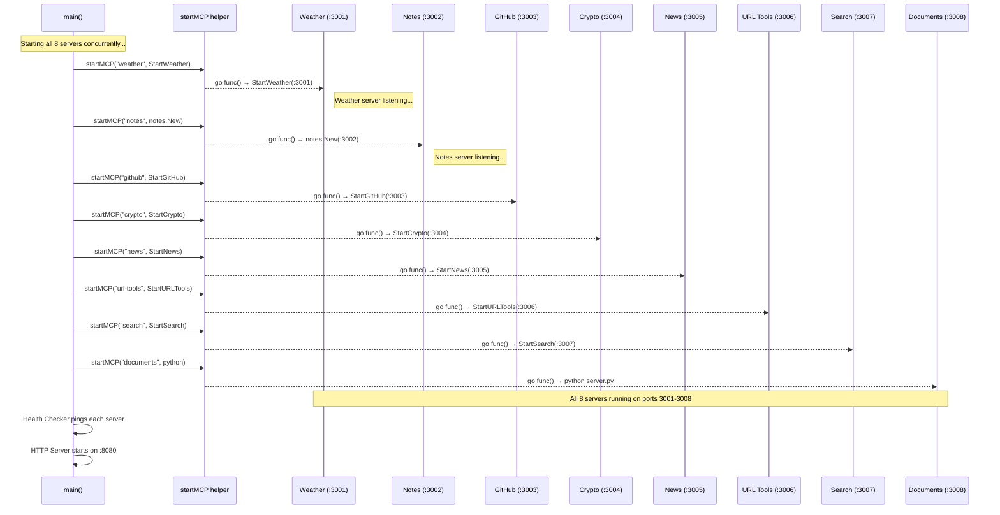
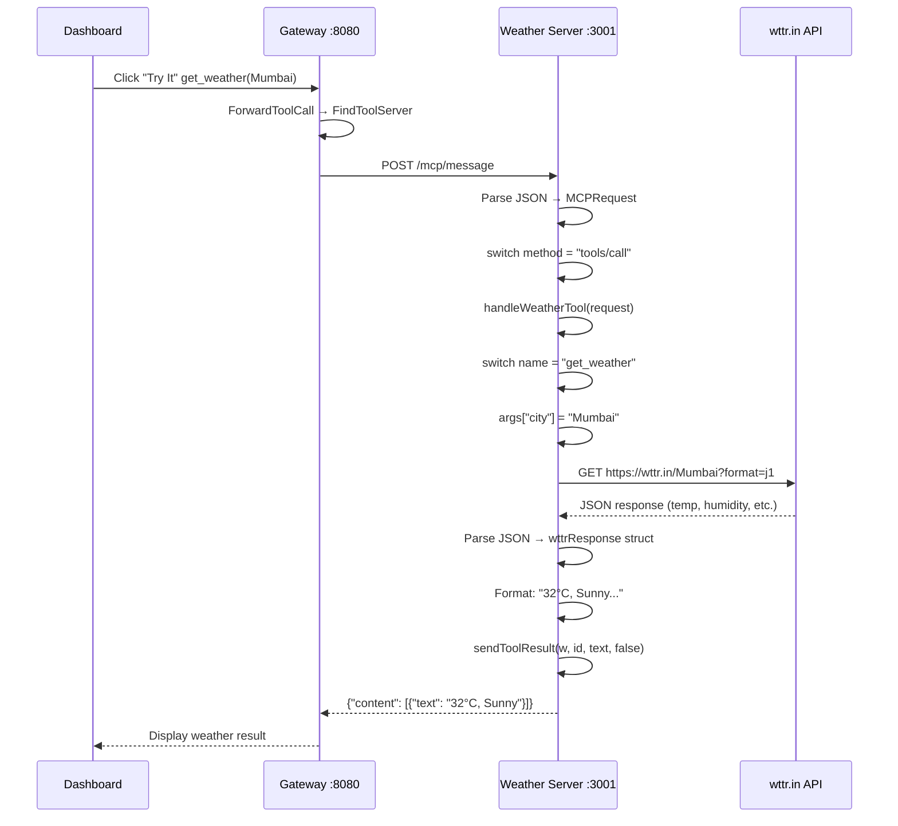
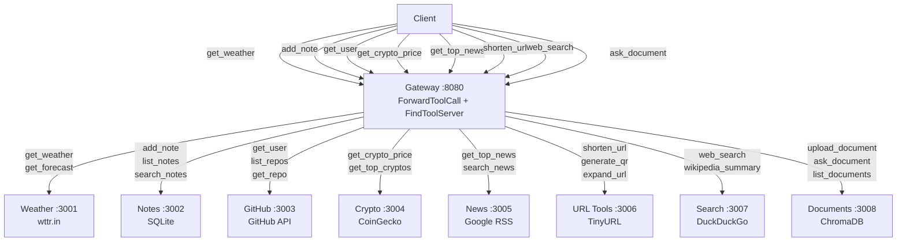
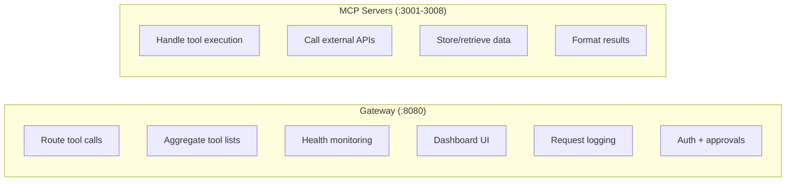
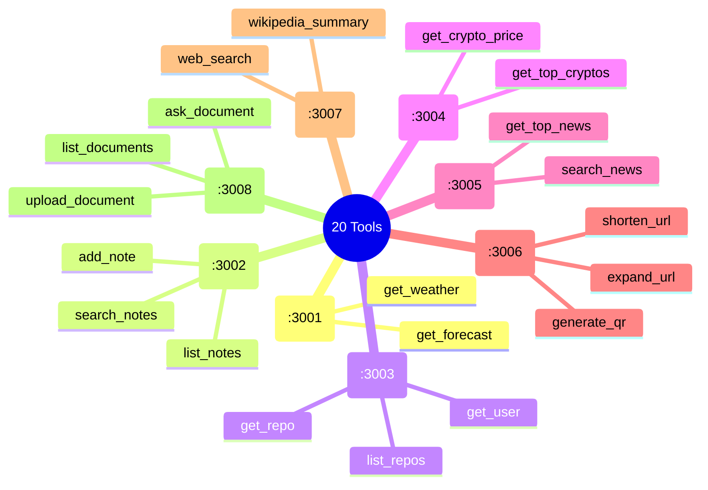

# Part 4: Embedded MCP Servers — The Backend Workers

## Table of Contents
1. [Architecture Overview](#1-architecture-overview)
2. [The Common Pattern](#2-the-common-pattern)
3. [Weather Server (port 3001)](#3-weather-server-port-3001)
4. [Notes Server (port 3002)](#4-notes-server-port-3002)
5. [GitHub Server (port 3003)](#5-github-server-port-3003)
6. [Crypto Server (port 3004)](#6-crypto-server-port-3004)
7. [News Server (port 3005)](#7-news-server-port-3005)
8. [URL Tools Server (port 3006)](#8-url-tools-server-port-3006)
9. [Search Server (port 3007)](#9-search-server-port-3007)
10. [Documents Server (port 3008)](#10-documents-server-port-3008)
11. [The Server Lifecycle](#11-the-server-lifecycle)
12. [Interview Questions & Answers](#12-interview-questions--answers)
13. [Diagrams](#13-diagrams)

---

## 1. Architecture Overview

### What Are the Embedded MCP Servers?

Each embedded MCP server is a **tiny standalone HTTP server** that runs inside your Go program. They're the **workers** — they actually DO the work (fetch weather, save notes, search GitHub, etc.).

The Gateway doesn't do any real work itself. It just **routes** requests to these workers.

```
                         GATEWAY (:8080)
                    ┌──────────────────────┐
                    │  Routes all requests  │
                    └──────┬───────┬───────┘
                           │       │
          ┌────────────────┘       └────────────────┐
          ▼                                           ▼
    ┌──────────┐                                ┌──────────┐
    │ Weather  │ :3001                           │ Notes    │ :3002
    │ Server   │                                │ Server   │
    │          │                                │          │
    │ Calls    │                                │ Saves to │
    │ wttr.in  │                                │ SQLite   │
    │ API      │                                │ Database │
    └──────────┘                                └──────────┘
          ▼                                           ▼
    https://wttr.in/Mumbai                      notes.db file
```

### How They Start

In `main.go:73-98`, each server is started with `startMCP()`:

```go
startMCP("weather", func() error { return mcpserver.StartWeather(":3001") })
startMCP("notes",   func() error { return notes.New(":3002").Start() })
startMCP("github",  func() error { return mcpserver.StartGitHub(":3003") })
startMCP("crypto",  func() error { return mcpserver.StartCrypto(":3004") })
startMCP("news",    func() error { return mcpserver.StartNews(":3005") })
startMCP("url-tools", func() error { return mcpserver.StartURLTools(":3006") })
startMCP("search",  func() error { return mcpserver.StartSearch(":3007") })
startMCP("documents", func() error {
    cmd := exec.Command("python3", "examples/docs-server/server.py")
    return cmd.Run()
})
```

The `startMCP` helper runs each server in its own background goroutine:

```go
startMCP := func(name string, fn func() error) {
    go func() {
        if err := fn(); err != nil {
            log.Printf("%s server exited: %v", name, err)
        }
    }()
}
```

**This means all 8 servers start simultaneously and run in the background forever.**

---

## 2. The Common Pattern

Every embedded MCP server follows the **exact same pattern**:

### Step 1: Define tools

```go
var weatherTools = []map[string]any{
    {
        "name":        "get_weather",
        "description": "Get current weather for any city",
        "inputSchema": map[string]any{
            "type": "object",
            "properties": map[string]any{
                "city": map[string]any{"type": "string"},
            },
            "required": []string{"city"},
        },
    },
}
```

Each tool has:
- `name` — how it's called (e.g., `"get_weather"`)
- `description` — what it does (shown in dashboard)
- `inputSchema` — what arguments it needs (city, username, etc.)

### Step 2: Create HTTP server with MCP handler

```go
func StartWeather(port string) error {
    mux := http.NewServeMux()
    mux.HandleFunc("POST /mcp/message", func(w http.ResponseWriter, r *http.Request) {
        var req MCPRequest
        json.NewDecoder(r.Body).Decode(&req)

        switch req.Method {
        case "initialize":
            sendResult(w, req.ID, map[string]any{
                "protocolVersion": "2024-11-05",
                "serverInfo":      map[string]any{"name": "weather-server"},
            })
        case "tools/list":
            sendResult(w, req.ID, map[string]any{"tools": weatherTools})
        case "tools/call":
            handleWeatherTool(w, req)
        }
    })
    return http.ListenAndServe(port, mux)
}
```

### Step 3: Handle tool calls

```go
func handleWeatherTool(w http.ResponseWriter, req MCPRequest) {
    name := req.Params["name"].(string)
    args := req.Params["arguments"].(map[string]any)

    switch name {
    case "get_weather":
        city := args["city"].(string)
        result := fetchWeather(city)  // Call external API
        sendToolResult(w, req.ID, result, false)
    case "get_forecast":
        city := args["city"].(string)
        result := fetchForecast(city)
        sendToolResult(w, req.ID, result, false)
    }
}
```

### The 4 MCP Methods Handled by Every Server

| Method | Response | Purpose |
|--------|----------|---------|
| `initialize` | Server info + capabilities | MCP handshake (used by health checker) |
| `tools/list` | List of available tools | Tool discovery (used by health checker) |
| `tools/call` | Tool execution result | Actually run a tool |
| anything else | Error: Method not found | Unknown request |

### The sendToolResult Helper (types.go:32-37)

```go
func sendToolResult(w http.ResponseWriter, id any, text string, isError bool) {
    sendResult(w, id, map[string]any{
        "content": []map[string]any{{"type": "text", "text": text}},
        "isError": isError,
    })
}
```

Every tool result is wrapped in the same format:
```json
{
    "content": [{"type": "text", "text": "32°C, Sunny"}],
    "isError": false
}
```

---

## 3. Weather Server (port 3001)

### File: `internal/mcpserver/weather.go`

### What it does

Fetches **real weather data** from `wttr.in` — a free weather API that requires no API key.

### Tools

| Tool | Description | Arguments |
|------|-------------|-----------|
| `get_weather` | Current weather for any city | `city` (required) |
| `get_forecast` | 3-day weather forecast | `city` (required) |

### How get_weather Works (weather.go:69-82)

```go
func fetchWeather(city string) (string, error) {
    // Step 1: Call wttr.in API
    resp, err := weatherClient.Get(
        fmt.Sprintf("https://wttr.in/%s?format=j1", url.QueryEscape(city)),
    )

    // Step 2: Read the response body
    body, _ := io.ReadAll(resp.Body)

    // Step 3: Parse JSON into struct
    var data wttrResponse
    json.Unmarshal(body, &data)

    // Step 4: Extract current conditions
    c := data.CurrentCondition[0]

    // Step 5: Format and return
    return fmt.Sprintf(
        "Current weather in %s:\n  Temp: %s°C (%s°F)\n  Feels like: %s°C\n  Condition: %s\n  Humidity: %s%%\n  Wind: %s km/h",
        city, c.TempC, c.TempF, c.FeelsLikeC, desc, c.Humidity, c.WindspeedK,
    ), nil
}
```

### The wttr.in API Response

```json
{
    "current_condition": [{
        "temp_C": "32",
        "temp_F": "90",
        "humidity": "65",
        "windspeedKmph": "15",
        "FeelsLikeC": "35",
        "weatherDesc": [{"value": "Sunny"}]
    }],
    "weather": [{
        "date": "2026-07-25",
        "maxtempC": "34",
        "mintempC": "27",
        "hourly": [{"tempC": "32", "weatherDesc": [{"value": "Sunny"}]}]
    }]
}
```

### The wttrResponse Struct (weather.go:20-30)

```go
type wttrResponse struct {
    CurrentCondition []struct {
        TempC      string `json:"temp_C"`
        TempF      string `json:"temp_F"`
        Humidity   string `json:"humidity"`
        WindspeedK string `json:"windspeedKmph"`
        FeelsLikeC string `json:"FeelsLikeC"`
        Desc       []struct{ Value string } `json:"weatherDesc"`
    } `json:"current_condition"`
    Weather []struct {
        Date    string `json:"date"`
        MaxTempC string `json:"maxtempC"`
        MinTempC string `json:"mintempC"`
        Hourly  []struct {
            TempC string `json:"tempC"`
            Desc  []struct{ Value string } `json:"weatherDesc"`
        } `json:"hourly"`
    } `json:"weather"`
}
```

This struct maps to the **exact JSON structure** that wttr.in returns. The `json:"temp_C"` tags tell Go which JSON field maps to which struct field.

### Complete Flow for "get_weather Mumbai"

```
Your Browser → Gateway :8080 → Weather Server :3001 → wttr.in API (internet)
                                                          │
    32°C, Sunny ←──────────────────────────────────────────┘
```

---

## 4. Notes Server (port 3002)

### File: `internal/notes/notes.go`

### What it does

Runs a **real SQLite database** to save and retrieve notes. This is the only server that stores persistent data (in `notes.db` file).

### Tools

| Tool | Description | Arguments |
|------|-------------|-----------|
| `add_note` | Save a new note | `title`, `content`, `tags` (optional) |
| `list_notes` | List all notes | `limit` (optional, default 20) |
| `search_notes` | Search notes by keyword | `query` (required) |

### How add_note Works

```go
func (s *Server) handleTool(w http.ResponseWriter, req MCPRequest) {
    name := req.Params["name"].(string)
    args := req.Params["arguments"].(map[string]any)

    switch name {
    case "add_note":
        title := args["title"].(string)
        content := args["content"].(string)
        tags, _ := args["tags"].(string)

        // Insert into SQLite database
        _, err := s.db.Exec(
            "INSERT INTO notes (title, content, tags) VALUES (?, ?, ?)",
            title, content, tags,
        )

        if err != nil {
            sendToolResult(w, req.ID, "Error: "+err.Error(), true)
        } else {
            sendToolResult(w, req.ID, "Note saved successfully!", false)
        }
    }
}
```

### SQLite Database

SQLite is a **file-based database** — the entire database is stored in a single file (`notes.db`). No separate database server needed.

```sql
CREATE TABLE notes (
    id INTEGER PRIMARY KEY AUTOINCREMENT,
    title TEXT NOT NULL,
    content TEXT NOT NULL,
    tags TEXT,
    created_at DATETIME DEFAULT CURRENT_TIMESTAMP
);
```

### Why SQLite?

| Feature | Benefit |
|---------|---------|
| No server needed | Just a file — zero setup |
| Persistent | Data survives restarts |
| SQL queries | Can search, filter, sort |
| Single-user | Perfect for local tools |

---

## 5. GitHub Server (port 3003)

### File: `internal/mcpserver/github.go`

### What it does

Fetches **real GitHub data** from `https://api.github.com` — no API key needed for public data, but a `GITHUB_TOKEN` env var gives higher rate limits.

### Tools

| Tool | Description | Arguments |
|------|-------------|-----------|
| `get_user` | GitHub user profile | `username` (required) |
| `list_repos` | List user's repos | `username` (required), `sort` (optional) |
| `get_repo` | Repository details | `owner` (required), `repo` (required) |

### How get_user Works (github.go:46-53)

```go
case "get_user":
    u := args["username"].(string)
    r, err := githubAPI("/users/" + url.PathEscape(u))

    var user struct {
        Login, Name, Bio, Location, CreatedAt string
        Followers, Following, PublicRepos int
    }
    json.Unmarshal(r, &user)

    sendToolResult(w, req.ID, fmt.Sprintf(
        "GitHub User: %s (@%s)\n  Bio: %s\n  Location: %s\n  Repos: %d\n  Followers: %d | Following: %d",
        user.Name, user.Login, user.Bio, user.Location,
        user.PublicRepos, user.Followers, user.Following,
    ), false)
```

### The githubAPI Helper (github.go:81-96)

```go
func githubAPI(path string) ([]byte, error) {
    req, _ := http.NewRequest("GET", "https://api.github.com"+path, nil)
    req.Header.Set("Accept", "application/vnd.github.v3+json")
    req.Header.Set("User-Agent", "mcp-gateway")

    if githubToken != "" {
        req.Header.Set("Authorization", "Bearer "+githubToken)
    }

    resp, err := githubHTTPClient.Do(req)
    body, _ := io.ReadAll(resp.Body)

    if resp.StatusCode == 404 { return nil, fmt.Errorf("not found") }
    if resp.StatusCode == 403 { return nil, fmt.Errorf("rate limited — set GITHUB_TOKEN") }
    if resp.StatusCode != 200 { return nil, fmt.Errorf("status %d", resp.StatusCode) }

    return body, nil
}
```

### Rate Limiting

Without a token: **60 requests per hour** (GitHub's limit for unauthenticated users)
With `GITHUB_TOKEN`: **5000 requests per hour**

---

## 6. Crypto Server (port 3004)

### File: `internal/mcpserver/crypto.go`

### What it does

Fetches **live cryptocurrency prices** from the **CoinGecko API** (free, no API key needed).

### Tools

| Tool | Description | Arguments |
|------|-------------|-----------|
| `get_crypto_price` | Live price for any coin | `coin` (required, e.g., "bitcoin") |
| `get_top_cryptos` | Top 10 by market cap | None |

### How get_crypto_price Works (crypto.go:55-68)

```go
func fetchCrypto(coin string) (string, error) {
    resp, err := cryptoClient.Get(fmt.Sprintf(
        "https://api.coingecko.com/api/v3/simple/price?ids=%s&vs_currencies=usd,inr&include_24hr_change=true&include_market_cap=true",
        strings.ToLower(coin),
    ))

    var data map[string]map[string]float64
    json.Unmarshal(body, &data)

    d := data[strings.ToLower(coin)]

    dir := "up"
    if d["usd_24h_change"] < 0 { dir = "down" }

    return fmt.Sprintf(
        "%s Price:\n  USD: $%.2f\n  INR: Rs.%.2f\n  24h: %.2f%% (%s)\n  Market Cap: $%.0f",
        strings.Title(coin), d["usd"], d["inr"], d["usd_24h_change"], dir, d["usd_market_cap"],
    ), nil
}
```

### CoinGecko API Response

```json
{
    "bitcoin": {
        "usd": 67432.50,
        "inr": 5600000.00,
        "usd_24h_change": 2.35,
        "usd_market_cap": 1320000000000
    }
}
```

---

## 7. News Server (port 3005)

### File: `internal/mcpserver/news.go`

### What it does

Fetches **news headlines** from **Google News RSS feeds** (free, no API key needed).

### Tools

| Tool | Description | Arguments |
|------|-------------|-----------|
| `get_top_news` | Top headlines by topic | `topic` (optional: general, tech, business, sports, science, health) |
| `search_news` | Search news by keyword | `query` (required) |

### How It Works (news.go:94-103)

```go
func fetchRSS(feedURL string) ([]RSSItem, error) {
    resp, err := newsClient.Get(feedURL)    // Fetch RSS XML
    body, _ := io.ReadAll(resp.Body)

    var rss RSS
    xml.Unmarshal(body, &rss)               // Parse XML

    return rss.Channel.Items, nil           // Return news items
}
```

Instead of a standard REST API, Google News provides an **RSS feed** (XML format). The server parses this XML into Go structs:

```go
type RSS struct {
    Channel struct {
        Items []RSSItem `xml:"item"`
    } `xml:"channel"`
}

type RSSItem struct {
    Title   string `xml:"title"`
    Link    string `xml:"link"`
    PubDate string `xml:"pubDate"`
}
```

### RSS vs JSON

| Format | Used by | Parsing |
|--------|---------|---------|
| JSON | Weather, GitHub, Crypto | `json.Unmarshal` |
| XML/RSS | News | `xml.Unmarshal` |

---

## 8. URL Tools Server (port 3006)

### File: `internal/mcpserver/urltools.go`

### What it does

URL utilities — shortening, QR code generation, and expansion.

### Tools

| Tool | Description | Arguments |
|------|-------------|-----------|
| `shorten_url` | Shorten a long URL | `url` (required) |
| `generate_qr` | Generate QR code | `text` (required) |
| `expand_url` | Expand a shortened URL | `url` (required) |

---

## 9. Search Server (port 3007)

### File: `internal/mcpserver/search.go`

### What it does

Web search and Wikipedia summaries using **DuckDuckGo** (free, no API key).

### Tools

| Tool | Description | Arguments |
|------|-------------|-----------|
| `web_search` | Search the internet | `query` (required) |
| `wikipedia_summary` | Wikipedia article summary | `topic` (required) |

---

## 10. Documents Server (port 3008)

### File: `examples/docs-server/server.py`

### What it does

A **Python Flask server** with **ChromaDB** (vector database) for document search (RAG — Retrieval Augmented Generation).

### Tools

| Tool | Description | Arguments |
|------|-------------|-----------|
| `upload_document` | Upload a document to knowledge base | filename + content |
| `ask_document` | Ask questions about uploaded documents | `question` (required) |
| `list_documents` | List all uploaded documents | None |

### Why Python?

This is the **only server not written in Go**. It's a separate Python process because ChromaDB and the embedding models are Python-native. The Go program starts it as a child process:

```go
startMCP("documents", func() error {
    cmd := exec.Command("python3", "examples/docs-server/server.py")
    cmd.Stdout = os.Stdout
    cmd.Stderr = os.Stderr
    return cmd.Run()
})
```

---

## 11. The Server Lifecycle

### Startup Sequence



### Request Flow to a Downstream Server

```
Dashboard "Try It" button clicked
        │
        ▼
Gateway handleMCPMessage (server.go)
        │
        ▼
Gateway ForwardToolCall (forwarder.go)
        │
        ├── FindToolServer("get_weather") → finds weather
        │
        └── forwardToServer(weather, request)
                │
                ▼
        POST http://localhost:3001/mcp/message
                │
                ▼
        Weather Server mux handler
                │
                ├── Parse MCP request
                ├── switch on method: "tools/call"
                │
                └── handleWeatherTool(request)
                        │
                        ├── switch on name: "get_weather"
                        │
                        └── fetchWeather("Mumbai")
                                │
                                ▼
                        GET https://wttr.in/Mumbai?format=j1
                                │
                                ▼
                        Parse JSON response
                                │
                                ▼
                        Return "32°C, Sunny"
                                │
                                ▼
        Response flows back: Weather → Gateway → Browser
```

### Each Server's Independence

```
Each server:
  - Has its OWN port (3001-3008)
  - Has its OWN HTTP server (mux + ListenAndServe)
  - Has its OWN HTTP client (for external APIs)
  - Knows NOTHING about other servers
  - Knows NOTHING about the Gateway
  - Just handles MCP messages and returns results

The Gateway:
  - Knows about ALL servers (their ports, tools, status)
  - Routes requests to the RIGHT server
  - Aggregates tool lists from ALL servers
  - But does NO real work itself
```

---

## 12. Interview Questions & Answers

### Q1: "How are the 8 MCP servers started?"

> In `main.go:73-98`, the `startMCP` helper function runs each server in its own goroutine:
>
> ```go
> startMCP := func(name string, fn func() error) {
>     go func() {
>         if err := fn(); err != nil {
>             log.Printf("%s server exited: %v", name, err)
>         }
>     }()
> }
> ```
>
> This means all 8 servers start **concurrently** and each runs its own `http.ListenAndServe` loop, blocking within its own goroutine. The `go` keyword makes them non-blocking, so `main.go` can continue to start the health checker and HTTP gateway server immediately after.
>
> The documents server is an exception — it's a Python Flask process started via `exec.Command` instead of a Go HTTP server.

### Q2: "What is the common pattern all MCP servers follow?"

> Every MCP server follows a consistent three-part pattern:
>
> 1. **Tool definitions** — A `var tools = []map[string]any{...}` slice that declares each tool's name, description, and input schema. These are returned by the `tools/list` handler.
> 2. **HTTP server** — Each server creates its own `http.ServeMux`, registers a `POST /mcp/message` handler, and calls `http.ListenAndServe`. The handler parses incoming JSON-RPC requests and uses a `switch` statement on the `method` field.
> 3. **Tool handler** — Each server has a function like `handleWeatherTool` that switches on the tool name, extracts arguments, does the actual work (calling an external API or database), and returns a formatted result via `sendToolResult`.
>
> This pattern makes adding a new server straightforward — just define tools, create an HTTP handler, and implement the tool logic.

### Q3: "How does a server like weather handle a `tools/call` request?"

> The weather server's `POST /mcp/message` handler receives the request, parses the JSON body into an `MCPRequest`, and switches on `req.Method`. For `"tools/call"`, it calls `handleWeatherTool`, which extracts the tool name from `req.Params["name"]` and switches again:
>
> - For `"get_weather"`: extracts `city` from arguments, calls `fetchWeather(city)` which makes an HTTP GET to `https://wttr.in/{city}?format=j1`, parses the JSON response, and formats it as a human-readable string
> - For `"get_forecast"`: similar but calls `fetchForecast(city)` which parses the 3-day forecast section of the same API response
>
> The result is wrapped in the standard MCP format:
> ```json
> {"content": [{"type": "text", "text": "32°C, Sunny"}], "isError": false}
> ```

### Q4: "What happens when a server receives an `initialize` request?"

> The `initialize` request is part of the MCP handshake. Every server responds with:
> - `protocolVersion`: which MCP version it supports (`"2024-11-05"`)
> - `capabilities`: what features it supports (here just `{"tools": {}}`)
> - `serverInfo`: its name and version (e.g., `"weather-server"`, `"2.0.0"`)
>
> This is called by the health checker (Part 2) to verify the server is alive and speaking the correct protocol. If the server doesn't respond or responds with an error, it's marked as offline.

### Q5: "How is the notes server different from the other servers?"

> The notes server is the only one that:
> - **Stores persistent data** in a SQLite database file (`notes.db`)
> - **Has state** that survives restarts (notes are permanent)
> - **Is implemented differently** — as a struct `Server` with methods rather than standalone functions
>
> All other servers are **stateless** — they fetch data from external APIs on each call and store nothing locally. The notes server creates, reads, and searches data in a database, making it the only server with actual persistent state.

### Q6: "Why is the documents server written in Python?"

> The documents server uses **ChromaDB**, a vector database for semantic search, and requires **text embedding models** to convert documents into vector representations. These are Python-native technologies — the most mature libraries for embeddings and vector search are in the Python ecosystem (sentence-transformers, chromadb, etc.).
>
> Rather than reimplementing everything in Go, the project spawns a Python Flask server as a child process using `exec.Command`. This is a pragmatic architectural decision: use the right tool for the job. The Go gateway communicates with the Python server over HTTP, just like any other MCP server.

### Q7: "How does error handling work in the MCP servers?"

> Each server handles errors at multiple levels:
>
> 1. **JSON parsing errors** — If the incoming request isn't valid JSON, the server returns an MCP parse error (`-32700`)
> 2. **Unknown methods** — If the method isn't `initialize`, `tools/list`, or `tools/call`, the server returns "Method not found" (`-32601`)
> 3. **Missing arguments** — If required arguments (like `city`) are missing, the server returns a descriptive error via `sendToolResult` with `isError: true`
> 4. **External API failures** — If the external API (wttr.in, GitHub, etc.) fails or times out, the error is caught and returned to the caller
> 5. **HTTP timeouts** — Each server's HTTP client has a 10-second timeout to prevent hanging on unresponsive external services

### Q8: "Explain the `sendToolResult` helper function."

> `sendToolResult` (in `types.go:32-37`) is a utility that wraps a text response in the standard MCP tool result format:
>
> ```go
> func sendToolResult(w http.ResponseWriter, id any, text string, isError bool) {
>     sendResult(w, id, map[string]any{
>         "content": []map[string]any{{"type": "text", "text": text}},
>         "isError": isError,
>     })
> }
> ```
>
> Every tool response, regardless of which server or tool generated it, follows this structure. The `"content"` array allows for multiple content items (like text + images), though currently only text is used. The `"isError"` flag tells the client whether the result is an error message or a successful result.
>
> This consistency is important because the Gateway doesn't modify the response — it just forwards whatever the server returns back to the original caller. The caller can parse any server's response the same way.

### Q9: "What external APIs does each server call?"

> | Server | External API | API Key Needed? | Rate Limit |
> |--------|-------------|----------------|------------|
> | Weather | wttr.in | No | No limit |
> | GitHub | GitHub API | No (optional for higher limit) | 60/hr (unauthenticated) |
> | Crypto | CoinGecko API | No | 10-30 calls/min |
> | News | Google News RSS | No | No limit |
> | URL Tools | TinyURL API | No | No limit |
> | Search | DuckDuckGo | No | No limit |

### Q10: "How would you add a new server to the project?"

> To add a new server, you'd:
>
> 1. **Create a new file** in `internal/mcpserver/` (e.g., `reddit.go`)
> 2. **Define tools** — a `var redditTools = []map[string]any{...}` with tool names, descriptions, and input schemas
> 3. **Create `StartReddit(port string) error`** — an HTTP server with a `POST /mcp/message` handler that handles `initialize`, `tools/list`, and `tools/call`
> 4. **Create `handleRedditTool`** — switches on tool name, calls external API, formats result
> 5. **Add to `config.yaml`** — a new server entry with name, URL, and enabled: true
> 6. **Add to `main.go`** — `startMCP("reddit", func() error { return mcpserver.StartReddit(":3009") })`
>
> That's it. The health checker automatically discovers the new server's tools in its next cycle, and the dashboard shows it immediately.

---

## 13. Diagrams

### All 8 Servers Overview

```mermaid
graph TB
    subgraph "GATEWAY :8080"
        GW[Routes tool calls + Dashboard]
    end

    subgraph "Embedded MCP Servers"
        W[Weather :3001<br/>wttr.in API]
        N[Notes :3002<br/>SQLite Database]
        G[GitHub :3003<br/>GitHub API]
        C[Crypto :3004<br/>CoinGecko API]
        NE[News :3005<br/>Google News RSS]
        U[URL Tools :3006<br/>TinyURL API]
        S[Search :3007<br/>DuckDuckGo]
        D[Documents :3008<br/>ChromaDB + Flask<br/>(Python)]
    end

    GW --> W
    GW --> N
    GW --> G
    GW --> C
    GW --> NE
    GW --> U
    GW --> S
    GW --> D

    W --> WWW[https://wttr.in]
    G --> WWW2[https://api.github.com]
    C --> WWW3[https://api.coingecko.com]
    NE --> WWW4[https://news.google.com/rss]
```

### Common Server Pattern

```mermaid
flowchart LR
    subgraph "Every MCP Server"
        START[StartServer(port)] --> MUX[Create ServeMux]
        MUX --> ROUTE["HandleFunc POST /mcp/message"]
        ROUTE --> PARSE[Parse MCP Request]
        PARSE --> SWITCH{req.Method}
        
        SWITCH -->|"initialize"| INIT[Return server info]
        SWITCH -->|"tools/list"| LIST[Return tool definitions]
        SWITCH -->|"tools/call"| TOOL[handleTool]
        SWITCH -->|other| ERR[Return error]
        
        TOOL --> TSWITCH{tool name}
        TSWITCH -->|"tool_1"| T1[Extract args → call API → format result]
        TSWITCH -->|"tool_2"| T2[Extract args → call API → format result]
        
        INIT --> SEND[sendResult]
        LIST --> SEND
        T1 --> SEND
        T2 --> SEND
    end
```

### Weather Server Detailed Flow



### Request Routing Across All Servers



### Server vs Gateway Responsibilities



### Tools by Server



---

## Quick Reference

### All MCP Servers

| Server | Port | File | External API | Language |
|--------|------|------|-------------|----------|
| Weather | 3001 | `internal/mcpserver/weather.go` | wttr.in | Go |
| Notes | 3002 | `internal/notes/notes.go` | SQLite (none) | Go |
| GitHub | 3003 | `internal/mcpserver/github.go` | GitHub API | Go |
| Crypto | 3004 | `internal/mcpserver/crypto.go` | CoinGecko | Go |
| News | 3005 | `internal/mcpserver/news.go` | Google News RSS | Go |
| URL Tools | 3006 | `internal/mcpserver/urltools.go` | TinyURL | Go |
| Search | 3007 | `internal/mcpserver/search.go` | DuckDuckGo | Go |
| Documents | 3008 | `examples/docs-server/server.py` | ChromaDB | Python |

### Key Functions in Each Server

| Function | Purpose |
|----------|---------|
| `StartWeather(port)` | Creates HTTP server, registers MCP handler |
| `handleWeatherTool(w, req)` | Routes tool calls to specific handlers |
| `fetchWeather(city)` | Calls wttr.in API, returns formatted weather |
| `fetchForecast(city)` | Calls wttr.in API, returns formatted forecast |

### MCP Request Handling in Each Server

```go
switch req.Method {
case "initialize":
    // Return server capabilities
case "tools/list":
    // Return tool definitions
case "tools/call":
    // Execute tool and return result
default:
    // Return error
}
```

### The sendToolResult Format

```go
sendToolResult(w, id, text, isError)
// Sends:
// {
//   "content": [{"type": "text", "text": "..."}],
//   "isError": false
// }
```

### Common HTTP Client Pattern

```go
var client = &http.Client{Timeout: 10 * time.Second}
// Each server has its own client with 10s timeout
```

---

*End of Part 4 study material. Continue to Part 5: AI Chat System for the next phase.*