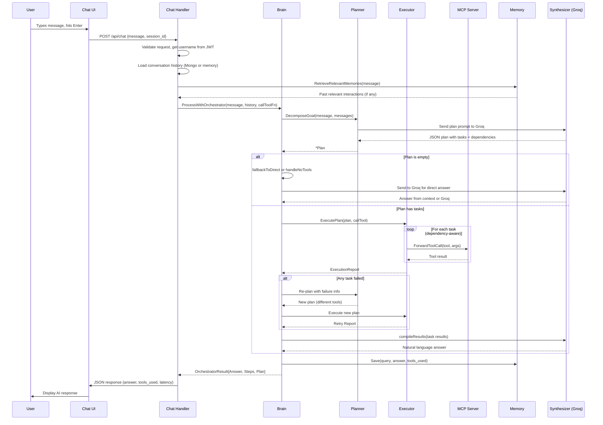
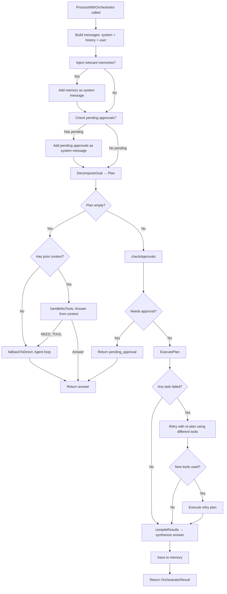
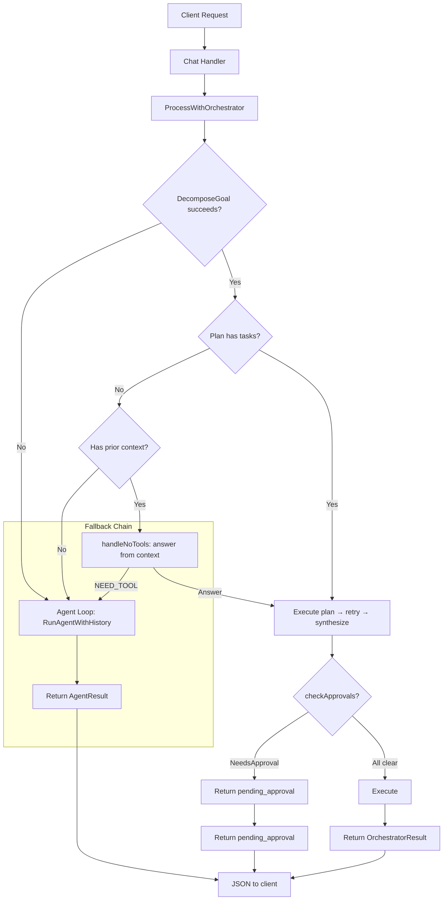
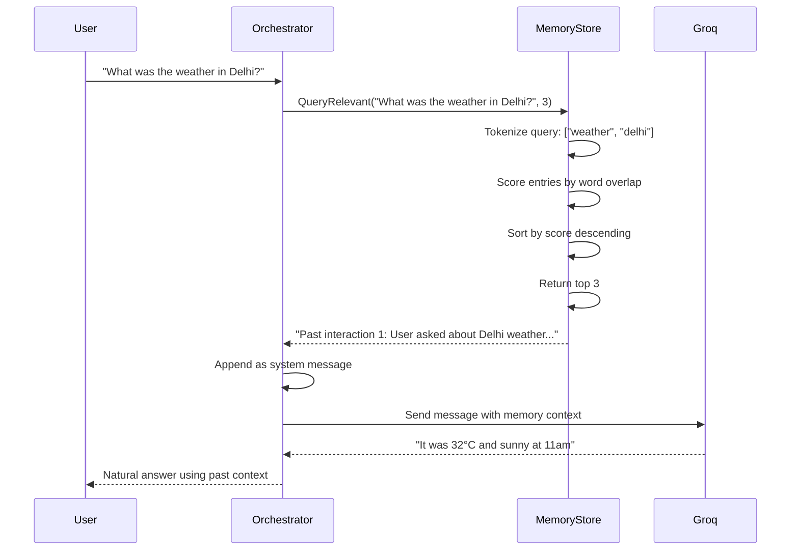
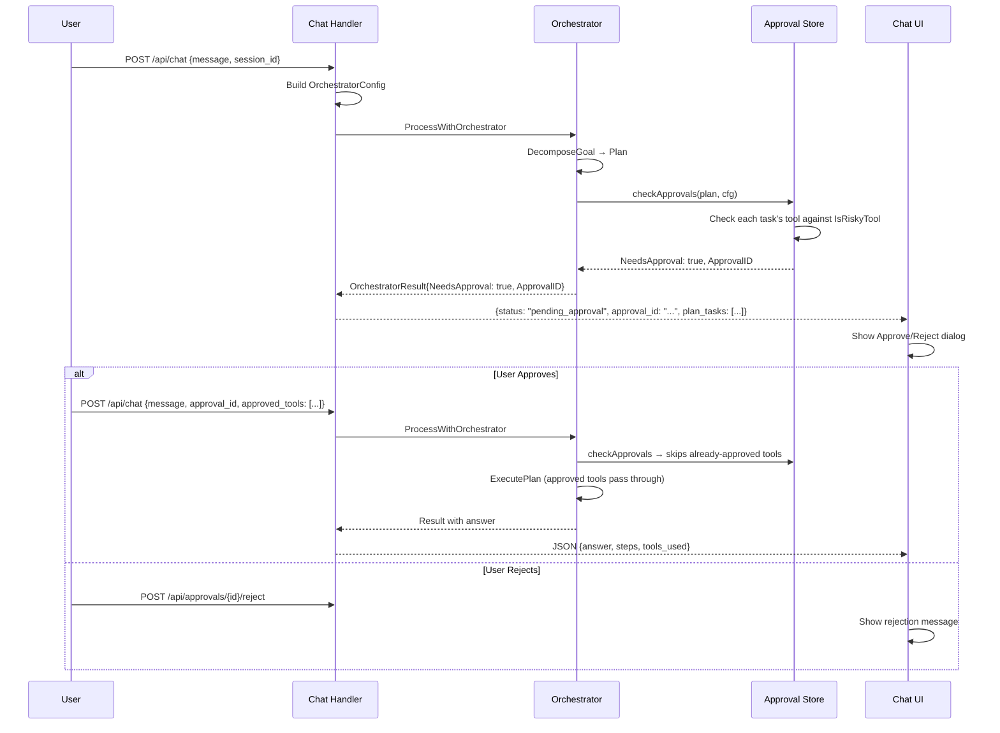
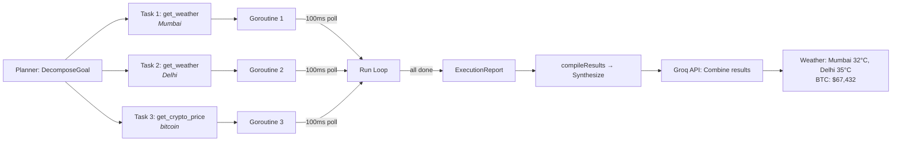

# Part 5: AI Chat System — Multi-Step Agent with Tool Orchestration

## Table of Contents
1. [Architecture Overview](#1-architecture-overview)
2. [The Brain (`brain.go`)](#2-the-brain-braingo)
3. [The Planner (`planner.go`)](#3-the-planner-plannergo)
4. [The Executor (`executor.go`)](#4-the-executor-executorgo)
5. [Memory (`memory.go`)](#5-memory-memorygo)
6. [The Orchestrator (`orchestrator.go`)](#6-the-orchestrator-orchestratorgo)
7. [The Agent (`agent.go`)](#7-the-agent-agentgo)
8. [Chat HTTP Handler (`chat.go`)](#8-chat-http-handler-chatgo)
9. [Chat UI (`chatui.go`)](#9-chat-ui-chatui-go)
10. [Interview Questions & Answers](#10-interview-questions--answers)
11. [Diagrams](#11-diagrams)
12. [Quick Reference](#12-quick-reference)

---

## 1. Architecture Overview

### What Is the AI Chat System?

The AI Chat system transforms MCP Gateway from a simple API proxy into an intelligent assistant. It integrates with **Groq Cloud** (LLaMA 3.3 70B) to process natural language, decompose questions into tasks, call MCP tools in parallel, and synthesize results — all while supporting **conversation memory**, **human-in-the-loop approvals**, and a **rich web UI**.

```
User (Chat UI) → HTTP /api/chat → Brain (Groq) → Planner → Executor → MCP Tools → Synthesize → Response
                                     ↕                           ↕
                                  Memory Store            Approval Store (human-in-loop)
```

**3 source files for the AI engine:** `internal/ai/brain.go` (381 lines), `internal/ai/planner.go` (94 lines), `internal/ai/executor.go` (118 lines), `internal/ai/memory.go` (159 lines), `internal/ai/orchestrator.go` (356 lines), `internal/ai/agent.go` (227 lines), `internal/ai/agent_test.go` (29 lines)

**2 source files for the server integration:** `internal/server/chat.go` (353 lines), `internal/server/chatui.go` (810 lines)

### How It Fits Into the Gateway

```
Dashboard/UI ──HTTP──→ Gateway (server.go) ──→ Chat Handler (chat.go)
                                                    │
                                                    ▼
                                              Brain.ProcessWithOrchestrator()
                                                    │
                              ┌─────────────────────┼─────────────────────┐
                              ▼                     ▼                     ▼
                        Planner (plan)        Executor (run)        Memory (recall)
                              │                     │                     │
                              ▼                     ▼                     ▼
                        DecomposeGoal       Go routines for      Token overlap
                        JSON tasks          each task,           scoring
                        (DAG)               dependency-aware
                                                   │
                                                   ▼
                                            compileResults → Synthesis prompt → Groq
                                                   │
                                                   ▼
                                            OrchestratorResult{Answer, Steps}
                                                   │
                                                   ▼
                                            JSON Response → Chat UI
```

### The Three AI Processing Modes

| Mode | Method | When Used |
|---|---|---|
| **Direct tool call** | `DecideAction` | Simple round: question + tools → Groq → tool call or answer |
| **Agent loop** | `RunAgentWithHistory` | Multi-turn; AI decides each tool call; max 5 rounds |
| **Orchestrator** | `ProcessWithOrchestrator` | Full pipeline: plan → execute → retry → summarize; supports approvals & memory |

In practice, `chat.go` always calls `ProcessWithOrchestrator`. The orchestrator internally falls back to `RunAgentWithHistory` if planning fails.

---

## 2. The Brain (`brain.go`)

**File:** `internal/ai/brain.go` (381 lines)

### What Does It Do?

The Brain is the central AI engine. It wraps the **Groq API** with a **3-model fallback chain** and exposes multiple entry points for different processing strategies.

### The Brain Struct

```go
type Brain struct {
    apiKey     string
    models     []string              // ordered fallback chain
    httpClient *http.Client
    memory     MemoryStore            // optional cross-session memory
}
```

### Constructor — `New(apiKey string) *Brain`

```go
func New(apiKey string) *Brain {
    models := []string{
        "llama-3.3-70b-versatile",
        "qwen/qwen3-32b",
        "qwen/qwen3.6-27b",
    }
    // ... also supports GROQ_MODELS env var override
    return &Brain{
        apiKey:     apiKey,
        models:     models,
        httpClient: &http.Client{Timeout: 30 * time.Second},
    }
}
```

**3-model fallback chain:**
1. `llama-3.3-70b-versatile` (primary, most capable)
2. `qwen/qwen3-32b` (fallback for rate limits)
3. `qwen/qwen3.6-27b` (last resort)

On `429` (rate limit), `403` (forbidden), `5xx` (server error) → tries the next model automatically.

### Three Entry Points

| Method | What It Does |
|---|---|
| `DecideAction(userMessage, history)` | Single round: send question + tools → Groq → returns tool call or direct answer |
| `RunAgent(userMessage, callTool)` | Multi-turn tool-calling loop, max 5 rounds |
| `ProcessWithOrchestrator(userMessage, history, callTool, config)` | Full pipeline: plan → execute → retry → summarize + approvals + memory |

### Post-Tool-Entry Points

- **`DecideAction`** — sends the user's message to Groq with available tools. Returns a `ToolCallResult` containing either a tool to call (with name, args, toolCallID) or a direct natural-language answer. Used by the simple single-tool path and `generate_final_answer.go`.

- **`GenerateFinalAnswer(userMessage, toolName, toolCallID, toolResult)`** — after a tool executes, feeds the result back to Groq as a conversation turn and asks for a natural synthesis. Returns the cleaned answer (think tags stripped).

### Core Data Types

```go
type Message struct {
    Role       string     `json:"role"`
    Content    string     `json:"content,omitempty"`
    ToolCalls  []ToolCall `json:"tool_calls,omitempty"`
    ToolCallID string     `json:"tool_call_id,omitempty"`
}

type ToolCall struct {
    ID       string       `json:"id"`
    Type     string       `json:"type"`
    Function FunctionCall `json:"function"`
}

type FunctionCall struct {
    Name      string `json:"name"`
    Arguments string `json:"arguments"`
}

type ChatRequest struct {
    Model    string    `json:"model"`
    Messages []Message `json:"messages"`
    Tools    []ToolDef `json:"tools,omitempty"`
}
```

### The 18 Hardcoded Tools

`GetAvailableTools()` returns 18 `ToolDef` entries as a **hardcoded list** (not dynamically built from MCP server registrations — the tools ARE the MCP servers):

| Category | Tools |
|---|---|
| Weather | `get_weather`, `get_forecast` |
| GitHub | `get_user`, `list_repos`, `get_repo` |
| Notes | `add_note`, `list_notes`, `search_notes` |
| Crypto | `get_crypto_price`, `get_top_cryptos` |
| News | `get_top_news`, `search_news` |
| Web/Info | `web_search`, `wikipedia_summary` |
| Utilities | `shorten_url`, `generate_qr` |
| Documents | `upload_document`, `ask_document`, `list_documents` |

Each `ToolDef` includes `Type: "function"`, a `FuncDef` with `Name`, `Description`, and JSON `Parameters` schema with `Required` fields. The helper `makeTool()` builds these structs from name, description, properties map, and required fields list.

### `executeChat` — Multi-Model Fallback

`executeChat(reqBody)` implements a chain of fallback models. On `429`, `403`, `404`, or `>=500` → tries the next model. On other `4xx` → returns the error immediately (bad request, not retryable). Returns the first successful response, or an error listing all failures.

### `stripThinkTags`

Removes `...` blocks from model output before returning to the user. Uses regex `(?s)...*?...` with the `s` flag (dotall mode) to match across newlines. Groq models use think tags to show their reasoning process internally, which should not be shown to users.

---

## 3. The Planner (`planner.go`)

**File:** `internal/ai/planner.go` (94 lines)

### What Does It Do?

`Brain.DecomposeGoal(userMessage, messages)` asks Groq to break a user question into a structured plan of independent tasks that can potentially run in parallel.

### The Prompt

A dedicated system prompt instructs Groq to:
1. Analyze the user's question
2. Break it into independent tasks that can run in parallel
3. Return strict JSON (nothing else — no markdown fences, no explanation)

The prompt emphasizes **parallelism** wherever tasks are independent.

### Sample Plan JSON Output

```json
{
  "tasks": [
    {"tool": "get_weather", "arguments": {"city": "Tokyo"}, "description": "Get Tokyo weather"},
    {"tool": "get_weather", "arguments": {"city": "Delhi"}, "description": "Get Delhi weather"}
  ],
  "reasoning": "Fetching weather for both cities in parallel since they are independent"
}
```

### Plan / Task Data Structures

```go
type Plan struct {
    Tasks     []*Task  `json:"tasks"`
    Reasoning string   `json:"reasoning,omitempty"`
}

type Task struct {
    Tool        string         `json:"tool"`
    Arguments   map[string]any `json:"arguments"`
    Description string         `json:"description"`
    DependOn    []int          `json:"depend_on"` // indices of tasks to wait for
    status      TaskStatus     // internal, not serialized
    result      string         // internal, not serialized
    Error       string         // populated on failure
}
```

Tasks can declare `DependOn` forming a DAG (Directed Acyclic Graph). The executor uses this for ordering.

### Task Statuses

```go
type TaskStatus int
const (
    TaskPending TaskStatus = iota
    TaskRunning
    TaskDone
    TaskFailed
)
```

### JSON Parsing

Groq's response is cleaned using `cleanJSON` (strips markdown code fences) and unmarshalled into a `Plan`. If no plan is returned or parsing fails, `DecomposeGoal` returns an empty plan — causing the orchestrator to fall back to `RunAgentWithHistory`.

---

## 4. The Executor (`executor.go`)

**File:** `internal/ai/executor.go` (118 lines)

### What Does It Do?

`Brain.ExecutePlan(plan, callTool)` runs all tasks with dependency-aware concurrency.

### Execution Strategy

- **Dependency graph:** Tasks with `DependOn` wait for their prerequisites to complete.
- **Concurrency:** All tasks whose dependencies are satisfied launch as goroutines in parallel.
- **Polling loop:** The executor sleeps 100ms between checks, scanning pending tasks for which all dependencies are now `TaskDone`.
- **`callTool` callback:** Signature `func(name string, args map[string]any) (string, error)` — provided by the orchestrator/chat handler, routes tool calls through `gateway.ForwardToolCall`.

### The Run Loop

```
for any task not in terminal state {
    for each pending task:
        if all DependOn indices are TaskDone or TaskFailed:
            launch goroutine: call task.Tool(task.Arguments)
            mark task as TaskRunning
    sleep 100ms
}
return ExecutionReport
```

Each goroutine calls `callTool(task.Tool, task.Arguments)`. On success, sets `task.result` and `status = TaskDone`. On error, sets `task.Error` and `status = TaskFailed`. The executor waits for ALL tasks to reach a terminal state before returning.

### Execution Report

```go
type ExecutionReport struct {
    TaskResults map[int]string `json:"task_results"`
    Errors      map[int]string `json:"errors"`
    Complete    bool           `json:"complete"`
    Duration    time.Duration  `json:"duration"`
}
```

`Complete` is `true` only when every task reached either `TaskDone` or `TaskFailed`.

---

## 5. Memory (`memory.go`)

**File:** `internal/ai/memory.go` (159 lines)

### MemoryStore Interface

```go
type MemoryStore interface {
    Save(entry MemoryEntry) error
    QueryRelevant(query string, limit int) ([]MemoryEntry, error)
    GetRecent(limit int) ([]MemoryEntry, error)
    Clear() error
}

type MemoryEntry struct {
    Query     string    `json:"query"`
    Answer    string    `json:"answer"`
    ToolsUsed []string  `json:"tools_used"`
    Timestamp time.Time `json:"timestamp"`
}
```

### InMemoryStore — Ring Buffer with Relevance Scoring

A thread-safe implementation with `sync.RWMutex`:

| Method | What It Does |
|---|---|
| `Save(entry)` | Appends entry with `time.Now()` timestamp; evicts oldest if exceeding `maxSize` |
| `QueryRelevant(query, limit)` | Tokenizes query + entry text (lowercase, letters/digits only, min 3 chars). Counts word overlaps, returns top N sorted by score (descending, bubble sort) |
| `GetRecent(limit)` | Returns the most recent N entries in reverse chronological order |
| `Clear()` | Truncates the entries slice to zero length |

### Token Overlap Scoring

```
Query: "weather in Delhi" → tokens: ["weather", "delhi"]
Entry: "Current weather in Delhi: 32°C Sunny" → tokens: ["current", "weather", "delhi", "sunny"]

Overlap: "weather" (1 pt) + "delhi" (1 pt) = score 2
```

Only words with 3+ characters are counted. This simple approach works surprisingly well for cross-session recall.

### Integration with Brain

`Brain.RetrieveRelevantMemories(query)` is called by the orchestrator to inject relevant past interactions as a **system message**:

```
Here are relevant past conversations for context:

Past interaction 1:
  User asked: What is the weather in Delhi?
  I answered: Current weather in Delhi: 32°C, partly cloudy...
  Tools used: get_weather
```

This is appended as a system message in `ProcessWithOrchestrator` so the AI has cross-session context.

---

## 6. The Orchestrator (`orchestrator.go`)

**File:** `internal/ai/orchestrator.go` (356 lines)

### What Does It Do?

`Brain.ProcessWithOrchestrator` is the main entry point for chat (called by `chat.go` handler). It implements the complete AI pipeline with planning, execution, self-correction, approval gating, and memory persistence.

### The Full Flow

```
1.  Build messages via buildAgentMessages() (system + history + user)
2.  Inject relevant memories (if MemoryStore configured)
3.  Inject pending approval info (if ApprovalStore configured)
4.  DecomposeGoal() → Plan
5.  If plan empty and ≤1 prior turns → fallbackToDirect (agent loop)
6.  If plan empty and has prior context → handleNoTools (answer from history or NEED_TOOL)
7.  checkApprovals(plan, cfg) → if needs approval, return early with ApprovalID
8.  ExecutePlan(plan, callTool) → run all tasks
9.  If any task failed → one retry with re-plan (uses different tools)
10. compileResults() → synthesize final answer
11. Save to memory if configured
12. Return OrchestratorResult{Answer, Steps, Plan, Report}
```

### `buildAgentMessages` — Conversation History Builder

Constructs the message list with a system prompt describing capabilities and behaviour, then appends conversation history (mapping `"ai"` role to `"assistant"` for Groq API compatibility), and finally appends the current user message.

### Approval Flow (Human-in-the-Loop)

`checkApprovals(plan, cfg)` checks each task's tool against the `ApprovalStore`:

- If **already approved** (in `ApprovedTools` set) → skip permanently for this request (avoids repetitive approval prompts)
- If the tool is flagged as **risky** → create an approval request via `ApprovalStore.CreateRequest()` and return `NeedsApproval: true` with the `ApprovalID` and the full `Plan`

The front-end then shows Approve/Reject buttons. On user approval, the same message is re-sent with `approval_id` and `approved_tools` (accumulated across rounds), causing the orchestrator's `checkApprovals` to skip those tools' checks.

### Retry Logic (Self-Correction)

When tasks fail after initial execution:

1. Collect all `"tool X failed: <error>"` messages
2. Append them to the original user query as a retry hint
3. Call `DecomposeGoal()` with the retry hint — the AI must produce a different plan using different tools
4. Only use the retry plan if it **introduces new tools** (not the same failed ones — prevents infinite loops)
5. Merge any successful retry task results into the original plan
6. Use the retry's `ExecutionReport` if it's better

This allows the AI to adapt — e.g., if `web_search` fails, it might try `wikipedia_summary` instead.

### `fallbackToDirect`

When planning fails (no tools needed or parsing error), converts the `[]Message` to `[]map[string]string` history format and calls `RunAgentWithHistory()`. This ensures the user always gets an answer, even if the planner errors out.

### `handleNoTools` — Contextual Answers

When the planner returns no tasks but there IS conversation history:

1. Tell the AI to answer from context with strict rules
2. **Pronoun resolution:** "he/she/it/his/her" must be resolved from prior conversation — never ask "who do you mean?"
3. Answer from history if the fact is clearly mentioned (dates, names, facts)
4. If a specific fact is genuinely missing → respond `NEED_TOOL`
5. On `NEED_TOOL` or blank/empty answer → fall through to tool agent

This enables natural follow-ups like "What was the temperature again?" without re-calling tools unnecessarily.

### `compileResults` — Final Synthesis

After execution completes:

1. Collect all successful tool results and failed task descriptions into a formatted string
2. Build a summary prompt asking Groq to synthesize into a **natural answer** with strict rules:
   - NEVER output raw tool result text like `"Tool X result: ..."`
   - Answer the user's question directly using tool data
   - Present lists as bullet points with the most important details
   - Combine multiple tool results into ONE coherent answer — don't repeat the question
   - If a tool returned an error, acknowledge briefly and move on
   - Be concise but complete (2–6 sentences)
3. **Retry synthesis up to 2 times** (Groq can return empty on first call)
4. If synthesis still fails/empty → strip `"Tool 'X' result: "` prefixes and return clean raw data

The final `OrchestratorResult` contains `Answer`, `Steps`, `Plan`, and `Report` for the HTTP response.

---

## 7. The Agent (`agent.go`)

**File:** `internal/ai/agent.go` (227 lines)

### What Does It Do?

The Agent is a simpler, more flexible alternative to the orchestrator. It lets the AI drive the entire conversation, deciding which tools to call at each step.

### How It Works

```
Loop (max 5 iterations):
  1. Send all messages (system + history + user + previous tool results) to Groq
  2. If response has ToolCalls → for EACH tool call:
     a. Execute tool via callTool callback
     b. Append assistant tool call + tool result to conversation
  3. If response has NO ToolCalls → AI is done, return final answer
  4. If max steps reached → ask AI to summarize gathered data
```

### Key Features

- **Multi-tool per step:** Groq can request multiple tool calls in one response (e.g., get weather for Tokyo, Delhi, and Mumbai simultaneously)
- **Document-first routing:** If the user message contains a `*.pdf` / `*.txt` / `*.md` / etc. filename, the agent **force-calls `ask_document`** before the AI gets any choice (prevents hallucination from stale context)
- **Max steps guard:** At 5 iterations, the agent forces a final summary using whatever data was gathered
- **Error tolerance:** Tool errors are captured as text results (not exceptions) — the AI can decide whether to retry or move on
- **Pronoun resolution in tool context:** The system prompt instructs the AI to resolve pronouns from conversation history

### `AgentStep` and `AgentResult`

```go
type AgentStep struct {
    ToolName   string         `json:"tool_name"`
    Arguments  map[string]any `json:"arguments"`
    Result     string         `json:"result"`
    ToolCallID string         `json:"-"`
}

type AgentResult struct {
    Answer string      `json:"answer"`
    Steps  []AgentStep `json:"steps"`
}
```

---

## 8. Chat HTTP Handler (`chat.go`)

**File:** `internal/server/chat.go` (353 lines)

### Request Structure

```json
{
  "message": "What's the weather in Delhi?",
  "session_id": "abc123",
  "approval_id": "apr_xxx",
  "approved_tools": ["send_email"]
}
```

Validation: message required, max 10,000 chars, session_id required.

### `handleChat` Flow

```
1. If brain not configured (s.brain == nil) → 503 Service Unavailable
2. Parse JSON request body, validate
3. Get username from JWT auth context (via auth.UserFromContext)
4. Load conversation history:
   - If MongoDB auth exists → load from ChatStore, verify session ownership
   - If no MongoDB → use in-memory (s.memHistory), capped at 20 messages per session
5. If continuing after approval → wait for ApprovalStore.WaitForApproval (500ms timeout)
6. Build OrchestratorConfig (approval store + approved tools)
7. Create callToolFn → forwards to gateway.ForwardToolCall
8. s.brain.ProcessWithOrchestrator(req.Message, history, callToolFn, orchCfg)
9. If NeedsApproval → return {"status": "pending_approval", "approval_id": "...", "plan_tasks": [...]}
10. Store AI response + metadata in ChatStore or in-memory
11. Log agent tool calls and chat latency
12. Return JSON: {answer, steps, tools_used, num_steps, latency, num_tasks, all_completed}
```

### Session Management Endpoints

| Endpoint | Method | Purpose |
|---|---|---|
| `/api/chat` | POST | Send message, get AI response |
| `/api/chat/sessions` | GET | List user's chat sessions |
| `/api/chat/sessions` | POST | Create new session |
| `/api/chat/sessions/{id}` | DELETE | Delete a session |
| `/api/chat/sessions/{id}/messages` | GET | Get all messages in a session |

### `extractToolText` Helper

Extracts plain text from the standard MCP tool response JSON:

```json
{
  "result": {
    "content": [{"text": "The actual text content here"}]
  }
}
```

---

## 9. Chat UI (`chatui.go`)

**File:** `internal/server/chatui.go` (810 lines)

### What Is It?

A single-page embedded HTML/CSS/JS application served as a Go string constant `chatPageHTML`. No frameworks, no build step — pure vanilla JS.

### Tech Stack & Theme

- **Pure vanilla JS** — no React, Vue, or build tools
- **Dark theme** — purple accent (#a855f7), dark background (#0f1117), card surfaces (#1a1b23)
- **Responsive** — hamburger sidebar toggle on mobile (≤768px), touch-friendly tap targets
- **localStorage fallback** — works entirely without a backend once connected

### Core Features

| Feature | Implementation Detail |
|---|---|
| Session sidebar | Left panel with create/delete, sorted by date, shows last message preview |
| Message bubbles | User (purple gradient, right-aligned) / AI (dark card, left-aligned) |
| Tool badges | Purple pill badges showing which tools were used per response |
| Step expansion | Expandable per-tool details showing arguments |
| Typing indicator | Animated bouncing dots while waiting for AI response |
| Voice input | Web Speech API (`webkitSpeechRecognition`), pulsing red button while recording |
| File upload | Paperclip button → file picker → `FormData` POST `/api/upload` |
| Approval dialogs | Yellow-bordered card with "Action Required", Approve (green) / Reject (red) buttons |
| Token refresh | Silent JWT refresh every hour via `/api/auth/refresh` |
| Welcome screen | Quick-action buttons for common queries (weather, crypto, news, etc.) |
| Scroll-to-bottom | Floating arrow button appears when scrolled up |
| Timestamps | Hover over any message to see the time |

### State Management Architecture

```
Client State (localStorage):
  - chat_messages    → {sessionId: [{role, content, meta}]}
  - local_sessions   → [{id, title, created_at}]
  - local_session_id → currently active session ID

Server Sync:
  - If server responds (200)  → use server sessions + messages
  - If server 404/405          → use localStorage only (no backend)
  - Hybrid mode                → merge server + local sessions in sidebar
```

### Approval UI Flow

1. User message is sent → orchestrator returns `pending_approval`
2. UI removes typing indicator, shows yellow approval card
3. Card lists planned tasks with tool names and their arguments
4. User clicks **Approve** (green) → POST to `/api/approval/{id}/approve` → re-send original message with `approval_id`
5. User clicks **Reject** (red) → POST to `/api/approval/{id}/reject` → show "Action rejected" message
6. The `pendingApprovedTools` array accumulates across multiple approval rounds so the same tool isn't re-requested

### Document Upload & RAG Flow

```
User clicks paperclip → file picker → FormData POST /api/upload
  → success message appears as AI bubble: "Document uploaded: filename.pdf"
  → user can then ask questions about the document
  → agent.go detects filename via regex → force-calls ask_document
  → RAG retrieves passages → AI answers from document content only
```

### `formatText` HTML Sanitizer

The JS `formatText()` function safely renders AI markdown in the browser:
- Escapes all HTML entities first
- Re-introduces safe tags in order: images → QR codes → bold/italic → inline code → links
- Uses `_escHtml()` for all user-generated and URL content to prevent XSS
- Converts `\n` to `<br>`

---

## 10. Interview Questions & Answers

### Q1: "How does the AI system decide which tools to call?"

> The system uses a 3-stage pipeline:
> 1. **Planner** (`planner.go`): Asks Groq to decompose the user's question into independent tasks with tool names and arguments
> 2. **Executor** (`executor.go`): Runs all tasks concurrently with dependency resolution, collecting results
> 3. **Synthesizer** (`orchestrator.go:compileResults`): Asks Groq one more time to turn raw tool results into a natural answer
>
> If the planner fails (no tools needed, parsing error), the system falls back to a simpler **Agent loop** (`agent.go`) where the AI decides each tool call step-by-step, up to 5 rounds.

### Q2: "What happens if a tool call fails?"

> The orchestrator implements **self-correction with one retry**:
> 1. After all tasks complete, if any task failed, the orchestrator collects the error messages
> 2. It appends `"tool X failed: <error>"` to the original user query as a retry hint
> 3. It calls `DecomposeGoal()` again — the AI must produce a different plan using different tools
> 4. The retry plan is only accepted if it introduces **new tools** (not the same failed tools)
> 5. Successful retry results are merged into the original plan
>
> This prevents infinite loops (the AI can't keep retrying the same failing tool) and allows adaptation (try `wikipedia_summary` instead of `web_search` if the latter fails).

### Q3: "How does the system handle follow-up questions like 'What was the temperature again?'"

> Two mechanisms work together:
> 1. **Memory**: `memory.go` stores all past interactions (query, answer, tools used). When a new message arrives, `RetrieveRelevantMemories` finds the most relevant past conversations by token overlap and injects them as a system message.
> 2. **handleNoTools** (`orchestrator.go`): If the planner returns no tasks there's prior context, the system instructs Groq to answer from the conversation history. It includes strict rules for pronoun resolution — "he/she/it" must be resolved from prior turns. If a specific fact IS in the history, the AI answers directly without calling tools.
>
> This means follow-ups work without re-calling tools unnecessarily, saving API calls and latency.

### Q4: "What is the human-in-the-loop approval system?"

> The approval system prevents the AI from making dangerous tool calls without user permission:
> 1. When the planner generates a plan, `checkApprovals` checks each task's tool against the `ApprovalStore`
> 2. Tools already approved in this request cycle are skipped
> 3. "Risky" tools trigger an approval request — the orchestrator returns `NeedsApproval: true` with the `ApprovalID` and the full plan
> 4. The chat UI shows Approve/Reject buttons with the planned tasks listed
> 5. On approval, the user re-sends the same message with `approval_id` and the approved tool name added to `approved_tools`
> 6. On subsequent requests, the orchestrator skips the already-approved tool's approval check (prevents asking twice for the same tool)
> 7. Each round's approved tools accumulate in `pendingApprovedTools` on the frontend
>
> This is a "gate before execution" model — no tool runs before the user approves it.

### Q5: "How does Groq's multi-model fallback work?"

> `executeChat` in `brain.go` tries models in order: `llama-3.3-70b-versatile` → `qwen/qwen3-32b` → `qwen/qwen3.6-27b`.
>
> Each model call is wrapped in error handling that categorizes failures:
> - `429` (rate limit), `403` (forbidden), `404` (not found), `5xx` (server error) → tries the next model
> - Other `4xx` errors → returns immediately (bad request, not retryable)
> - Success → returns the first successful response
> - All fail → returns an error listing all failures
>
> The `GROQ_MODELS` environment variable can override this list. The 30-second HTTP timeout per call means the entire fallback chain takes at most 90 seconds in the worst case.

### Q6: "Why is the tool registry hardcoded instead of dynamically built from MCP servers?"

> The 18 tools in `GetAvailableTools()` are hardcoded in `brain.go` rather than dynamically built from MCP server registrations. This is a deliberate choice for the V1 system because:
> 1. **Simplicity** — no need to discover tools at runtime; the list is fixed and predictable
> 2. **Consistency** — the Groq AI sees the same tool definitions every time, reducing hallucination
> 3. **Documentation** — each tool has a clear description that helps the AI choose the right tool
> 4. **The tools ARE the MCP servers** — each tool name maps directly to a registered MCP server that the gateway forwards requests to
>
> In a future version, this could be made dynamic by calling each MCP server's `tools/list` method and building the registry at startup.

### Q7: "How does the chat UI handle authentication and token refresh?"

> The chat UI stores the JWT in `localStorage` as `mcp_token` and sends it as `Authorization: Bearer <token>` on every request. It implements silent refresh: every 60 minutes, it checks if the token expires within 24 hours by decoding the JWT payload (Base64) and reading the `exp` claim. If refresh is needed, it POSTs to `/api/auth/refresh` and stores the new token. On a `401` response, it clears localStorage and redirects to the login page.

### Q8: "Explain the `compileResults` synthesis step."

> After all tasks complete (successfully or with failures), `compileResults` in the orchestrator:
> 1. Collects all successful tool results and failed task descriptions into a formatted string
> 2. Builds a summary prompt instructing Groq to synthesize into a natural answer with strict rules (no raw tool output, combine results, be concise)
> 3. Retries the synthesis up to 2 times — Groq can occasionally return empty on the first call
> 4. If synthesis still fails/returns empty text → strips `"Tool 'X' result: "` prefixes from the raw data as a fallback, returning clean text rather than a labelled dump
>
> This ensures the user always gets a readable, natural language answer even if Groq doesn't follow the synthesis instructions perfectly.

### Q9: "How does the system work without MongoDB or authentication?"

> When `s.auth` is `nil` (no MongoDB configured):
> - The middleware allows all requests through (no JWT check)
> - Chat uses an in-memory fallback (`s.memHistory`, capped at 20 messages per session) instead of `ChatStore`
> - Request logging (`LogRequest`) is skipped entirely
> - The AI Chat, Dashboard, and all tool calls work exactly the same — just anonymous and stateless
> - Session IDs are timestamp-based (e.g., `"local-1659061200000000"`) for temporary sessions
>
> This makes the system fully functional for local development and testing without any database setup.

### Q10: "What happens when the Groq API returns an empty or malformed response?"

> Multiple layers of resilience handle this:
> 1. **`executeChat`**: If a model returns 0 choices or an error, it falls through to the next model in the chain
> 2. **`DecomposeGoal`**: If the JSON is malformed or no plan is returned, the planner returns an empty plan → orchestrator falls back to `fallbackToDirect` (agent loop) or `handleNoTools` (contextual answer)
> 3. **`compileResults` synthesis**: Retries up to 2 times if Groq returns empty; falls back to stripping `"Tool 'X' result: "` prefixes from raw data
> 4. **`RunAgent` max steps**: At 5 iterations, the agent forces a final summary — so even if Groq keeps requesting tools, the conversation terminates
>
> The system degrades gracefully at every stage — the user always gets some kind of response, even if it's not perfect.

---

## 11. Diagrams

### Full AI Chat Data Flow



### Orchestrator Internal Decision Tree



### Request Routing Across AI Modes



### Memory Retrieval Flow



### Approval Flow



### Multi-Tool Parallel Execution



### AI Processing Modes (Fallback Chain)

```
User Message
    │
    ▼
ProcessWithOrchestrator
    │
    ├── DecomposeGoal succeeds?
    │     │
    │     ├── Yes → Has tools in plan?
    │     │     │
    │     │     ├── Yes → Normal pipeline (plan → execute → retry → synthesize)
    │     │     └── No → Has prior context?
    │     │           ├── Yes → handleNoTools (answer from history or NEED_TOOL)
    │     │           └── No → fallbackToDirect (agent loop)
    │     │
    │     └── No (error/empty) → fallbackToDirect (agent loop)
    │
    ▼
Agent Loop (max 5 rounds)
    │
    ├── Round 1: Send to Groq → if ToolCalls → execute → append result → loop
    ├── Round 2: Send to Groq → if ToolCalls → execute → append result → loop
    ├── Round 3: Send to Groq → if ToolCalls → execute → append result → loop
    ├── Round 4: Send to Groq → if ToolCalls → execute → append result → loop
    ├── Round 5: Send to Groq → if ToolCalls → force summary
    └── No ToolCalls → Return final answer
```

---

## 12. Quick Reference

### All AI Source Files

| File | Lines | Role |
|---|---|---|
| `internal/ai/brain.go` | 381 | AI engine, Groq API client, 3-model fallback, 18 hardcoded tools |
| `internal/ai/planner.go` | 94 | Goal decomposition → Plan with dependency DAG |
| `internal/ai/executor.go` | 118 | Parallel task execution with dependency resolution |
| `internal/ai/memory.go` | 159 | MemoryStore interface + InMemoryStore with relevance scoring |
| `internal/ai/orchestrator.go` | 356 | Full pipeline: plan → execute → retry → summarize + approval |
| `internal/ai/agent.go` | 227 | Multi-step tool-calling agent loop |
| `internal/ai/agent_test.go` | 29 | Tests for document name extraction |
| `internal/server/chat.go` | 353 | HTTP handlers for chat + session management |
| `internal/server/chatui.go` | 810 | Embedded HTML/CSS/JS single-page chat UI |

### All 18 Hardcoded Tools

| Category | Tools | External API |
|---|---|---|
| Weather | `get_weather`, `get_forecast` | wttr.in |
| GitHub | `get_user`, `list_repos`, `get_repo` | GitHub API |
| Notes | `add_note`, `list_notes`, `search_notes` | SQLite (notes.db) |
| Crypto | `get_crypto_price`, `get_top_cryptos` | CoinGecko API |
| News | `get_top_news`, `search_news` | Google News RSS |
| Web/Info | `web_search`, `wikipedia_summary` | DuckDuckGo / Wikipedia |
| Utilities | `shorten_url`, `generate_qr` | TinyURL / QR server |
| Documents | `upload_document`, `ask_document`, `list_documents` | ChromaDB (Python) |

### AI Processing Modes

| Mode | Entry Point | Max Steps | Supports Approval | Supports Memory |
|---|---|---|---|---|
| Direct tool call | `DecideAction` | 1 | No | No |
| Agent loop | `RunAgentWithHistory` | 5 | No | No |
| Orchestrator | `ProcessWithOrchestrator` | Unlimited (with retry) | Yes | Yes |

### Orchestrator Decision Tree

```
ProcessWithOrchestrator(message, history)
  │
  ├─ Build messages (system + history + user)
  ├─ Inject memories (if MemoryStore configured)
  ├─ Inject pending approval info (if ApprovalStore configured)
  ├─ DecomposeGoal → Plan
  │
  ├─ Plan empty?
  │   ├─ No prior context → fallbackToDirect (agent loop)
  │   └─ Has prior context → handleNoTools (contextual answer or NEED_TOOL)
  │
  ├─ checkApprovals → NeedsApproval? → return pending_approval
  │
  ├─ ExecutePlan → Any task failed?
  │   ├─ No → compileResults → synthesize → save to memory
  │   └─ Yes → Re-plan with failure info → ExecutePlan → compileResults → save to memory
  │
  └─ Return OrchestratorResult{Answer, Steps, Plan, Report}
```

### Key Environment Variables

| Variable | Purpose | Required? |
|---|---|---|
| `GROQ_API_KEY` | Groq API key for AI | Yes (for AI chat features) |
| `GROQ_MODELS` | Override default Groq model list | No (uses defaults if unset) |
| `JWT_SECRET` | HMAC signing key for JWT tokens | Yes (if auth is used) |
| `MONGODB_URI` | MongoDB connection string | Yes (if MongoDB is used) |
| `MONGODB_DATABASE` | MongoDB database name | Yes (if MongoDB is used) |

### Key Timeout Values

| Operation | Timeout | Purpose |
|---|---|---|
| Brain HTTP client | 30s | Per Groq API call |
| MongoDB operations | 10s | auth.go connections |
| MongoDB logging | 5s | LogRequest goroutine |
| Approval wait | 500ms | WaitForApproval in chat.go |
| History cap | 20 messages | In-memory chat fallback |

---

*End of Part 5: AI Chat System.*
