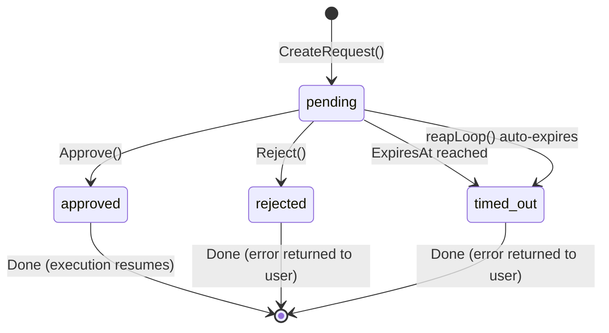
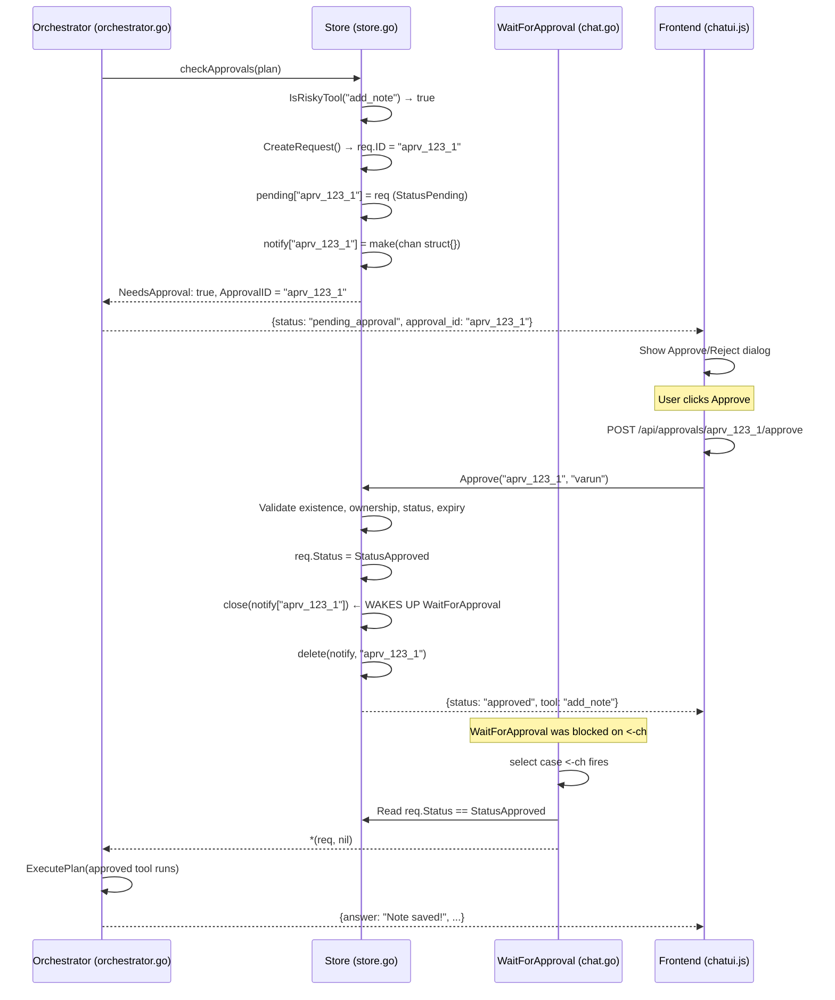
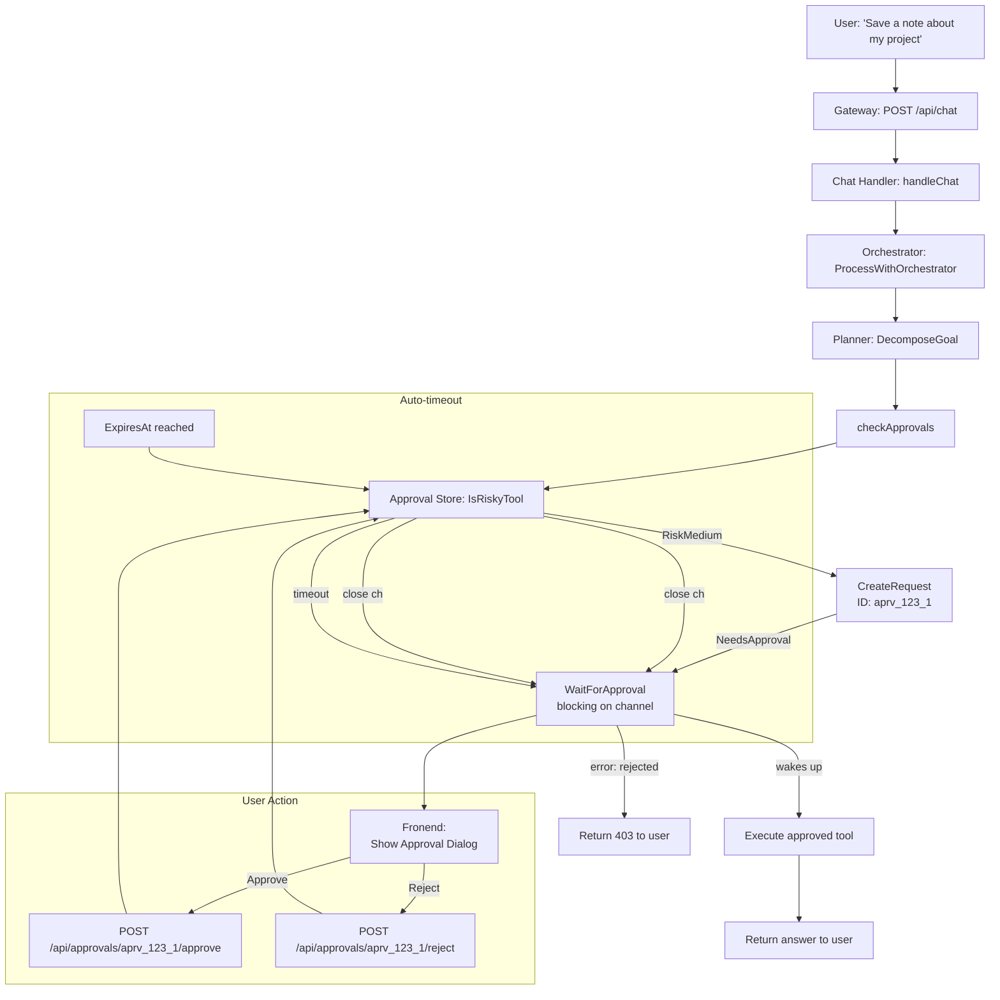
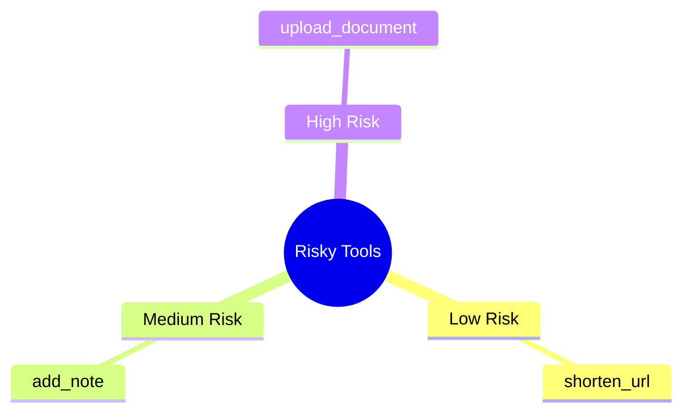

# Part 7: Human-in-the-Loop — The Approval Workflow

## Table of Contents
1. [Architecture Overview](#1-architecture-overview)
2. [Data Structures](#2-data-structures)
3. [Risk Assessment](#3-risk-assessment)
4. [Creating an Approval Request](#4-creating-an-approval-request)
5. [Waiting for Approval](#5-waiting-for-approval)
6. [Approving a Request](#6-approving-a-request)
7. [Rejecting a Request](#7-rejecting-a-request)
8. [Automatic Cleanup (Reaper)](#8-automatic-cleanup-reaper)
9. [How the Orchestrator Uses the Approval Store](#9-how-the-orchestrator-uses-the-approval-store)
10. [The Frontend Approval UI Flow](#10-the-frontend-approval-ui-flow)
11. [Interview Questions & Answers](#11-interview-questions--answers)
12. [Diagrams](#12-diagrams)
13. [Quick Reference](#13-quick-reference)

---

## 1. Architecture Overview

### What Is the Approval System?

The approval system implements a **human-in-the-loop** workflow for risky MCP tool calls. Before an AI agent executes a potentially dangerous action (like saving a note or uploading a document), the system pauses and asks the user for explicit permission. This prevents the AI from making irreversible changes without human confirmation.

```
User Message → Orchestrator → Planner → Approval Check → [APPROVAL NEEDED?]
                                                         │
                                            ┌────────────┴────────────┐
                                            ▼                         ▼
                                       No Approval               Wait for User
                                       (execute directly)        (show UI dialog)
                                            │                         │
                                            ▼                         ▼
                                       tool result           User clicks Approve
                                                                       │
                                                       POST /api/approvals/{id}/approve
                                                                       │
                                            ┌────────────────────────┘
                                            ▼
                                       Resume execution
                                       with approved tool
```

### Single Source File

| File | Lines | Purpose |
|---|---|---|
| `store.go` | 232 | ApprovalRequest, Store, risk assessment, wait/notify, reaper |

### Key Design Decisions

- **In-memory only** — no MongoDB dependency for the approval data; approvals are per-request, not persistent
- **Channel-based notification** — `WaitForApproval` blocks on a channel (zero CPU), not busy-polling
- **Per-user scoping** — users can only approve/reject their own requests (ownership check)
- **Auto-expiry** — pending requests expire after a configurable timeout and are automatically cleaned up

---

## 2. Data Structures

### 2.1 ApprovalRequest

```go
type ApprovalRequest struct {
    ID          string         `json:"id"`             // "aprv_{timestamp}_{seq}"
    Username    string         `json:"username"`       // who owns this request
    Description string         `json:"description"`    // human-readable summary
    Tool        string         `json:"tool"`           // which tool (e.g. "add_note")
    Arguments   map[string]any `json:"arguments"`      // tool arguments
    Status      ApprovalStatus `json:"status"`         // pending/approved/rejected/timed_out
    CreatedAt   time.Time      `json:"created_at"`
    ExpiresAt   time.Time      `json:"expires_at"`
}
```

- **ID format:** `aprv_{unix_timestamp}_{sequence_number}` — e.g., `aprv_1721691200_1`
- **Status transitions:** `pending` → `approved` | `rejected` | `timed_out`
- **ExpiresAt:** `time.Now().Add(timeout)` — set when the request is created

### 2.2 ApprovalStatus

```go
type ApprovalStatus string

const (
    StatusPending  ApprovalStatus = "pending"
    StatusApproved ApprovalStatus = "approved"
    StatusRejected ApprovalStatus = "rejected"
    StatusTimedOut ApprovalStatus = "timed_out"
)
```

Four terminal states — once a request leaves `pending`, it never returns.

### 2.3 RiskLevel

```go
type RiskLevel int

const (
    RiskLow    RiskLevel = 0
    RiskMedium RiskLevel = 1
    RiskHigh   RiskLevel = 2
)
```

Three risk tiers. Each tool is assigned a risk level at startup.

### 2.4 The Risky Tools Registry

```go
var riskyTools = map[string]RiskLevel{
    "add_note":         RiskMedium,
    "upload_document":  RiskHigh,
    "shorten_url":      RiskLow,
}
```

| Tool | Risk Level | Why |
|---|---|---|
| `add_note` | Medium | Writes persistent data to the notes database |
| `upload_document` | High | Adds content to the knowledge base (RAG), affects future AI answers |
| `shorten_url` | Low | No data mutation, no side effects beyond the URL shortening service |

All other tools are considered **not risky** (the `IsRiskyTool` function returns `false` for unlisted tools). This means the default is to auto-execute tools without approval unless explicitly registered as risky.

### 2.5 Store

```go
type Store struct {
    mu       sync.RWMutex
    pending  map[string]*ApprovalRequest    // id → request
    notify   map[string]chan struct{}       // id → notification channel (closed on approve/reject)
    nextID   int                             // monotonic sequence counter
    timeout  time.Duration                   // per-request expiry (default: 5 minutes)
    stopCh   chan struct{}                   // signal to stop the reaper goroutine
}
```

### 2.6 Notification Channels

Each pending approval request has an associated `chan struct{}`. When the user approves or rejects, the channel is **closed**. This is the Go idiom for broadcasting a one-time event — any goroutine waiting on `<-ch` wakes up instantly.

```
User clicks Approve → Approve() → close(ch) → WaitForApproval receives from ch → returns
```

---

## 3. Risk Assessment

### `IsRiskyTool(toolName string) (RiskLevel, bool)`

```go
func (s *Store) IsRiskyTool(toolName string) (RiskLevel, bool) {
    level, ok := riskyTools[toolName]
    return level, ok
}
```

Returns `(RiskLevel, true)` if the tool is in the risky registry, `(RiskLow, false)` otherwise. The boolean tells the caller whether the tool is registered as risky at all.

### How Risk Assessment Works in the Orchestrator

In `orchestrator.go:checkApprovals()`:

```go
for _, task := range plan.Tasks {
    if approved[task.Tool] {
        continue // already approved this round
    }
    if _, risky := cfg.ApprovalStore.IsRiskyTool(task.Tool); risky {
        // Create an approval request and return early
        req := cfg.ApprovalStore.CreateRequest(...)
        return &OrchestratorResult{NeedsApproval: true, ApprovalID: req.ID}, nil
    }
}
```

The flow:
1. Skip tools already approved in this request cycle
2. Check if the tool is in the `riskyTools` map
3. If risky → create an approval request and pause execution
4. If not risky → proceed to execute

---

## 4. Creating an Approval Request

### `CreateRequest(username, description, tool, args) *ApprovalRequest`

```go
func (s *Store) CreateRequest(username, description, tool string, args map[string]any) *ApprovalRequest {
    s.mu.Lock()
    defer s.mu.Unlock()

    s.nextID++
    id := fmt.Sprintf("aprv_%d_%d", time.Now().Unix(), s.nextID)

    req := &ApprovalRequest{
        ID:          id,
        Username:    username,
        Description: description,
        Tool:        tool,
        Arguments:   args,
        Status:      StatusPending,
        CreatedAt:   time.Now(),
        ExpiresAt:   time.Now().Add(s.timeout),
    }
    s.pending[id] = req
    s.notify[id] = make(chan struct{})
    return req
}
```

### ID Generation

The ID combines a Unix timestamp and a monotonic sequence number:
```
aprv_1721691200_1
aprv_1721691200_2
aprv_1721691260_3  (next second, sequence resets per second)
```

This ensures IDs are:
- **Unique** — timestamp + sequence guarantees no collisions
- **Sortable** — lexicographic order matches creation order
- **Readable** — you can decode `aprv_1721691200` → Unix timestamp → July 23, 2024

### Notify Channel

A fresh `make(chan struct{})` is created for every request. This channel is **closed** (not sent to) when the request is approved or rejected. Closing a channel broadcasts to all receivers — this is the mechanism that wakes up `WaitForApproval`.

---

## 5. Waiting for Approval

### `WaitForApproval(id, username string, _ time.Duration) (*ApprovalRequest, error)`

Note: The `_ time.Duration` parameter is unused — the expiry timeout is already baked into the request's `ExpiresAt` field.

### Flow

```
1.  Grab the notify channel and expiry time under a read lock
2.  Set up a timer: fire when ExpiresAt is reached
3.  Select on:
      - <-ch: notification channel closed (approved/rejected)
      - <-timer.C: expiry reached
4.  On notification: read final status from pending map, return request or error
5.  On timeout: mark request as timed_out, return error
```

### Key Code: The Select Block

```go
timer := time.NewTimer(time.Until(expiresAt))
defer timer.Stop()

select {
case <-ch:
    // Approved or rejected — read final status
    s.mu.RLock()
    req, ok = s.pending[id]
    s.mu.RUnlock()
    // ... return based on req.Status
case <-timer.C:
    s.mu.Lock()
    if r, exists := s.pending[id]; exists && r.Status == StatusPending {
        r.Status = StatusTimedOut
    }
    s.mu.Unlock()
    return nil, fmt.Errorf("approval request timed out")
}
```

### Zero CPU Burn

The `select` statement blocks the goroutine without consuming CPU. When either the channel is closed (user acts) or the timer fires (timeout), exactly one branch executes. This is idiomatic Go concurrency — no busy-looping, no polling.

---

## 6. Approving a Request

### `Approve(id, username string) (*ApprovalRequest, error)`

### Validation Sequence (all under write lock)

| Step | Check | Error if Failed |
|---|---|---|
| 1 | Request exists in `pending` map | `"approval request not found"` |
| 2 | `req.Username == username` | `"belongs to a different user"` |
| 3 | `req.Status == StatusPending` | `"already approved"` or `"already rejected"` |
| 4 | `time.Now() < req.ExpiresAt` | `"has expired"` |

### On Success

```go
req.Status = StatusApproved
close(s.notify[id])  // wake up WaitForApproval goroutine
delete(s.notify, id) // cleanup notification channel (no leaks)
```

The `close(ch)` is the critical operation — it wakes up the user's HTTP handler that's blocked in `WaitForApproval`, allowing the approval to propagate back to the chat flow.

### Why Close (Not Send)

Go channels: closing is a one-time broadcast to all receivers. Sending requires someone on the receiving end. Since `WaitForApproval` is the only receiver and we don't need to pass data through the channel, closing is the correct choice. It signals "something happened" without allocating a value on the heap.

---

## 7. Rejecting a Request

### `Reject(id, username string) (*ApprovalRequest, error)`

Identical validation logic to `Approve` (same 3 checks), except:
- On success, sets `req.Status = StatusRejected`
- Also calls `close(s.notify[id])` to wake up the waiting goroutine

### WaitForApproval Error on Rejection

When the waiting goroutine wakes up and finds `StatusRejected`:

```go
case StatusRejected:
    return nil, fmt.Errorf("action rejected by user")
```

The chat handler in `chat.go` receives this error and responds with a 403 Forbidden containing `"The action was not approved. Try rephrasing your request."` — the exact error message the front-end shows.

---

## 8. Automatic Cleanup (Reaper)

### `reapLoop()` — Background Goroutine

Started with `go s.reapLoop()` inside `NewStore()`. Runs until `Close()` is called or the process exits.

### Two Cleanup Tasks (every 30 seconds)

```go
func (s *Store) reapLoop() {
    ticker := time.NewTicker(30 * time.Second)
    defer ticker.Stop()
    for {
        select {
        case <-s.stopCh:
            return
        case <-ticker.C:
            s.mu.Lock()
            now := time.Now()
            for id, req := range s.pending {
                // Task 1: Auto-expire timed-out requests
                if req.Status == StatusPending && now.After(req.ExpiresAt) {
                    req.Status = StatusTimedOut
                    if ch, ok := s.notify[id]; ok {
                        close(ch)      // wake up any waiters
                        delete(s.notify, id)
                    }
                }
                // Task 2: Remove old non-pending requests (24h+)
                if req.Status != StatusPending && now.After(req.CreatedAt.Add(24*time.Hour)) {
                    delete(s.pending, id)
                }
            }
            s.mu.Unlock()
        }
    }
}
```

Task 1 ensures that expired requests don't linger in a `pending` state forever — they get auto-timed-out and the notification channel is closed (waking any waiting goroutine with a timeout error). Task 2 ensures old completed requests don't accumulate in memory indefinitely (24-hour grace period).

---

## 9. How the Orchestrator Uses the Approval Store

### Setup

In `chat.go` (handler), the orchestrator config is built with the approval store:

```go
orchCfg := &ai.OrchestratorConfig{}
if s.approvalStore != nil && username != "" {
    orchCfg.ApprovalStore = s.approvalStore
    orchCfg.ApprovalUser = username
    orchCfg.ApprovedTools = approvedTools // tools approved in earlier rounds
}
```

If there's no approval store (e.g., no auth configured), the orchestrator just skips `checkApprovals` entirely — no approval prompts are ever shown.

### `checkApprovals` in Detail (orchestrator.go:188-218)

```
For each task in the plan:
  1. If task.Tool is in ApprovedTools set → skip (already approved this cycle)
  2. If IsRiskyTool(task.Tool) returns true →
     a. Create an approval request via CreateRequest()
     b. Return OrchestratorResult{NeedsApproval: true, ApprovalID: req.ID}
```

### The ApprovedTools Accumulation Pattern

When re-planning after a failure (or after approval), the `approvedTools` list is accumulated across rounds:

```go
// After user approves, the frontend sends approved_tools with each subsequent request
approvedTools = append(approvedTools, req.ApprovedTools...)  // carry forward
approvedTools = append(approvedTools, approved.Tool)        // add newly approved
```

This prevents the system from asking for approval of the same tool twice in the same conversation round — a critical guard against infinite approval loops.

### WaitForApproval in Chat Handler (chat.go)

```go
if req.ApprovalID != "" && s.approvalStore != nil {
    approved, err := s.approvalStore.WaitForApproval(req.ApprovalID, username, 500*time.Millisecond)
    if err != nil {
        // Timeout or rejection → show error
        s.jsonResponse(w, http.StatusForbidden, ...)
        return
    }
    if approved.Tool != "" {
        approvedTools = append(approvedTools, approved.Tool)
    }
    approvedTools = append(approvedTools, req.ApprovedTools...)
}
```

The `500 * time.Millisecond` timeout for WaitForApproval is the **wait timeout**, not the request expiry timeout. It means the HTTP handler waits up to 500ms for the approval result. If the result comes back in 10ms (user clicks Approve immediately), the handler proceeds immediately. If the user takes 30 seconds, the HTTP request will have already returned a "pending" response and the frontend handles it.

Actually wait — looking at the code more carefully, the `WaitForApproval` uses the request's own `ExpiresAt` field, not the passed duration parameter which is `_` (unused). So the WaitForApproval will block until either the user acts OR the request's own `ExpiresAt` fires.

---

## 10. The Frontend Approval UI Flow

### When `pending_approval` Is Received

The chat UI (chatui.js) handles the `status: "pending_approval"` response:

1. Remove the typing indicator
2. Show an "Action Required" card with a yellow border
3. List planned tasks with tool names and arguments
4. Show **Approve** (green) and **Reject** (red) buttons

### Approve Flow

```javascript
async function approveAction() {
    // 1. POST to /api/approvals/{id}/approve
    const approveResp = await fetch('/api/approval/' + pendingApprovalId + '/approve', {
        method: 'POST', headers: authHeaders()
    });
    // 2. Capture the approved tool name
    if (approveResp.ok) {
        const approveData = await approveResp.json();
        if (approveData.tool) pendingApprovedTools.push(approveData.tool);
    }
    // 3. Remove the approval prompt
    document.getElementById('approval-prompt').remove();
    // 4. Re-send the original message with the approval_id
    await doSend(savedMsg, savedId);
}
```

### The `pendingApprovedTools` Accumulation

```javascript
let pendingApprovedTools = []; // resets for each new message

// When an approval is granted, the tool name is added:
pendingApprovedTools.push(approveData.tool);

// On the next message send, it's carried forward:
if (pendingApprovedTools.length > 0) body.approved_tools = pendingApprovedTools;
```

This ensures that within a single message cycle, if the oracle re-plans and includes the same tool, it won't trigger another approval prompt because the orchestrator already has it in the `approvedTools` set.

---

## 11. Interview Questions & Answers

### Q1: "What triggers an approval request?"

> The `checkApprovals` function in the orchestrator checks each task's tool against the `riskyTools` registry. Only tools explicitly registered as risky (`add_note`, `upload_document`, `shorten_url`) trigger approval. If the tool is not in the registry, or if the user already approved it in the current request cycle (via `ApprovedTools` set), it executes without prompting.

### Q2: "How does WaitForApproval avoid busy-polling?"

> It uses a Go `select` statement that blocks on two channels:
> 1. The notification channel (`<-ch`) — closed by `Approve()` or `Reject()`, which wakes the goroutine instantly
> 2. A `time.Timer` (`<-timer.C`) — fires when the request expires
>
> The `select` blocks the goroutine without consuming CPU. When either event occurs, exactly one branch executes. This is idiomatic Go concurrency — zero polling overhead.

### Q3: "What happens if a user leaves the approval dialog open and walks away?"

> Two mechanisms handle this:
> 1. **Request expiry** — When `WaitForApproval` finds `now > ExpiresAt`, it marks the request as `timed_out` and returns an error. The chat handler sends a 403 with "The action was not approved."
> 2. **Reaper goroutine** — The `reapLoop()` runs every 30 seconds and auto-expires any pending request whose `ExpiresAt` has passed. It also closes the notification channel to wake any lingering waiters.
>
> The default timeout is typically 5 minutes (configurable via the Store's `timeout` parameter). After expiry, the user can rephrase their request and the AI may choose a different tool.

### Q4: "Why is there a 24-hour cleanup for completed requests?"

> Completed requests (approved, rejected, or timed-out) are kept in memory for 24 hours before being deleted by the reaper. This serves two purposes:
> 1. **Audit trail** — completed requests remain queryable during their 24-hour window
> 2. **Debugging** — if an issue arises, developers can inspect recent approval history
>
> After 24 hours, non-pending requests are cleaned up to prevent unbounded memory growth.

### Q5: "How does the system prevent approval loops?"

> Three mechanisms prevent infinite approval loops:
> 1. **Per-round approval tracking** — `ApprovedTools` accumulates within a single message cycle. If the user approves `add_note` once, subsequent `add_note` calls in the same cycle skip approval.
> 2. **Retry plan validation** — When the orchestrator retries after a failure, it only accepts the retry plan if it introduces **new tools**. If the same failed tool is in the retry plan, the retry is rejected.
> 3. **Auto-expiry** — Pending requests expire after the timeout, so even if the user doesn't act, the system progresses (with a timeout error that prompts the user to rephrase).

### Q6: "What is the role of the notification channel in Go?"

> The notification channel (`chan struct{}`) is a one-time broadcast mechanism:
> - **Created** as an open channel when an approval request is made
> - **Closed** by `Approve()` or `Reject()` — closing is a broadcast that wakes ALL receivers
> - **Deleted** from the `notify` map after being closed to prevent memory leaks
>
> This pattern is better than sending a value through the channel because:
> - No allocation of a send value is needed
> - The channel can only be closed once, naturally preventing duplicate notifications
> - `WaitForApproval` uses `select`/`<-ch` which wakes on close without needing to read a value

### Q7: "How is the Request ID generated and how is it useful?"

> IDs are generated as `aprv_{unix_timestamp}_{sequence_number}` (e.g., `aprv_1721691200_1`). The timestamp makes IDs sortable by creation time and decodable without a database lookup. The sequence number ensures uniqueness within the same second. This format is useful for:
> - Client-side rendering (showing the ID in approval dialogs for debugging)
> - URL paths in REST API calls (`/api/approvals/aprv_1721691200_1/approve`)
> - Log correlation (matching approval events across microservices)

### Q8: "What security checks does `Approve` perform?"

> The `Approve` method performs four security checks sequentially:
> 1. **Existence** — the request must exist in the `pending` map (prevents approving non-existent requests)
> 2. **Ownership** — `req.Username == username` (user A cannot approve user B's requests)
> 3. **Status** — `req.Status == StatusPending` (cannot re-approve an already approved/rejected request)
> 4. **Expiry** — `time.Now() < req.ExpiresAt` (cannot approve an expired request)
>
> Every check returns a specific error message, making debugging and user feedback precise.

### Q9: "Why is the approval store in-memory instead of MongoDB?"

> Approvals are **ephemeral** — they exist only for the duration of a single request-response cycle (seconds to minutes). Persisting them to MongoDB would add:
> - Unnecessary latency (MongoDB insert + read for a short-lived operation)
> - Unnecessary complexity (cleanup jobs for expired approvals)
> - Unnecessary failure modes (what if MongoDB is down during an approval?)
>
> The in-memory approach is simpler, faster (sub-microsecond map lookup vs. network round-trip), and functionally correct. The reaper goroutine handles cleanup automatically. If the gateway server restarts, any pending approvals are lost — which is acceptable because the AI can simply re-plan and ask again.

### Q10: "How would you add a new risky tool?"

> To add a new tool to the risky registry, you'd:
> 1. Add the tool to the `riskyTools` map in `store.go`:
>    ```go
>    var riskyTools = map[string]RiskLevel{
>        // ... existing entries ...
>        "send_email": RiskHigh,  // new entry
>    }
>    ```
> 2. Choose the appropriate risk level:
>    - `RiskLow` — minimal side effects (URL shortening, QR generation)
>    - `RiskMedium` — writes to user data (notes, saved preferences)
>    - `RiskHigh` — irreversible or broad-impact actions (document upload, sending emails)
> 3. No changes needed in the orchestrator or frontend — `checkApprovals` and the UI dynamically check the registry
>
> This design makes it trivial to add new risky tools without modifying any other code.

---

## 12. Diagrams

### Approval Lifecycle State Machine



### Notification Channel Flow



### Reaper Cleanup Flow

```mermaid
sequenceDiagram
    participant Reaper as reapLoop() goroutine
    participant S as Store (store.go)
    participant Pending as s.pending map

    Reaper->>Reaper: Ticker fires every 30s

    loop For each request in s.pending
        Reaper->>Pending: req.Status == pending AND now > req.ExpiresAt?
        Pending-->>Reaper: Yes
        Reaper->>S: req.Status = StatusTimedOut
        Reaper->>S: close(notify[id]) ← wake WaitForApproval
        Reaper->>S: delete(notify, id)

        Reaper->>Pending: req.Status != pending AND now > req.CreatedAt + 24h?
        Pending-->>Reaper: Yes
        Reaper->>S: delete(pending, id) ← memory cleanup
    end
```



### Full Approval Flow (End-to-End)



### Tools by Risk Level



### Approval Request Lifecycle Data

```
┌─────────────────────────────────────────────────────────────┐
│                    ApprovalRequest                          │
├─────────────────────────────────────────────────────────────┤
│ ID:        "aprv_1721691200_1"                             │
│ User:      "varun"                                         │
│ Tool:      "add_note"                                      │
│ Status:    pending → approved/rejected/timed_out           │
│ Created:   2026-07-21T10:00:00Z                            │
│ Expires:   2026-07-21T10:05:00Z (5 min from creation)     │
│ Notify:    chan struct{} (closed on approve/reject)        │
└─────────────────────────────────────────────────────────────┘
```

---

## 13. Quick Reference

### Approval Store Methods

| Method | Signature | Purpose |
|---|---|---|
| `IsRiskyTool` | `(toolName string) (RiskLevel, bool)` | Check if a tool is registered as risky |
| `CreateRequest` | `(username, desc, tool, args) *ApprovalRequest` | Create new pending approval request |
| `Approve` | `(id, username string) (*ApprovalRequest, error)` | Approve a pending request (validates ownership + expiry) |
| `Reject` | `(id, username string) (*ApprovalRequest, error)` | Reject a pending request (validates ownership) |
| `GetPending` | `(username string) []ApprovalRequest` | List all pending requests for a user |
| `WaitForApproval` | `(id, username string, _ time.Duration) (*ApprovalRequest, error)` | Block until approved/rejected/timed out |
| `Close` | `()` | Stop the reaper goroutine |

### Risk Levels

| Level | Constant | Tools | Description |
|---|---|---|---|
| Low | `RiskLow = 0` | `shorten_url` | Read-only, no data mutation, minimal side effects |
| Medium | `RiskMedium = 1` | `add_note` | Writes persistent user data |
| High | `RiskHigh = 2` | `upload_document` | Irreversible action, affects AI knowledge base |

### Approval Status Transitions

```
pending ──Approve()──→ approved ──→ (terminal)
    │                    
    ├──Reject()──→ rejected ──→ (terminal)
    │
    ├──Reaper expiry──→ timed_out ──→ (terminal)
    │
    └──24h cleanup─────→ deleted from pending map
```

### ID Format

```
aprv_{unix_timestamp}_{sequence_number}
Example: aprv_1721691200_1
Decoded: created at 1721691200 (Unix epoc), sequence 1
```

### Key Timeouts

| Timeout | Default | Where Set | Purpose |
|---|---|---|---|
| Request expiry | Configurable via `NewStore(timeout)` | Store constructor | How long a pending approval is valid before auto-expiry |
| Reaper interval | 30 seconds | `reapLoop()` ticker | How often the cleanup goroutine scans pending requests |
| Retention period | 24 hours | `reapLoop()` cleanup logic | How long completed requests stay in memory before deletion |
| WaitForApproval timeout | Unused (uses ExpiresAt) | Orchestrator chat.go | The HTTP handler wait timeout (500ms passed but unused) |

### Error Messages by Failure Mode

| Failure | Error Message | HTTP Status |
|---|---|---|
| Request not found | `"approval request \"X\" not found"` | 404 (conceptually) |
| Wrong user | `"approval request \"X\" belongs to a different user"` | 403 |
| Already approved | `"approval request \"X\" is already approved"` | 400 |
| Already rejected | `"approval request \"X\" is already rejected"` | 400 |
| Expired | `"approval request \"X\" has expired"` | 410 (Gone) |
| User rejected | `"action rejected by user"` | 403 |
| Timed out | `"approval request timed out"` | 408 (Request Timeout) |

---

*End of Part 7: Human-in-the-Loop — The Approval Workflow.*
