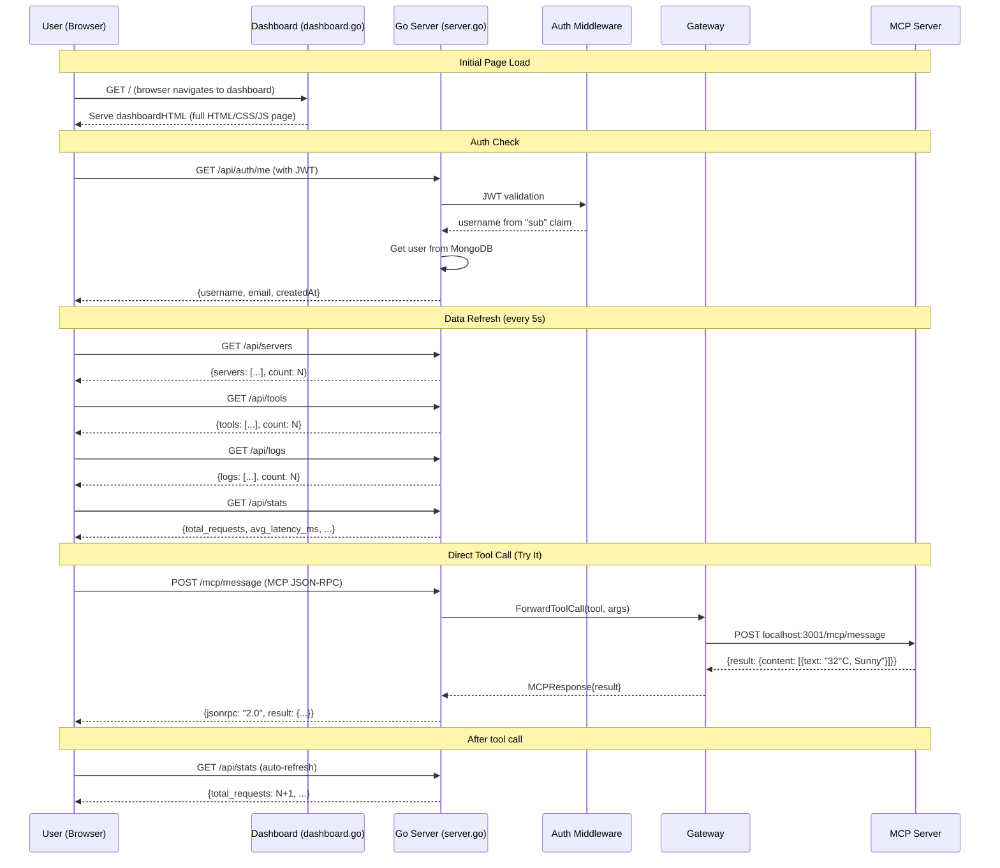
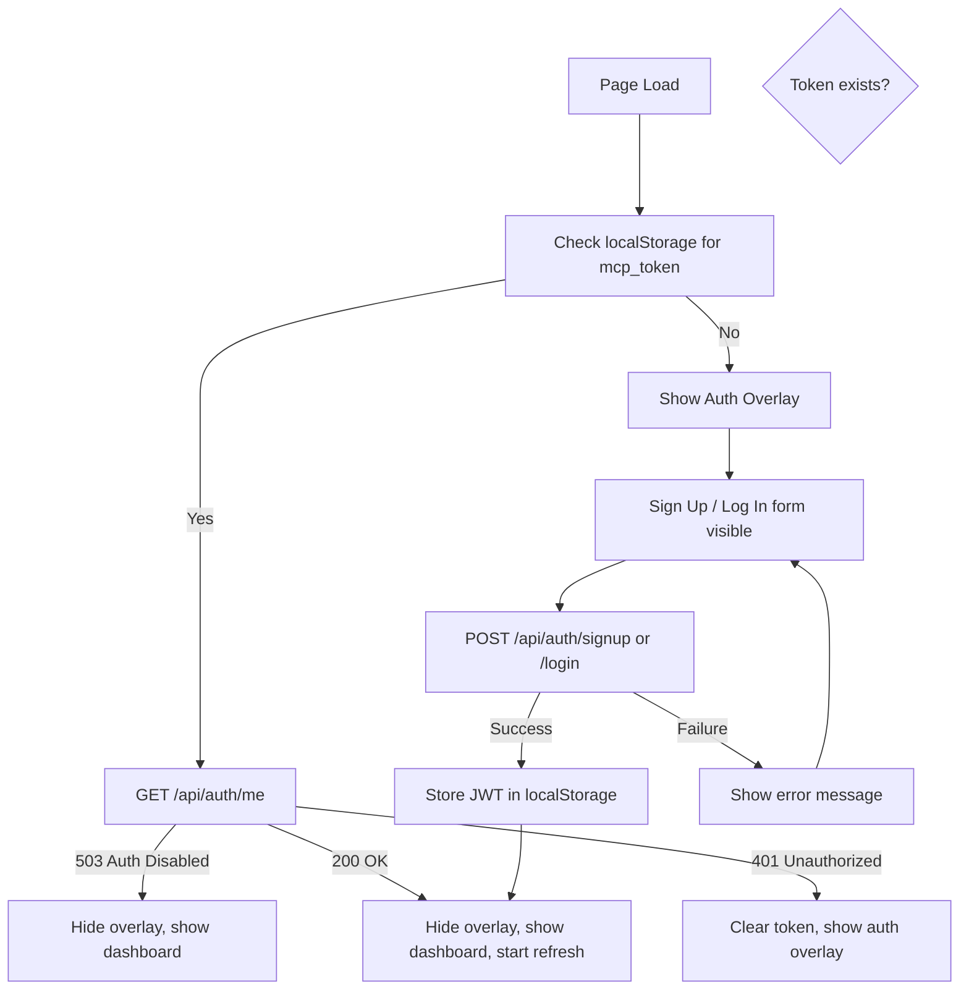

# Part 8: Dashboard Frontend — The Embedded HTML/CSS/JS Interface

## Table of Contents
1. [Architecture Overview](#1-architecture-overview)
2. [Dashboard vs Chat UI — Two Separate Interfaces](#2-dashboard-vs-chat-ui--two-separate-interfaces)
3. [Auth Overlay (Signup/Login)](#3-auth-overlay-signuplogin)
4. [Header & User Display](#4-header--user-display)
5. [Stats Grid](#5-stats-grid)
6. [Try It Live Section](#6-try-it-live-section)
7. [Servers & Tools Panels](#7-servers--tools-panels)
8. [Request Logs](#8-request-logs)
9. [JavaScript Architecture](#9-javascript-architecture)
10. [API Endpoints Used by the Dashboard](#10-api-endpoints-used-by-the-dashboard)
11. [Interview Questions & Answers](#11-interview-questions--answers)
12. [Diagrams](#12-diagrams)
13. [Quick Reference](#13-quick-reference)

---

## 1. Architecture Overview

### What Is the Dashboard?

The Dashboard is an embedded single-page HTML/CSS/JS application served by the Go backend (`internal/server/dashboard.go`). It provides a visual interface for:

- **Authentication** — signup, login, token refresh, logout
- **Live tool execution** — "Try It" forms for all 18 MCP tools
- **Server monitoring** — status of all connected MCP servers
- **Tool browsing** — list of all available tools across all servers
- **Request logging** — recent tool call history with latency and status
- **Statistics** — aggregate request counts, success rates, and latency

```
┌─────────────────────────────────────────────────────────────────────────┐
│                          Dashboard Browser                              │
│  ┌──────────────┐  ┌──────────────────┐  ┌──────────────────────────┐  │
│  │  Auth Overlay  │  │  Stats Grid      │  │  Try It Live (tabs)    │  │
│  │  (signup/login)│  │  (4 cards)       │  │  (weather, github, etc.)│  │
│  └──────────────┘  └──────────────────┘  └──────────────────────────┘  │
│  ┌────────────────────────────────────────────────────────────────────┐  │
│  │  Servers Panel │ Tools Panel                                      │  │
│  └────────────────────────────────────────────────────────────────────┘  │
│  ┌────────────────────────────────────────────────────────────────────┐  │
│  │  Request Logs (table with time, method, tool, latency, status)    │  │
│  └────────────────────────────────────────────────────────────────────┘  │
└─────────────────────────────────────────────────────────────────────────┘
          │
          │  AJAX/Fetch calls (JSON)
          ▼
┌─────────────────────────────────────────────────────────────────────────┐
│              MCP Gateway HTTP Server (Go)                               │
│  ┌───────────────────────────────────────────────────────────────────┐  │
│  │  dashboardHTML (Go string constant)  ──→  serves HTML to browser │  │
│  │  handleDashboard()                        serves at GET /          │  │
│  │  handleListServers()                      GET /api/servers         │  │
│  │  handleListTools()                        GET /api/tools           │  │
│  │  handleLogs()                             GET /api/logs            │  │
│  │  handleStats()                            GET /api/stats           │  │
│  │  handleMCPMessage()                       POST /mcp/message        │  │
│  │  handlePendingApprovals()   (for chat UI) GET /api/approvals/pending│ │
│  │  handleApproveAction()       (for chat UI) POST /api/approvals/... │ │
│  └───────────────────────────────────────────────────────────────────┘  │
│          │                                                                │
│          ▼                                                                │
│  ┌───────────────────────────────────────────────────────────────────┐  │
│  │  MCP Servers (localhost:3001-3008)  ←  ForwardToolCall            │  │
│  └───────────────────────────────────────────────────────────────────┘  │
└─────────────────────────────────────────────────────────────────────────┘
```

### File Statistics

| File | Lines | Purpose |
|---|---|---|
| `internal/server/dashboard.go` | ~1220 | Embedded HTML/CSS/JS as a Go string constant |
| `internal/server/server.go` | N/A | Hosts dashboard at `GET /`, serves API endpoints |

---

## 2. Dashboard vs Chat UI — Two Separate Interfaces

The project has **two** embedded HTML interfaces:

| Feature | Dashboard (`dashboard.go`) | Chat UI (`chatui.go`) |
|---|---|---|
| Entry URL | `GET /` | `GET /chat` |
| Primary purpose | Tool exploration, testing, monitoring | Conversational AI chat |
| Auth required | Yes (after initial setup) | Yes (for chat history) |
| Try-It buttons | 8 tool categories with forms | None (chat-based input) |
| Server monitoring | Live status panel | None |
| Request logs | Table with timestamps | None |
| Statistics | 4 stat cards (total, servers, tools, latency) | None |
| Chat history | None | Full session management |
| Approval dialogs | None (tools execute directly) | Yes (for risky tools) |
| Voice input | None | Web Speech API |
| File upload | Yes (for document RAG) | Yes (for document RAG) |

---

## 3. Auth Overlay

### Structure

The dashboard has a full authentication overlay that covers the entire page when the user is not logged in:

```html
<div class="auth-overlay" id="authOverlay">
    <div class="auth-box">
        <!-- Signup Form (shown by default) -->
        <div id="authSignupForm">
            <div class="auth-logo">...</div>
            <h2>Create Account</h2>
            <p class="subtitle">Sign up to use the MCP Gateway</p>
            <div class="auth-error" id="authError"></div>
            <div class="auth-success" id="authSuccess"></div>
            <!-- Username, Email, Password fields -->
            <button class="auth-btn" id="signupBtn" onclick="handleSignup()">
                <span class="btn-text">Sign Up</span>
                <div class="spinner"></div>
            </button>
            <div class="auth-switch">Already have an account? <a onclick="showLogin()">Log in</a></div>
        </div>

        <!-- Login Form (hidden by default) -->
        <div id="authLoginForm" style="display:none;">
            <div class="auth-logo">...</div>
            <h2>Welcome Back</h2>
            <p class="subtitle">Log in to continue using the MCP Gateway</p>
            <div class="auth-error" id="loginError"></div>
            <!-- Username, Password fields -->
            <button class="auth-btn" id="loginBtn" onclick="handleLogin()">
                <span class="btn-text">Log In</span>
                <div class="spinner"></div>
            </button>
            <div class="auth-switch">Don't have an account? <a onclick="showSignup()">Sign up</a></div>
        </div>
    </div>
</div>
```

### Auth Form Fields

| Field | Type | Validation |
|---|---|---|
| Username | text | Required (for both signup and login) |
| Email | email | Required for signup only |
| Password | password | Required, min 6 chars for signup |

### Auth Flow

```
User loads dashboard (GET /)
    │
    ▼
JavaScript checks localStorage for saved JWT token
    │
    ├── Token exists → call GET /api/auth/me to verify
    │       ├── 200 OK → hide auth overlay, show dashboard, refresh data
    │       ├── 401 → clear token, show auth overlay
    │       └── 503 → auth disabled, skip login, show dashboard
    │
    ├── No token → call GET /api/auth/me (anonymous check)
    │       ├── 503 → auth disabled, skip login, show dashboard
    │       └── 401 → show auth overlay
    │
    └── User clicks Sign Up / Log In → POST /api/auth/signup or /api/auth/login
            ├── Success → store JWT in localStorage, hide overlay, show dashboard
            └── Failure → show error message under the form
```

### Signup Validation (Frontend)

```javascript
// Frontend checks before sending request:
if (!username || !email || !password) {
    errEl.textContent = 'All fields are required';
    errEl.style.display = 'block';
    return;
}
// Password length check is done SERVER-SIDE (min 6 chars)
```

### Loading Spinner

The auth button shows a CSS-only spinner during the request:

```css
.spinner {
    display: none;
    width: 16px; height: 16px;
    border: 2px solid rgba(255,255,255,0.3);
    border-top-color: #fff;
    border-radius: 50%;
    animation: spin 0.7s linear infinite;
}
.auth-btn.loading .btn-text { display: none; }
.auth-btn.loading .spinner { display: block; }
```

The button is disabled and gets the `loading` class during the request, preventing double-clicks.

### Token Refresh on Dashboard

The dashboard implements silent token refresh on page load and every hour:

```javascript
// Decode JWT payload (Base64) to check expiry — no network call
function tokenExpiresAt(token) {
    const payload = JSON.parse(atob(token.split('.')[1].replace(/-/g,'+').replace(/_/g,'/')));
    return payload.exp || 0;
}

// Refresh if less than 24 hours remain
async function silentRefresh() {
    const token = getToken();
    const exp = tokenExpiresAt(token);
    const secsLeft = exp - Math.floor(Date.now() / 1000);
    if (secsLeft > 24 * 3600) return; // more than 1 day left
    const resp = await fetch(API_BASE + '/api/auth/refresh', {
        method: 'POST',
        headers: { 'Authorization': 'Bearer ' + token }
    });
    if (resp.ok) { const data = await resp.json(); if (data.token) setToken(data.token); }
}
```

---

## 4. Header & User Display

The header bar contains:

1. **Title** — "MCP Gateway"
2. **AI Chat link** — navigates to `/chat`
3. **User info** (hidden until login):
   - Avatar — first letter of username, purple background
   - Username display
   - Logout button
4. **Status indicator** — green pulsing dot + "Live" text

### User Display After Login

```javascript
function setUserDisplay(username) {
    const info = document.getElementById('userInfo');
    info.style.display = 'flex';
    document.getElementById('userAvatar').textContent = username.charAt(0).toUpperCase();
    document.getElementById('userName').textContent = username;
    localStorage.setItem('mcp_username', username);
}
```

### Logout Flow

1. Clears JWT token from `localStorage`
2. Clears `mcp_username` from `localStorage`
3. Clears ALL chat data (messages, sessions, session ID) so the next user doesn't see previous user's history
4. Stops the auto-refresh interval
5. Hides user info panel
6. Shows auth overlay

---

## 5. Stats Grid

Four stat cards displayed at the top of the dashboard:

| Stat Card | ID | Data Source | Color | Description |
|---|---|---|---|---|
| Total Requests | `stat-total` | `GET /api/stats` → `total_requests` | Blue (#3b82f6) | All-time MCP tool calls |
| Servers Online | `stat-servers` | `GET /api/servers` + `GET /api/stats` | Green (#22c55e) | Active / configured count |
| Tools Available | `stat-tools` | `GET /api/tools` → `count` | Purple (#a855f7) | Across all servers |
| Avg Latency | `stat-latency` | `GET /api/stats` → `avg_latency_ms` | Orange (#f97316) | Per tool call response time |

### Stats Update Logic

```javascript
function updateStats(stats, servers, tools) {
    document.getElementById('stat-total').textContent = stats.total_requests || 0;
    const onlineCount = (servers.servers || []).filter(s => s.Status === 'online').length;
    document.getElementById('stat-servers').textContent = onlineCount + '/' + (servers.count || 0);
    document.getElementById('stat-tools').textContent = tools.count || 0;
    const avgMs = Math.round(stats.avg_latency_ms || 0);
    document.getElementById('stat-latency').textContent = avgMs + 'ms';
}
```

Stats are refreshed every 5 seconds via the `refreshAll()` function.

---

## 6. Try It Live Section

### Tabbed Interface

The "Try It Live" section provides 8 tabs, one for each MCP tool category:

| Tab | Tools | Form Fields |
|---|---|---|
| **Weather** | `get_weather`, `get_forecast` | City name, type dropdown (current/forecast) |
| **GitHub** | `get_user`, `list_repos`, `get_repo` | Username, repo name (optional), action dropdown |
| **Notes** | `add_note`, `list_notes`, `search_notes` | Action dropdown, title/content fields (dynamic) |
| **Crypto** | `get_crypto_price`, `get_top_cryptos` | Coin name, action dropdown |
| **News** | `get_top_news`, `search_news` | Query/topic, action dropdown |
| **URL Tools** | `shorten_url`, `generate_qr`, `expand_url` | URL/text, action dropdown |
| **Search** | `web_search`, `wikipedia_summary` | Query, source dropdown |
| **Documents** | `upload_document`, `ask_document`, `list_documents` | Action dropdown, dynamic fields |

### Tab Switching Function

```javascript
function switchTab(tab, e) {
    document.querySelectorAll('.try-tab').forEach(t => t.classList.remove('active'));
    document.querySelectorAll('.try-form').forEach(f => f.classList.remove('active'));
    if (e && e.target) e.target.classList.add('active');
    document.getElementById('form-' + tab).classList.add('active');
}
```

### Dynamic Form Fields

Some tabs show/hide fields based on the selected action:

- **Notes**: `add_note` shows title + content fields; `search_notes` hides title and shows content as "search keyword"; `list_notes` hides both
- **Documents RAG**: `ask_document` shows question field; `upload_document` shows file picker + paste area; `list_documents` shows no input fields

### The `callTool` Generic Function

All tab forms call the same `callTool(name, args)` function:

```javascript
async function callTool(name, args) {
    const resultEl = document.getElementById('try-result');
    resultEl.style.display = 'block';
    resultEl.className = 'try-result';
    resultEl.textContent = 'Calling ' + name + '...';

    try {
        const resp = await fetch(API_BASE + '/mcp/message', {
            method: 'POST',
            headers: authHeaders(),
            body: JSON.stringify({
                jsonrpc: '2.0',
                id: Date.now(),
                method: 'tools/call',
                params: { name: name, arguments: args }
            })
        });
        // Handle 401 (session expired)...
        const data = await resp.json();
        if (data.result && data.result.content) {
            resultEl.textContent = data.result.content.map(c => c.text).join('\n');
            resultEl.classList.add('success');
        } else if (data.error) {
            resultEl.textContent = 'Error: ' + data.error;
            resultEl.classList.add('error');
        } else {
            resultEl.textContent = JSON.stringify(data, null, 2);
        }
    } catch (e) {
        resultEl.textContent = 'Error: ' + e.message;
        resultEl.classList.add('error');
    }

    setTimeout(refreshAll, 500); // Refresh dashboard data after tool call
}
```

### How `callTool` Differs from Chat UI's Tool Forwarding

The dashboard calls `/mcp/message` directly (the MCP protocol endpoint), bypassing the AI orchestrator. This is a raw tool call — no AI planning, no tool selection. The chat UI uses `/api/chat` which goes through the full AI pipeline (planner → executor → AI synthesis).

---

## 7. Servers & Tools Panels

### Servers Panel

After login, the dashboard fetches server data via `GET /api/servers` and renders each server as a card:

```javascript
function updateServers(data) {
    list.innerHTML = data.servers.map(s => {
        const toolCount = (s.Tools || []).length;
        const latencyMs = Math.round(s.Latency || 0);
        const dotClass = s.Status === 'online' ? 'online' : (s.Status === 'offline' ? 'offline' : 'unknown');
        return '<div class="server-item">' +
            '<div class="left">' +
                '<div class="status-dot ' + dotClass + '"></div>' +
                '<div><div class="name">' + esc(s.Config.Name) + '</div>' +
                '<div class="meta">' + esc(s.Config.URL) + '</div></div>' +
            '</div>' +
            '<div class="meta">' + toolCount + ' tools | ' + latencyMs + 'ms</div>' +
        '</div>';
    }).join('');
}
```

### Status Dot Colors

| Status | Color | Meaning |
|---|---|---|
| `online` | Green (#22c55e) | Server is healthy and responding |
| `offline` | Red (#ef4444) | Server failed health check |
| `unknown` | Gray (#71717a) | Server status not yet determined |

### Tools Panel

Fetches all tools via `GET /api/tools` and renders them as a list with:
- Tool name (monospace font, purple color)
- Tool description (gray, truncated at 300px)
- Server badge (shows which server the tool belongs to)

### Data Fetching

Both panels refresh every 5 seconds using `Promise.all` for parallel fetches:

```javascript
async function refreshAll() {
    const [serversRes, toolsRes, logsRes, statsRes] = await Promise.all([
        apiFetch(API_BASE + '/api/servers'),
        apiFetch(API_BASE + '/api/tools'),
        apiFetch(API_BASE + '/api/logs'),
        apiFetch(API_BASE + '/api/stats'),
    ]);
    updateServers(serversRes);
    updateTools(toolsRes);
    updateLogs(logsRes);
    updateStats(statsRes, serversRes, toolsRes);
    document.getElementById('header-status').textContent = 'Live';
}
```

If any fetch fails, the status indicator shows "Disconnected".

---

## 8. Request Logs

### The Logs Table

The bottom panel shows a scrollable table of the last 50 request log entries:

| Column | CSS Class | Content |
|---|---|---|
| Time | `.time` | `toLocaleTimeString()` |
| Method | `.method` | HTTP method (`chat`, `agent`, `tools/call`, etc.) |
| Tool Name | `.tool` | Tool name (`get_weather`, `add_note`, etc.) |
| Latency | `.latency` | Response time in ms |
| Status | `.status-success` or `.status-error` | Green for success, red for error |

### Log Entry Rendering

```javascript
function updateLogs(data) {
    list.innerHTML = data.logs.map(l => {
        const time = new Date(l.timestamp).toLocaleTimeString();
        const latencyMs = Math.round(l.latency_ms || 0);
        const statusClass = l.status === 'success' ? 'status-success' : 'status-error';
        return '<div class="log-entry">' +
            '<span class="time">' + esc(time) + '</span>' +
            '<span class="method">' + esc(l.method) + '</span>' +
            '<span class="tool">' + esc(l.tool_name || '-') + '</span>' +
            '<span class="latency">' + latencyMs + 'ms</span>' +
            '<span class="' + statusClass + '">' + esc(l.status) + '</span>' +
        '</div>';
    }).join('');
}
```

### Log Source (Backend)

When MongoDB is configured, logs come from `s.auth.RecentLogs(50, username)`. Without MongoDB, logs come from `s.logger.Recent(50, username)` — a Go in-memory logger.

---

## 9. JavaScript Architecture

### Key Functions

| Function | Purpose | Trigger |
|---|---|---|
| `getToken()` | Read JWT from localStorage | Every API call |
| `authHeaders()` | Build headers with Bearer token | Every API call |
| `tokenExpiresAt(token)` | Decode JWT payload to check expiry | Silent refresh |
| `silentRefresh()` | Refresh JWT if <24h before expiry | Page load + every hour |
| `apiFetch(url, opts)` | Fetch wrapper that handles 401 → logout | Every API call |
| `handleSignup()` | POST to `/api/auth/signup` | Signup button click |
| `handleLogin()` | POST to `/api/auth/login` | Login button click |
| `handleLogout()` | Clear token, redirect to auth | Logout button click |
| `switchTab(tab)` | Show/hide try-it forms | Tab button click |
| `callTool(name, args)` | POST to `/mcp/message` | Try-it form submit |
| `refreshAll()` | Fetch all dashboard data | Every 5s, after tool calls |
| `esc(s)` | XSS escape HTML entities | Rendering any data to DOM |
| `togglePw(inputId, btn)` | Toggle password visibility | Eye icon click |

### XSS Protection

All user-generated data rendered in the dashboard is escaped:

```javascript
function esc(s) {
    const d = document.createElement('div');
    d.textContent = String(s || '');
    return d.innerHTML;
}
```

This prevents XSS attacks by converting `&`, `<`, `>`, and quotes to HTML entities before inserting into the DOM.

### CORS Handling

`apiFetch` only adds CORS headers for allowed origins (configured via `ALLOWED_ORIGINS` env var, defaults to `"https://mcp-gateway-tvaa.onrender.com"`). The server also has an `OPTIONS` handler for CORS preflight.

### Rate Limiting (Dashboard → Backend)

The server uses a `rateLimiter` (10 requests per IP per minute) for auth endpoints (`/api/auth/signup`, `/api/auth/login`) to prevent brute-force attacks.

---

## 10. API Endpoints Used by the Dashboard

| Endpoint | Method | Purpose | Auth Required? |
|---|---|---|---|
| `/` | GET | Serve dashboard HTML | No |
| `/chat` | GET | Link to chat UI | No |
| `/api/auth/signup` | POST | Register new user | No |
| `/api/auth/login` | POST | Authenticate, get JWT | No |
| `/api/auth/refresh` | POST | Refresh JWT token | Yes (Bearer token) |
| `/api/auth/me` | GET | Get current user info | Yes (Bearer token) |
| `/api/servers` | GET | List all MCP servers + status | Yes |
| `/api/tools` | GET | List all available tools | Yes |
| `/api/logs` | GET | Recent request logs | Yes |
| `/api/stats` | GET | Aggregate request statistics | Yes |
| `/mcp/message` | POST | Execute a tool call (MCP protocol) | Yes |
| `/api/upload` | POST | Upload document for RAG | Yes |

---

## 11. Interview Questions & Answers

### Q1: "How does the dashboard handle authentication?"

> The dashboard uses a client-side auth overlay pattern:
> 1. On page load, JavaScript checks `localStorage` for a saved JWT token (`mcp_token`).
> 2. If a token exists, it calls `GET /api/auth/me` (with the Bearer token) to verify the token and fetch user info.
> 3. If the token is valid (200 OK), the auth overlay is hidden, the dashboard is shown, and data refresh begins.
> 4. If the token is expired/invalid (401), the token is cleared and the auth overlay is shown.
> 5. If the server returns 503 (auth not configured), the dashboard is shown without requiring login.
> 6. The user can also sign up or log in via the overlay forms, which POST to `/api/auth/signup` or `/api/auth/login`.
> 7. On successful auth, the JWT is stored in `localStorage`, and subsequent API calls include `Authorization: Bearer <token>`.
> 8. Token refresh happens silently every hour — the JWT payload is decoded client-side to check the `exp` claim without making a network call, and a refresh is requested if fewer than 24 hours remain.

### Q2: "How does the 'Try It Live' section work?"

> The "Try It Live" section provides 8 tabs, each with a form for a specific tool category. When the user fills in the form and clicks "Go" (or "Fetch" / "Get Weather" depending on the tab):
> 1. The JavaScript collects the form values and builds a tool name + arguments object.
> 2. It calls the generic `callTool(name, args)` function.
> 3. `callTool` sends a `POST /mcp/message` JSON-RPC request directly to the MCP server:
>    ```json
>    {
>      "jsonrpc": "2.0",
>      "id": <timestamp>,
>      "method": "tools/call",
>      "params": {
>        "name": "get_weather",
>        "arguments": { "city": "Mumbai" }
>      }
>    }
>    ```
> 4. The Go backend's `handleMCPMessage` receives this, routes it through the gateway's `ForwardToolCall`, which finds the correct MCP server (weather, port 3001) and forwards the request.
> 5. The tool result is returned and displayed in a result box below the form. Green border for success, red for error.
> 6. After the tool call returns, `refreshAll()` is called after 500ms to update the stats, server status, and logs.

### Q3: "Why does the dashboard call `/mcp/message` directly instead of using `/api/chat`?"

> The dashboard's "Try It Live" feature is for **manual, direct tool execution** — it's a developer/testing interface, not an AI chat. Calling `/mcp/message` directly means:
> - No AI overhead (no planner, no LLM call, no synthesis delay)
> - The user sees the raw tool result immediately
> - Useful for debugging, testing, and verifying server connectivity
> - The response format is the raw MCP JSON-RPC response with `result.content`
>
> The chat UI (`/chat`) uses `/api/chat` which goes through the full AI pipeline: planner → executor → AI synthesis → natural language answer.

### Q4: "How are the 4 stat cards populated?"

> Each stat card is populated by combining data from multiple API endpoints:
> - **Total Requests**: From `GET /api/stats` → `stats.total_requests` (MongoDB aggregation count)
> - **Servers Online**: From `GET /api/servers` → count servers where `Status === "online"`, formatted as `onlineCount / total count`
> - **Tools Available**: From `GET /api/tools` → `tools.count` (number of tools across all servers)
> - **Avg Latency**: From `GET /api/stats` → `stats.avg_latency_ms`, rounded to integer milliseconds
>
> All four values are refreshed every 5 seconds by `refreshAll()`, which fetches all endpoints in parallel using `Promise.all`.

### Q5: "What happens when the dashboard loses connection to the server?"

> The `refreshAll()` function catches fetch errors:
> 1. If any `apiFetch()` call throws (network error, server down), the `catch` block runs
> 2. The header status indicator changes from "Live" (green pulsing dot) to "Disconnected" (gray dot)
> 3. The dashboard data (servers, tools, logs, stats) is NOT cleared — it continues showing the last known values
> 4. When the connection is restored, `refreshAll()` succeeds and the status returns to "Live"
>
> This ensures the dashboard remains usable (read-only) even when the backend is temporarily unavailable.

### Q6: "How does the logout function ensure data isolation between users?"

> The `handleLogout()` function performs a thorough cleanup:
> 1. Clears the JWT token from `localStorage`
> 2. Clears the saved username from `localStorage`
> 3. **Clears ALL chat data** — `chat_messages`, `local_sessions`, and `local_session_id` — so the next user who logs in doesn't see the previous user's conversation history stored in localStorage
> 4. Stops the auto-refresh interval (`clearInterval(refreshInterval)`) — prevents background fetch attempts that would fail without a token
> 5. Hides the user info panel (avatar + username + logout button)
> 6. Shows the auth overlay again
>
> This ensures complete data isolation — no user data persists after logout.

### Q7: "Why are there two separate interfaces (Dashboard and Chat UI) instead of one?"

> The separation follows the **separation of concerns** principle:
>
> | Dashboard | Chat UI |
> |---|---|
> | Developer/testing tool | End-user tool |
> | Direct tool execution (no AI) | AI-driven conversation (with planner/executor) |
> | Monitoring + statistics | Chat history + conversation memory |
> | Raw JSON-RPC responses | Natural language AI answers |
> | Approval-free (executes tools directly) | Approval prompts for risky tools |
> | Server health visibility | Document upload + voice input |
>
> Combining them would make each interface more complex. The Dashboard is optimized for **exploration and debugging** — seeing raw results instantly. The Chat UI is optimized for **conversation and AI assistance** — natural answers with tool results synthesized by the model.

### Q8: "How does the password show/hide toggle work?"

> The auth forms include a toggle button (eye icon) inside the password input field:
> 1. The password field is wrapped in a `pw-wrapper` div with `position: relative`
> 2. The toggle button is positioned absolutely at `right: 10px, top: 50%, transform: translateY(-50%)`
> 3. When clicked, `togglePw(inputId, btn)` switches the input's `type` between `"password"` and `"text"`
> 4. The SVG icon changes accordingly (eye closed ↔ eye open — implemented via CSS or SVG swap - actually this example uses the same SVG but could easily swap between two icons)
> 5. The `tabindex="-1"` on the toggle button prevents it from being included in the tab order, so pressing Tab still focuses the password field

### Q9: "What prevents XSS in the dashboard?"

> Multiple layers of XSS protection:
> 1. **`esc()` function** — All dynamic data rendered in the DOM passes through `esc(s)`, which creates a temporary `<div>`, sets its `textContent`, and returns `innerHTML`. This automatically escapes `<`, `>`, `&`, `"`, and `'` to their HTML entity equivalents.
> 2. **No `innerHTML` with raw user data** — The dashboard never inserts raw user-generated content directly into the DOM via `innerHTML`.
> 3. **JSON content escaping** — Tool results that contain HTML (e.g., from `wikipedia_summary`) are displayed as plain text in a `<pre>`-like element with `white-space: pre-wrap`, not rendered as HTML.
> 4. **Content-Type headers** — The dashboard HTML is served with `Content-Type: text/html`, but all API responses are `application/json`, preventing browser interpretation of API responses as HTML.

### Q10: "How does the CORS middleware work in the dashboard context?"

> The `corsMiddleware` in `server.go`:
> 1. Reads the `Origin` header from the incoming request
> 2. Checks it against the `ALLOWED_ORIGINS` list (defaults to `"https://mcp-gateway-tvaa.onrender.com"`)
> 3. If the origin matches, adds `Access-Control-Allow-Origin` response header
> 4. Always sets `Access-Control-Allow-Methods: GET, POST, OPTIONS` and `Access-Control-Allow-Headers: Content-Type, Authorization`
> 5. For `OPTIONS` preflight requests, returns 200 OK immediately without passing to the handler
>
> This allows the dashboard (served from the same origin) to make fetch calls to the API without CORS errors. The `Access-Control-Allow-Origin` header is only set for trusted origins, preventing unauthorized cross-origin requests.

---

## 12. Diagrams

### Dashboard Request Flow



### Dashboard Layout Screenshots Reference

```
┌─────────────────────────────────────────────────────────────────────┐
│  MCP Gateway                         [AI Chat]  [U]  ● Live        │
├─────────────────────────────────────────────────────────────────────┤
│  ┌─────────┐  ┌──────────┐  ┌──────────┐  ┌───────────────────┐   │
│  │ Total   │  │ Servers  │  │  Tools   │  │  Avg Latency      │   │
│  │ 142     │  │ 8/8      │  │   20     │  │  234ms            │   │
│  └─────────┘  └──────────┘  └──────────┘  └───────────────────┘   │
├─────────────────────────────────────────────────────────────────────┤
│  [Weather][GitHub][Notes][Crypto][News][URL][Search][Documents]    │
│  ┌─────────────────────────────────────────────────────────────┐   │
│  │  City: [Mumbai                    ]  [Current Weather]  [Get]│   │
│  │  Result: "Current weather in Mumbai..."                      │   │
│  └─────────────────────────────────────────────────────────────┘   │
├─────────────────────────────────────────────────────────────────────┤
│  ┌────────────────────┐  ┌────────────────────────────────────────┐│
│  │ Connected Servers  │  │ Available Tools                        ││
│  │ ● weather :3001    │  │ get_weather (Weather server)           ││
│  │ ● notes :3002      │  │ get_forecast (Weather server)          ││
│  │ ● github :3003     │  │ add_note (Notes server)                ││
│  │ ...                │  │ ...                                    ││
│  └────────────────────┘  └────────────────────────────────────────┘│
├─────────────────────────────────────────────────────────────────────┤
│  Recent Requests                                                     │
│  Time      Method     Tool           Latency  Status               │
│  10:30:01   chat      get_weather    450ms    success              │
│  10:29:58   agent     add_note       120ms    success              │
│  10:29:42   chat      search_news    890ms    success              │
└─────────────────────────────────────────────────────────────────────┘
```

### Auth Overlay Flow



### Dashboard Data Refresh Cycle

```
Every 5 seconds (auto-refresh)
        │
        ▼
┌──────────────────────────────┐
│  refreshAll()                │
│                              │
│  ┌────────────────────────┐  │
│  │ Promise.all([          │  │
│  │   fetch /api/servers,  │  │
│  │   fetch /api/tools,    │  │
│  │   fetch /api/logs,     │  │
│  │   fetch /api/stats     │  │
│  │ ])                     │  │
│  └────────────────────────┘  │
│         │                    │
│         ▼                    │
│  ┌────────────────────────┐  │
│  │ updateServers(data)    │  │
│  │ updateTools(data)      │  │
│  │ updateLogs(data)       │  │
│  │ updateStats(data, ...) │  │
│  └────────────────────────┘  │
│         │                    │
│         ▼                    │
│  Header shows "Live"         │
│  (green pulsing dot)         │
│                              │
│  If any fetch fails:         │
│  Header shows "Disconnected" │
│  (gray dot)                  │
└──────────────────────────────┘
```

### Dashboard Components Map

```
Dashboard (dashboard.go:1220 lines)
│
├── Auth Overlay (lines 218-340)
│   ├── Signup Form (username, email, password)
│   ├── Login Form (username, password)
│   ├── Error/Success messages
│   ├── Password show/hide toggle
│   ├── Loading spinner (CSS-only)
│   └── Switch between signup ↔ login
│
├── Header (lines 334-390)
│   ├── MCP Gateway title
│   ├── "AI Chat" link
│   ├── User info (avatar, username, logout)
│   └── Status indicator (green dot + "Live" text)
│
├── Container (hidden until authenticated)
│   │
│   ├── Stats Grid (lines 43-63)
│   │   ├── Total Requests (blue)
│   │   ├── Servers Online (green)
│   │   ├── Tools Available (purple)
│   │   └── Avg Latency (orange)
│   │
│   ├── Try It Live (lines 66-1200+)
│   │   ├── 8 tabs (weather, github, notes, crypto, news, url, search, docs)
│   │   ├── Dynamic forms per tab
│   │   └── Result display box
│   │
│   ├── Servers & Tools Panels (grid layout)
│   │   ├── Connected Servers (status dot, name, URL, tool count, latency)
│   │   └── Available Tools (name, description, server badge)
│   │
│   └── Request Logs (table)
│       ├── Time column
│       ├── Method column
│       ├── Tool column
│       ├── Latency column
│       └── Status column (green/red)
│
└── JavaScript (inline <script>)
    ├── Auth functions (signup, login, logout, refresh)
    ├── Tab switching
    ├── Tool call execution (callTool)
    ├── Data rendering (updateServers, updateTools, updateLogs, updateStats)
    ├── Auto-refresh loop (every 5 seconds)
    ├── XSS escaping (esc function)
    └── Password visibility toggle
```

---

## 13. Quick Reference

### Dashboard HTML/CSS/JS Files

| Component | Lines | File | Role |
|---|---|---|---|
| Dashboard HTML | embedded | `internal/server/dashboard.go` | `<body>` content (auth overlay, stats, try-it, panels, logs) |
| Dashboard CSS | embedded | `internal/server/dashboard.go` | `<style>` section (all CSS for layout, colors, responsive) |
| Dashboard JS | embedded | `internal/server/dashboard.go` | `<script>` section (all client-side logic) |
| Chat UI HTML/CSS/JS | 810 lines | `internal/server/chatui.go` | Separate AI chat interface |

### Auth Flow Summary

| Step | Action | Endpoint | Result |
|---|---|---|---|
| 1 | Load page | `GET /` | Dashboard HTML served |
| 2 | Check token | LocalStorage | Token exists? |
| 3 | Verify token | `GET /api/auth/me` | 200 → show dashboard, 401 → show auth, 503 → skip auth |
| 4 | Sign up | `POST /api/auth/signup` | JWT stored, dashboard shown |
| 5 | Log in | `POST /api/auth/login` | JWT stored, dashboard shown |
| 6 | Refresh token | `POST /api/auth/refresh` | New JWT stored (silent, every hour) |
| 7 | Log out | `handleLogout()` | Token cleared, chat data cleared, auth overlay shown |

### Try-It Tabs and Their Tools

| Tab | Tools Called | Endpoint |
|---|---|---|
| Weather | `get_weather`, `get_forecast` | `POST /mcp/message` |
| GitHub | `get_user`, `list_repos`, `get_repo` | `POST /mcp/message` |
| Notes | `add_note`, `list_notes`, `search_notes` | `POST /mcp/message` |
| Crypto | `get_crypto_price`, `get_top_cryptos` | `POST /mcp/message` |
| News | `search_news`, `get_top_news` | `POST /mcp/message` |
| URL Tools | `shorten_url`, `generate_qr`, `expand_url` | `POST /mcp/message` |
| Search | `web_search`, `wikipedia_summary` | `POST /mcp/message` |
| Documents | `upload_document`, `ask_document`, `list_documents` | `POST /mcp/message` |

### Dashboard API Endpoints

| Endpoint | Method | Returns | Auth? |
|---|---|---|---|
| `/` | GET | dashboardHTML | No |
| `/api/servers` | GET | `{servers: [...], count: N}` | Yes |
| `/api/tools` | GET | `{tools: [...], count: N}` | Yes |
| `/api/logs` | GET | `{logs: [...], count: N}` | Yes |
| `/api/stats` | GET | `{total_requests, avg_latency_ms, ...}` | Yes |
| `/mcp/message` | POST | MCP JSON-RPC response | Yes |
| `/api/auth/signup` | POST | `{token, username}` | No |
| `/api/auth/login` | POST | `{token, username}` | No |
| `/api/auth/refresh` | POST | `{token}` | Yes (Bearer) |
| `/api/auth/me` | GET | `{username, email, createdAt}` | Yes (Bearer) |

### CSS Design Tokens

| Token | Value | Used For |
|---|---|---|
| `--bg-primary` | `#0f1117` | Body background |
| `--bg-card` | `#1a1b23` | Cards, header, panels |
| `--bg-surface` | `#0f1117` | Input backgrounds, log rows |
| `--border` | `#2a2b35` | Borders, separators |
| `--text-primary` | `#e4e4e7` | Main text |
| `--text-secondary` | `#a1a1aa` | Secondary text, labels |
| `--text-muted` | `#71717a` | Meta text, timestamps |
| `--accent` | `#a855f7` | Primary accent (buttons, links, badges) |
| `--success` | `#22c55e` | Success indicators |
| `--error` | `#ef4444` | Error indicators |
| `--warning` | `#f97316` | Warning/attention indicators |
| `--info` | `#3b82f6` | Info indicators |

---

*End of Part 8: Dashboard Frontend — The Embedded HTML/CSS/JS Interface.*
