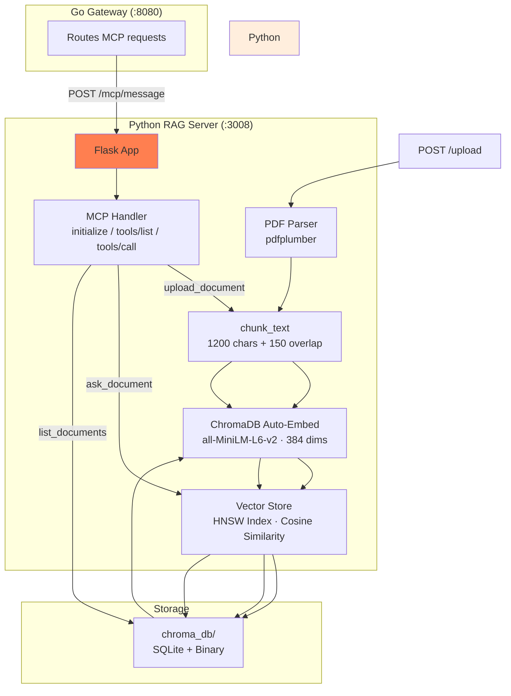
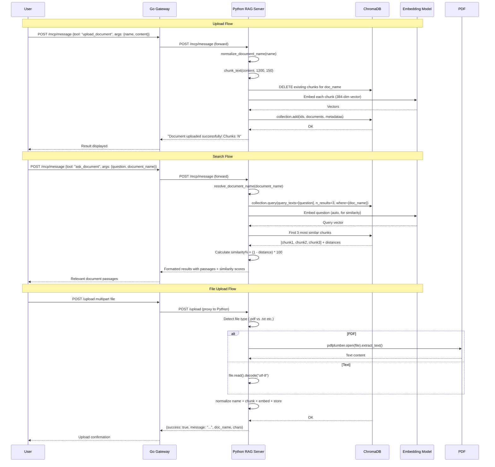

# Part 9: Documents RAG — Vector Search for AI

## Table of Contents
1. [Architecture Overview](#1-architecture-overview)
2. [Why Python Instead of Go](#2-why-python-instead-of-go)
3. [ChromaDB — The Vector Store](#3-chromadb--the-vector-store)
4. [Embedding Model — all-MiniLM-L6-v2](#4-embedding-model--allminilm-l6-v2)
5. [MCP Tool Definitions](#5-mcp-tool-definitions)
6. [Document Upload Flow](#6-document-upload-flow)
7. [Text Chunking](#7-text-chunking)
8. [Semantic Search — ask_document](#8-semantic-search--ask_document)
9. [Document Name Resolution](#9-document-name-resolution)
10. [File Upload Endpoint](#10-file-upload-endpoint)
11. [PDF Text Extraction](#11-pdf-text-extraction)
12. [Server Lifecycle](#12-server-lifecycle)
13. [Interview Questions & Answers](#13-interview-questions--answers)
14. [Diagrams](#14-diagrams)
15. [Quick Reference](#15-quick-reference)

---

## 1. Architecture Overview

### What Is the Documents RAG Server?

The Documents RAG (Retrieval Augmented Generation) server provides **semantic document search** — the ability to ask questions about uploaded documents and get relevant passages back based on meaning (vector similarity), not just keyword matching.

It is the **only server not written in Go** — it's a **Python Flask application** (367 lines) that runs on port 3008 as a child process of the main Go gateway.

```
User Query about Document
         │
         ▼
┌──────────────────────────────────────┐
│  Go Gateway (server.go)            │
│  POST /mcp/message                 │
│  ForwardToolCall("ask_document")   │
└──────────────┬─────────────────────┘
               │ HTTP POST
               ▼
┌──────────────────────────────────────┐
│  Python RAG Server (:3008)         │
│  Flask app (server.py)             │
│                                      │
│  1. Receive query                    │
│  2. ChromaDB query (vector similarity)│
│  3. Return relevant chunks           │
└──────────────┬─────────────────────┘
               │ Rows of text
               ▼
┌──────────────────────────────────────┐
│  Go Gateway                          │
│  Tool result → Orchestrator          │
│  → AI synthesis → User answer        │
└──────────────────────────────────────┘
```

**3 files in the docs-server directory:**

| File | Lines | Purpose |
|---|---|---|
| `server.py` | 367 | Python Flask server — ChromaDB, embedding, search |
| `doc.go` | 3 | Stub package (satisfies Go build system only) |
| `chroma_db/` | — | ChromaDB persistent storage (SQLite + binary data) |

### Why RAG?

Without RAG, the AI (LLaMA 3.3) can only answer from its training data and conversation context. With RAG:

- **User uploads** a PDF, README, or policy document
- The document is **chunked, embedded, and stored** in ChromaDB
- When the user **asks a question** about that document, the system retrieves the most relevant chunks using **vector similarity**
- The AI answers **only from the retrieved passages**, not from its own training data

This prevents hallucination and ensures answers come from the actual document content.

---

## 2. Why Python Instead of Go

The documents server is the **only server not written in Go**. This is a deliberate architectural decision.

### The Problem

Document RAG requires:
1. **Text embedding** — converting text to dense vector representations (384-dimensional embeddings)
2. **Vector similarity search** — finding the most semantically similar chunks to a query
3. **Pre-trained models** — the `all-MiniLM-L6-v2` embedding model (~80MB)

These capabilities are native to the **Python ecosystem**:
- `sentence-transformers` (HuggingFace) — easy model loading and embedding
- `chromadb` — production-ready vector database with built-in embedding support
- `pdfplumber` — robust PDF text extraction

Reimplementing all this in Go would require:
- Finding/ported Go embedding libraries (fewer, less mature)
- Implementing cosine similarity search from scratch
- Managing model files and inference in Go (complex)

### The Solution

Use **Python for what it's best at** (ML/AI), and **Go for what it's best at** (HTTP server, routing, concurrency). The Go gateway communicates with the Python server over a simple HTTP API — just like it communicates with the other MCP servers.

```go
// In main.go — the Python server is started as a child process:
startMCP("documents", func() error {
    cmd := exec.Command("python3", "examples/docs-server/server.py")
    cmd.Stdout = os.Stdout
    cmd.Stderr = os.Stderr
    return cmd.Run()
})
```

The Python server exposes the same MCP protocol (`initialize`, `tools/list`, `tools/call`) over HTTP — the gateway treats it identically to the Go-based servers.

---

## 3. ChromaDB — The Vector Store

### What Is ChromaDB?

ChromaDB is a **persistent vector database** that stores text chunks as high-dimensional vectors and enables fast similarity search. It handles:

- Vector storage and indexing (using HNSW — Hierarchical Navigable Small World)
- Automatic embedding generation (with built-in or custom embedding functions)
- Metadata filtering (e.g., filter by document name)
- Persistence to disk

### Initialization

```python
chroma_path = os.path.join(os.path.dirname(os.path.abspath(__file__)), "chroma_db")
chroma_client = chromadb.PersistentClient(path=chroma_path)
collection = chroma_client.get_or_create_collection(
    name="documents",
    metadata={"hnsw:space": "cosine"}
)
```

Key details:
- **PersistentClient** — data is saved to disk (`chroma_db/` directory) and survives process restarts
- **collection name:** `documents` — the single collection for all uploaded documents
- **hnsw:space = cosine** — uses cosine similarity for distance calculations (ideal for text embeddings)

### Data Stored Per Chunk

Each document chunk gets stored with:
| Field | Value | Purpose |
|---|---|---|
| `id` | `{uuid}_chunk_{i}` | Unique identifier for each chunk |
| `document` | The text chunk | The actual text content |
| `metadata` | `{doc_name, chunk_index, doc_id}` | Document name, position, and document UUID |
| `embedding` | 384-dimensional vector | Auto-generated by ChromaDB's embedding function |

---

## 4. Embedding Model — all-MiniLM-L6-v2

### What Is It?

`all-MiniLM-L6-v2` is a **lightweight sentence embedding model** from HuggingFace's `sentence-transformers` library.

| Property | Value |
|---|---|
| Model size | ~80 MB |
| Embedding dimension | 384 |
| Architecture | MiniLM (6 layers, 384 hidden) |
| Training data | STS (Semantic Textual Similarity) benchmark data |
| Use case | Sentence/paragraph embeddings for semantic search |
| Speed | ~10ms per embedding on CPU |

### How It Works

The model converts text into a 384-dimensional vector where **semantically similar text has similar vectors**:

```
"What is the leave policy?"  →  [0.12, -0.34, 0.56, ..., 0.78]  (384 dims)
"Our PTO policy allows 15 days"  →  [0.11, -0.33, 0.55, ..., 0.77]  (very similar!)
"Cryptocurrency prices are rising"  →  [0.89, 0.45, -0.23, ..., -0.12]  (very different!)
```

Cosine similarity between the query vector and stored chunk vectors determines relevance:

```
similarity = (A · B) / (||A|| × ||B||)
```

Result is a value between -1 (completely opposite) and 1 (identical meaning). The system returns chunks with the highest similarity scores.

---

## 5. MCP Tool Definitions

The RAG server exposes **3 tools**, matching the MCP protocol:

### 5.1 upload_document

| Property | Value |
|---|---|
| **Description** | Upload a document to the RAG knowledge base. It will be chunked and embedded for semantic search |
| **Parameters** | `name` (string, required), `content` (string, required) |
| **Purpose** | Store document text in ChromaDB for later search |

### 5.2 ask_document

| Property | Value |
|---|---|
| **Description** | Ask a question about uploaded documents using semantic vector search |
| **Parameters** | `question` (string, required), `document_name` (string, optional), `num_results` (number, optional, default 3) |
| **Purpose** | Retrieve relevant passages from documents |

### 5.3 list_documents

| Property | Value |
|---|---|
| **Description** | List all documents in the RAG knowledge base |
| **Parameters** | None |
| **Purpose** | Show what documents are uploaded and their chunk counts |

---

## 6. Document Upload Flow

### `upload_doc(name, content)` — Lines 145-177

Step-by-step flow:

```
1.  Normalize document name (remove path, extension, lowercase, underscored)
2.  Chunk the text into overlapping pieces (chunk_text)
3.  Check if document already exists in ChromaDB
    IF yes → delete existing chunks (avoid duplicates on re-upload)
4.  Generate a unique document ID (8-char UUID)
5.  Create chunk IDs: "{doc_id}_chunk_{0}", "{doc_id}_chunk_{1}", etc.
6.  Call collection.add() with:
    - ids: chunk IDs
    - documents: the text chunks
    - metadatas: [{doc_name, chunk_index, doc_id}, ...]
    - ChromaDB auto-generates embeddings using all-MiniLM-L6-v2
7.  Return success message with chunk count, model info, and total chunks
```

### Name Normalization

`normalize_document_name(name)` ensures consistent naming regardless of how the document is referenced:

```python
def normalize_document_name(name):
    raw_name = os.path.basename((name or "").strip())  # Strip path
    stem = os.path.splitext(raw_name)[0]               # Remove extension
    normalized = re.sub(r"[^a-z0-9]+", "_", stem.lower()).strip("_")
    return normalized
```

Examples:
- `"/path/to/report.pdf"` → `"report"`
- `"183_NGO_Reg_Cert.PDF"` → `"183_ngo_reg_cert"`
- `"my document (final).txt"` → `"my_document_final"`

This allows querying with any file variant and still matching the stored document.

### Re-upload Behavior

When a document is uploaded with the same name as an existing one:
1. ChromaDB finds the existing chunks (via `collection.get(where={"doc_name": name})`)
2. Existing chunks are **deleted** (`collection.delete(ids=existing["ids"])`)
3. New chunks are **added** with fresh embeddings

This ensures re-uploading a document **refreshes** it rather than duplicating data.

---

## 7. Text Chunking

### `chunk_text(text, chunk_size=1200, overlap=150)` — Lines 103-142

The `chunk_text` function splits large documents into manageable pieces for embedding and retrieval.

### Why Chunking?

Embedding models have a **token limit** (typically 512 tokens per input). A long document might be thousands of tokens. Chunking breaks it into smaller pieces that fit within the model's context window while preserving the document's structure and meaning.

### Chunking Strategy

| Parameter | Value | Purpose |
|---|---|---|
| `chunk_size` | 1200 characters (~200 tokens) | Maximum size per chunk |
| `overlap` | 150 characters | Overlap between adjacent chunks for boundary continuity |

### The Algorithm

```
Split text by newlines
For each line:
  IF line is blank (paragraph break):
    IF current chunk >= chunk_size/2 → flush chunk
    Restart current with overlap tail of previous chunk
  ELSE IF current + line would exceed chunk_size:
    Flush current chunk
    Start new chunk with overlap tail + current line
  ELSE:
    Append line to current chunk
Flush final chunk
De-duplicate adjacent identical chunks
```

### Why Overlap Matters

Consider a sentence that spans two chunks: "The leave policy allows 15 days of paid time off for all employees."

Without overlap: ["The leave policy allows 15 days of paid", "time off for all employees"]
→ A query about "paid time off" might miss first chunk

With overlap (150 chars): ["The leave policy allows 15 days of paid time off", "paid time off for all employees"]
→ The phrase "paid time off" appears in both chunks → both are retrieved

### Paragraph Breaks

The algorithm respects paragraph breaks (`\n\n`). When a blank line is encountered and the current chunk is large enough (>= chunk_size/2), it flushes the chunk. This preserves document structure for better retrieval.

---

## 8. Semantic Search — ask_document

### `ask_docs(question, num_results=3, document_name=None)` — Lines 180-222

### The Search Pipeline

```
1. Check if any documents exist → if not, return "No documents uploaded yet"
2. Resolve document_name to the stored key (handles path/extension/casing variants)
   → If not found, return "DOCUMENT_NOT_FOUND" with list of available docs
3. Build a filter: {"doc_name": resolved_name} (for single-document search) or None (search all)
4. count = collection.count() (or filtered count)
5. Call collection.query():
   - query_texts: [question] (ChromaDB auto-embeds the question)
   - n_results: min(num_results, matching_count)
   - where: filter (optional)
   - include: ["documents", "metadatas", "distances"]
6. If no results → return "NO_RELEVANT_PASSAGES"
7. Format results with similarity percentages and source document names
```

### Results Format

```
Found 3 relevant passages (semantic search):

--- From 'project-docs' (similarity: 94.2%) ---
The MCP Gateway is a reverse proxy that aggregates multiple AI tool servers into one endpoint.
It uses the Model Context Protocol (MCP) which is JSON-RPC over HTTP.
The gateway handles tool discovery, health monitoring, request routing, and logging.

--- From 'project-docs' (similarity: 87.5%) ---
Performance: Average latency through the gateway is 2-5ms overhead.
Health checks run every 10 seconds. The system handles concurrent requests safely using mutexes.

--- From 'project-docs' (similarity: 72.1%) ---
Security Considerations: Currently runs locally. For production, add API key authentication,
rate limiting, and HTTPS. The GROQ_API key should be stored as an environment variable,
never in code.
```

### Similarity Score Calculation

```python
similarity = round((1 - dist) * 100, 1)
```

Where `dist` is the **cosine distance** from ChromaDB (0 = identical, 2 = completely different). Converting to percentage:
- distance 0.0 → similarity 100% (identical)
- distance 0.058 → similarity 94.2% (very similar)
- distance 0.275 → similarity 72.5% (somewhat similar)

### Error Messages

| Error | When It Occurs |
|---|---|
| `"No documents uploaded yet"` | No documents in ChromaDB |
| `"DOCUMENT_NOT_FOUND: ..."` | User specified a document name that doesn't match any stored document |
| `"NO_RELEVANT_PASSAGES: ..."` | Documents exist but none are relevant to the query |

These error messages follow the same format used by `agent.go` to signal specific conditions to the AI, ensuring the AI doesn't hallucinate answers when there's no data.

---

## 9. Document Name Resolution

### `resolve_document_name(requested_name)` — Lines 91-100

When a user asks about a specific document, the requested name might not exactly match the stored name:

| User provides | Stored as | Match? |
|---|---|---|
| `report.pdf` | `report` | Yes (normalize strips extension + path) |
| `183_NGO_Reg_Cert.PDF` | `183_ngo_reg_cert` | Yes (lowercase, underscore normalized) |
| `My Document (final).txt` | `my_document_final` | Yes |
| `report` | `report` | Exact match |

The resolution process:
1. Normalize the requested name using the same `normalize_document_name()` function
2. Compare against all stored document names (also normalized)
3. Return the **stored name** (with original casing) if found, or `None` if not found

This ensures flexibility — users can reference documents with any file path, extension, or casing variation.

---

## 10. File Upload Endpoint

### `POST /upload` — Lines 287-324

A direct file upload endpoint (separate from the MCP protocol) that:

1. Accepts a multipart form with `file` field and optional `name` field
2. Detects file type by extension:
   - `.pdf` → parse with `pdfplumber`
   - All other types → read as plain text (UTF-8)
3. Extracts text content
4. Calls `upload_doc()` to store in ChromaDB
5. Returns success or error response

### Supported File Types

| Extension | Parser | Notes |
|---|---|---|
| `.pdf` | `pdfplumber` | Text extraction from PDF pages |
| `.txt` | Plain text | Direct UTF-8 decode |
| `.md` | Plain text | Direct UTF-8 decode |
| `.csv` | Plain text | Direct UTF-8 decode |
| `.json` | Plain text | Direct UTF-8 decode |
| `.py` | Plain text | Direct UTF-8 decode |
| `.js` | Plain text | Direct UTF-8 decode |
| `.go` | Plain text | Direct UTF-8 decode |
| `.html` | Plain text | Direct UTF-8 decode |

Scanned/image-based PDFs are **not** supported — `pdfplumber` only extracts text from text-based PDFs. If the PDF is a scanned image, the result is an error.

---

## 11. PDF Text Extraction

### `pdfplumber` Library

The PDF extraction uses `pdfplumber`, a Python library that:
- Extracts text from each PDF page
- Preserves paragraph structure and table layouts
- Handles encrypted/protected PDFs (returns empty if text cannot be extracted)

```python
with pdfplumber.open(io.BytesIO(file.read())) as pdf:
    text_content = ""
    for page in pdf.pages:
        page_text = page.extract_text()
        if page_text:
            text_content += page_text + "\n"
```

### Limitations

- **Scanned PDFs** (image-based, no text layer) → "Could not extract text from PDF. It might be a scanned image"
- **Encrypted PDFs** → `pdfplumber` cannot open them without a password
- **Large PDFs** → The entire text is loaded into memory (Python string), which may be slow for very large documents

---

## 12. Server Lifecycle

### How It Starts

From `main.go`:

```go
startMCP("documents", func() error {
    cmd := exec.Command("python3", "examples/docs-server/server.py")
    cmd.Stdout = os.Stdout
    cmd.Stderr = os.Stderr
    return cmd.Run()
})
```

The `startMCP` helper runs it in a background goroutine:

```go
startMCP = func(name string, fn func() error) {
    go func() {
        if err := fn(); err != nil {
            log.Printf("%s server exited: %v", name, err)
        }
    }()
}
```

### Pre-loaded Sample Document

On first run (when `collection.count() == 0`), the server automatically uploads a sample document called `"project-docs"` containing the MCP Gateway technical documentation. This ensures the system has content to demonstrate RAG capabilities even without user uploads.

```python
SAMPLE = """MCP Gateway Project - Technical Documentation
Architecture Overview:
The MCP Gateway is a reverse proxy that aggregates multiple AI tool servers into one endpoint.
...
"""

if collection.count() == 0:
    upload_doc("project-docs", SAMPLE)
```

### MCP Protocol Handling

The Python server implements the same MCP protocol as the Go servers:

| Method | Response | Purpose |
|---|---|---|
| `initialize` | Server info + capabilities | MCP handshake |
| `tools/list` | List of 3 tools | Tool discovery |
| `tools/call` | Tool execution result | Run `upload_document`, `ask_document`, or `list_documents` |

---

## 13. Interview Questions & Answers

### Q1: "Why is the documents server written in Python instead of Go?"

> Document RAG requires **vector embeddings** and **semantic search**, which are fundamentally machine learning operations. The Python ecosystem has mature, production-ready libraries for this (`sentence-transformers`, `chromadb`, `pdfplumber`) that would be difficult and time-consuming to reimplement in Go. Using Python for the ML parts while keeping Go for the HTTP server and routing is the most pragmatic architectural choice. The Go gateway communicates with the Python server over standard HTTP, treating it identically to a Go-based MCP server.

### Q2: "How does semantic search differ from keyword search?"

> **Keyword search** (like a database LIKE query) matches exact words. If a document says "the organization provides 15 days of paid time off" and the user asks about "vacation days," keyword search would return nothing because the words don't match.
>
> **Semantic search** converts both the query and stored text into numerical vectors (384 dimensions for all-MiniLM-L6-v2) and finds the most **meaningfully similar** chunks using cosine similarity. The vector for "vacation days" is close to the vector for "15 days of paid time off" because they express the same concept, even though they share no words.
>
> In the system's context, this means users can ask questions naturally ("What does the policy say about time off?") and get relevant documents even if the exact words aren't in the text.

### Q3: "Explain the chunking strategy and why overlap matters."

> Documents are split into chunks of 1200 characters (~200 tokens) with 150 characters of overlap between adjacent chunks:
> - **1200 chars** fits within the embedding model's context window
> - **150 chars overlap** ensures that sentences spanning chunk boundaries appear in both chunks, so the system can retrieve them regardless of where the query boundary falls
>
> The algorithm also respects paragraph breaks (blank lines) and flushes chunks at paragraph boundaries when they're large enough. Adjacent identical chunks are de-duplicated to avoid redundant results.

### Q4: "What happens when a document is re-uploaded?"

> When a document with the same normalized name is uploaded again:
> 1. The existing chunks for that document are found via `collection.get(where={"doc_name": name})`
> 2. All existing chunks are deleted with `collection.delete(ids=existing["ids"])`
> 3. New chunks are created and embedded with the fresh content
>
> This "replace" behavior ensures users can update documents without accumulating duplicate chunks.

### Q5: "How does the system handle PDF files differently from text files?"

> The file upload endpoint (`POST /upload`) detects file type by extension:
> - **PDF files** use `pdfplumber` library for text extraction, which reads text from each PDF page
> - **All other files** (`.txt`, `.md`, `.json`, `.py`, etc.) are read as plain UTF-8 text
>
> If a PDF is a scanned image (no text layer), `pdfplumber` cannot extract text and returns an error. The system explicitly handles this with the message "Could not extract text from PDF. It might be a scanned image."

### Q6: "What is the sample document pre-loaded on first run?"

> On first startup (when `collection.count() == 0`), the server automatically uploads a sample document called `"project-docs"` containing the MCP Gateway technical documentation. This includes:
> - Architecture overview
> - Team and contributions info
> - Performance characteristics
> - Security considerations
> - Instructions for adding new servers
> - Deployment options
>
> This allows the system to demonstrate RAG capabilities immediately without requiring the user to upload any documents first.

### Q7: "How does ChromaDB handle the embedding step?"

> ChromaDB is configured with `metadata={"hnsw:space": "cosine"}` and uses `all-MiniLM-L6-v2` as its default embedding function. When `collection.add(documents=chunks, ...)` is called, ChromaDB:
> 1. Automatically runs each chunk through the embedding model
> 2. Converts the text to a 384-dimensional vector
> 3. Stores the vector alongside the document text and metadata
> 4. Builds an HNSW index for fast approximate nearest neighbor search
>
> This means the Go gateway never needs to handle embeddings — it just sends text to the Python server, and ChromaDB handles the rest.

### Q8: "What is the `DOCUMENT_NOT_FOUND` error and why does the agent handle it specially?"

> When `ask_document` is called with a `document_name` that doesn't match any stored documents (after normalization), it returns a `DOCUMENT_NOT_FOUND` message listing the available documents.
>
> The `agent.go` file has a rule (line 72) that handles this: "If a document tool returns DOCUMENT_NOT_FOUND or NO_RELEVANT_PASSAGES, state that clearly. Never infer document contents from chat history, another document, or general knowledge."
>
> This prevents the AI from hallucinating information when a document doesn't exist — it must be honest about not having the document rather than guessing.

### Q9: "How is the Python server integrated with the Go gateway's MCP protocol?"

> The Python server implements the exact same MCP protocol as the Go servers:
> 1. `initialize` → returns server info (protocolVersion `"2024-11-05"`, capabilities `{"tools": {}}`, serverInfo `{"name": "docs-rag-server", "version": "2.0.0"}`)
> 2. `tools/list` → returns the 3 tool definitions (same format as Go servers)
> 3. `tools/call` → routes to `upload_doc()`, `ask_docs()`, or `list_docs()` based on tool name
>
> The Go gateway sends requests to `POST http://localhost:3008/mcp/message` just like it does for Go servers. The response format (`{"jsonrpc": "2.0", "id": ..., "result": {"content": [{"type": "text", "text": "..."}}]}`) is identical.

### Q10: "What are the limitations of this RAG implementation?"

> Several limitations exist in this V1 implementation:
> 1. **Python dependency** — requires Python 3 + pip packages (flask, chromadb, sentence-transformers, pdfplumber). If Python isn't available, the documents server won't start.
> 2. **Single collection** — all documents go into one "documents" collection. For a production system, per-user collections would be needed for multi-tenant isolation.
> 3. **No user-level access control** — any authenticated user can see all uploaded documents. A production system would need per-document ownership and access policies.
> 4. **Embedding model size** — the all-MiniLM-L6-v2 model (~80MB) is loaded into memory. For very large document collections, a more powerful model could be needed.
> 5. **Chunk size fixed at 1200 chars** — different document types might benefit from different chunk sizes (e.g., code files vs. prose documents).
> 6. **No batch upload API** — uploading many documents requires individual POST calls. A batch endpoint would be more efficient for large migrations.
> 7. **PDF extraction is text-only** — scanned image PDFs containing images with text (like scanned forms or image-based PDFs) cannot be processed. OCR would be needed for those.
> 8. **No chunk re-ranking** — the system returns the top N chunks by similarity but doesn't re-rank them using cross-encoders (a more accurate but slower approach).

---

## 14. Diagrams

### Documents RAG System Overview



### Document Upload & Search Flow



### Chunking with Overlap Visual

```
Document text (simplified):
"Line one of the document.
Line two of the document continues here.
Line three starts a new paragraph.
Line four continues the paragraph.
Line five is the final line of text."

Without overlap (chunk_size=30):
Chunk 1: "Line one of the document."
Chunk 2: "Line two of the document continues here."
Chunk 3: "Line three starts a new paragraph."
Chunk 4: "Line four continues the paragraph."
Chunk 5: "Line five is the final line of text."

With overlap=10 (chunk_size=30):
Chunk 1: "Line one of the document. Line"
       └── overlap ──┐
Chunk 2: "the document continues here. Line"
              └── overlap ──┐
Chunk 3: "paragraph. Line four continues"
         └── overlap ──┐
Chunk 4: "the paragraph. Line five"
              └── overlap ──┐
Chunk 5: "line of text."
```

### Querying with Semantic Similarity

```
Query: "What does the policy say about time off?"
       │
       ▼
[Embedding Model] → Query vector: [0.12, -0.34, 0.56, ..., 0.78]
       │
       ▼
[ChromaDB Cosine Similarity Search]
       │                                    │
       ▼                                    ▼
Chunk 1 vector: [0.11, -0.33, 0.55, ...]  "The policy allows 15 days of paid time off"
Similarity: 94.2%  ─── MATCH (returned)

Chunk 2 vector: [0.89, 0.45, -0.23, ...]   "Cryptocurrency prices are rising"
Similarity: 12.3%  ─── NOT MATCHED (too different)

Chunk 3 vector: [0.09, -0.31, 0.52, ...]   "Employees receive 15 days paid leave annually"
Similarity: 88.7%  ─── MATCH (returned)
```

### Server Architecture (Documents vs Go Servers)

```
┌─────────────────────────────────────────────────────────────┐
│                     MCP Gateway (:8080)                       │
│                                                              │
│  Go-based Servers (child processes):     Python-based Server │
│  ┌──────────┐ ┌──────────┐ ┌──────────┐    ┌──────────────┐│
│  │ Weather  │ │ Notes    │ │ GitHub   │    │ Documents RAG││
│  │ :3001    │ │ :3002    │ │ :3003    │    │ :3008        ││
│  │ (Go exe) │ │ (Go exe) │ │ (Go exe) │    │ (Python flt) ││
│  └──────────┘ └──────────┘ └──────────┘    └──────────────┘│
│                                                              │
│  All respond to: POST /mcp/message                          │
│  All return: {jsonrpc: "2.0", result: {...}}                │
│  All use:    initialize → tools/list → tools/call           │
│                                                              │
└─────────────────────────────────────────────────────────────┘
```

---

## 15. Quick Reference

### RAG Source Files

| File | Lines | Role |
|---|---|---|
| `examples/docs-server/server.py` | 367 | Python Flask RAG server with ChromaDB |
| `examples/docs-server/doc.go` | 3 | Go stub (satisfies build system only) |
| `examples/docs-server/chroma_db/` | — | Persistent vector storage |

### Three RAG Tools

| Tool | Description | Parameters |
|---|---|---|
| `upload_document` | Upload document to RAG knowledge base | `name` (required), `content` (required) |
| `ask_document` | Semantic search across uploaded documents | `question` (required), `document_name` (optional), `num_results` (optional, default 3) |
| `list_documents` | List all documents in the knowledge base | None |

### Python Dependencies

| Package | Purpose | Install |
|---|---|---|
| `flask` | HTTP web server framework | `pip install flask` |
| `chromadb` | Vector database | `pip install chromadb` |
| `sentence-transformers` | Embedding model loading | `pip install sentence-transformers` |
| `pdfplumber` | PDF text extraction | `pip install pdfplumber` |

### Key Python Functions

| Function | Lines | Purpose |
|---|---|---|
| `normalize_document_name()` | 74-79 | Strip path/extension, lowercase, underscore |
| `stored_document_names()` | 82-88 | Get all unique doc names from ChromaDB |
| `resolve_document_name()` | 91-100 | Match user variants to stored names |
| `chunk_text()` | 103-142 | Split text into overlapping chunks |
| `upload_doc()` | 145-177 | Chunk → embed → store in ChromaDB |
| `ask_docs()` | 180-222 | Semantic search with similarity scoring |
| `list_docs()` | 225-240 | List all stored documents |
| `handle_mcp()` | 245-279 | MCP protocol entry point |
| `handle_file_upload()` | 287-324 | Direct file upload endpoint |

### ChromaDB Configuration

| Setting | Value | Purpose |
|---|---|---|
| `path` | `chroma_db/` (relative to server.py) | Persistent storage location |
| `name` | `"documents"` | Collection name |
| `hnsw:space` | `"cosine"` | Distance metric for similarity |
| Embedding model | `all-MiniLM-L6-v2` | 384-dim sentence embeddings |
| Dimensions | 384 | Embedding vector size |

### Similarity Score Format

```
similarity = round((1 - distance) * 100, 1)

distance 0.00  → similarity 100.0%  (identical meaning)
distance 0.06  → similarity 94.2%   (very similar)
distance 0.25  → similarity 75.0%   (somewhat similar)
distance 1.00  → similarity 0.0%    (completely different)
```

### MCP Request Format (Same as Go Servers)

```json
{
  "jsonrpc": "2.0",
  "id": 1,
  "method": "tools/call",
  "params": {
    "name": "ask_document",
    "arguments": {
      "question": "What is the leave policy?",
      "document_name": "project-docs",
      "num_results": 3
    }
  }
}
```

### MCP Response Format (Same as Go Servers)

```json
{
  "jsonrpc": "2.0",
  "id": 1,
  "result": {
    "content": [{"type": "text", "text": "Found 2 relevant passages..."}],
    "isError": false
  }
}
```

---

*End of Part 9: Documents RAG — Vector Search for AI.*
